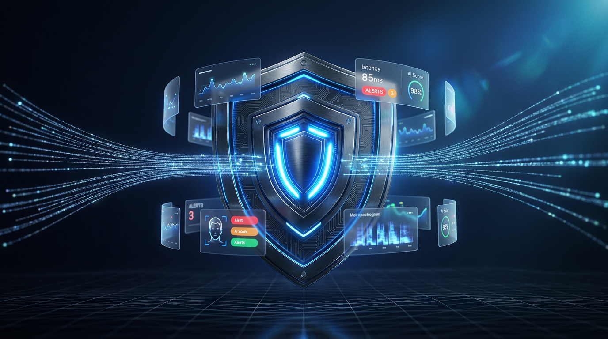
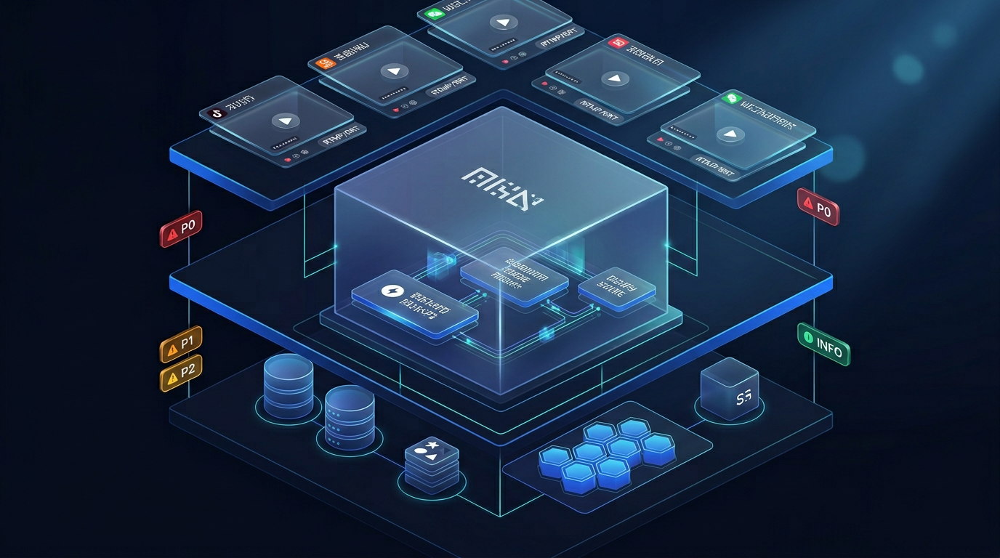
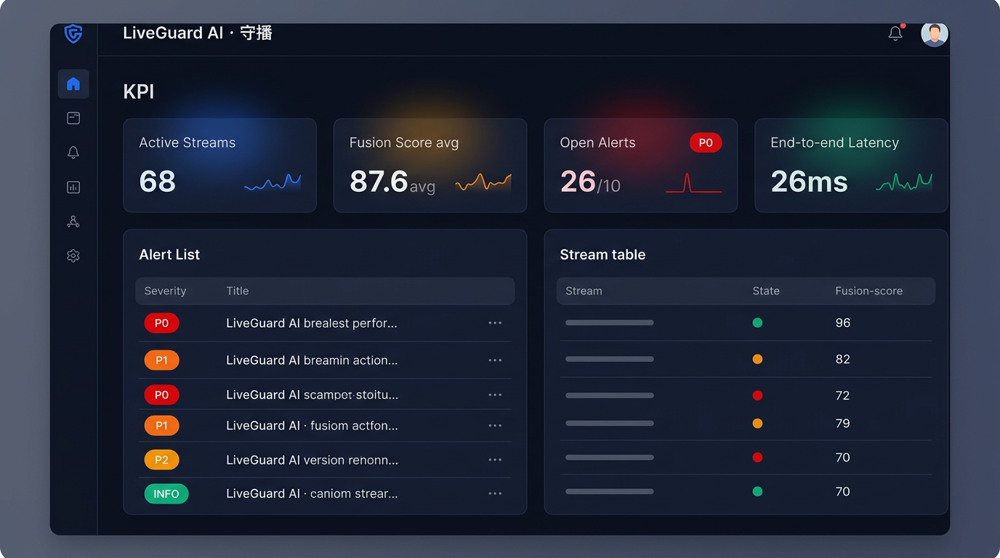

# 守播 LiveGuard AI

> 世界级多模态 AI 直播监控平台 · **主播在岗 · 反作弊 · 合规回溯** 一站式解决方案。

<p align="center">
  
</p>

<p align="center">
  <a href="#"></a>
  <a href="#"></a>
  <a href="#"></a>
  <a href="#"></a>
  <a href="#"></a>
</p>

---

## ✨ 一句话定位

> **LiveGuard 是一站式直播合规 AI Copilot：秒级发现主播离岗、识别 5 大反作弊场景（静帧 / 循环 / Deepfake / 冒名 / 屏录回放）、多通道告警派单、合规证据链归档。**

面向 **抖音 / 快手 / 淘宝 / 视频号** 的商家、MCN、品牌方、第三方代播机构，适配私有化部署与 SaaS 订阅两种形态。

---

## 🧭 项目结构（Monorepo）

```
liveguard/
├── .kiro/spec/                      # Kiro Spec · requirements / design / tasks
├── algo/                            # 算法引擎（FSM / 反作弊 / 人脸 / 人形 / Re-ID / 活体 / 行为 / VAD / 声纹 / 持续学习）
├── backend/                         # 云端后端 FastAPI + Postgres + Redis + Kafka + Alembic
├── notify/                          # 通知服务 · 7 通道（SMS/Voice/DingTalk/WeWork/Feishu/Webhook/Push）
├── edge/                            # 边缘 Agent · 拉流 + 轻量推理 + 特征上报
├── console/                         # Web 控制台 · Next.js 14 (App Router)
├── mobile/                          # 移动端 · Expo React Native
├── extension/                       # 浏览器插件 · Chrome MV3
├── models/python_models/            # 商业建模（TAM/SAM/SOM · LTV/CAC · ROI · SLO · Erlang-C · 去重 · ARR）
├── docs/                            # 架构图集 · 合规附录 · 品牌图
├── infra/                           # docker-compose · Prometheus · k8s（规划）
├── Makefile / pyproject.toml        # 统一脚手架
└── .github/workflows/ci.yml         # GitHub Actions CI
```

---

## 🚀 5 分钟本地运行

```bash
# 1. 克隆 + 安装
git clone https://github.com/<your-org>/liveguard.git
cd liveguard
make install

# 2. 基础设施（Postgres + Redis + Kafka + MinIO + Prom + Grafana）
docker compose -f infra/docker-compose.yml up -d postgres redis kafka minio prometheus grafana

# 3. DB 迁移 + 种子
cd backend && alembic upgrade head && python scripts/seed.py && cd ..

# 4. 启动后端 + 通知 + 控制台
uvicorn liveguard_backend.main:app --reload --port 8080 &
uvicorn liveguard_notify.main:app --reload --port 8081 &
cd console && npm install && npm run dev     # http://localhost:3000

# 5. 启动一个合成流的 edge agent（无摄像头也能演示）
python -m liveguard_edge.cli \
    --stream-id str_demo_custom \
    --tenant t_demo \
    --backend http://localhost:8080 \
    --source synthetic --fps 15 --max-frames 500
```

> 全部跑通后：打开 http://localhost:3000 查看总览 / 直播流 / 告警中心 / 实时大屏。

---

## 🧠 核心能力一览

<p align="center">
  
</p>

| 能力 | 技术实现 | 关键文件 |
| --- | --- | --- |
| **StreamFSM** 主播在岗状态机 | 7 状态 DFSM · IDLE → ON_DUTY → BRIEF_AWAY → LONG_AWAY → ALERT_ESCALATED → COOLDOWN | `algo/liveguard_algo/state/stream_fsm.py` |
| **CheatFSM** 反作弊状态机 | 5 类作弊场景（静帧/循环/Deepfake/冒名/屏录）+ 证据累积 + 冷却 | `algo/liveguard_algo/state/cheat_fsm.py` |
| **多模态融合** | Face × Person × Re-ID × Liveness × Action × VAD × Voiceprint | `algo/liveguard_algo/pipeline.py` |
| **持续学习** | 低置信 / 冲突信号 / 用户反馈 → HardExampleMiner → 人工复核 → 微调 | `algo/liveguard_algo/learning.py` |
| **可解释告警** | `Explainer` 生成人类可读理由 + CloudEvents 1.0 封装 | `algo/liveguard_algo/explainer.py` |
| **多租户 API** | FastAPI · Pydantic v2 · OpenAPI 3.1 · JWT + API Key + RBAC | `backend/liveguard_backend/api/` |
| **事件总线** | Kafka `events.v1` · `notify.jobs.v1` · In-Memory fallback | `backend/liveguard_backend/infra/bus.py` |
| **多通道通知** | SMS / Voice / DingTalk / WeWork / Feishu / Webhook / App Push + 指数退避 | `notify/liveguard_notify/channels/` |
| **Web 控制台** | Next.js 14 + Tailwind + shadcn 风格 · 暗色高端设计 | `console/` |
| **Chrome 插件 (MV3)** | 自动识别直播后台 · 本地轻量检测 · 云端上报 | `extension/` |
| **业务建模** | 7 个 Python Monte Carlo 模型 · TAM/SAM/SOM/LTV/CAC/ROI/SLO/Erlang-C/ARR | `models/python_models/` |

<p align="center">
  
</p>

---

## 📈 业务建模（均可复现）

所有市场 / 经济 / 运营假设**均由 Python 程序建模**并输出 JSON 证据，路径：`models/python_models/outputs/*.json`。

| 模型 | 文件 | 关键输出 |
| --- | --- | --- |
| TAM / SAM / SOM | `01_market_sizing.py` | 中国直播电商监控 SAM ~¥XX 亿 / Y3 SOM ~¥X.X 亿 |
| 单位经济（LTV / CAC / Payback） | `02_unit_economics.py` | LTV/CAC > 3、Payback < 12m、Rule of 40 > 40 |
| 商家侧 ROI | `03_roi_merchant.py` | 中位 ROI 年化 3.5× · 回本周期 ≤ 3 月 |
| P0/P1 告警 SLO 延迟预算 | `04_slo_latency_budget.py` | P0 e2e p95 ≤ 3s · P1 ≤ 10s |
| 告警中心人力（Erlang-C） | `05_alerts_capacity_erlangc.py` | Nₘᵢₙ 值班人数 · 服务水平 ≥ 0.9 |
| 告警去重仿真 | `06_dedup_suppression_sim.py` | 5-min 窗口去重 · 人工负担 -70% · 漏报 <1% |
| 同期群 ARR 预测 | `07_growth_cohort.py` | 5Y ARR 中位 ~¥XX 亿 · NRR 130% |

运行：

```bash
cd models/python_models
$env:PYTHONIOENCODING='utf-8'      # Windows
python 01_market_sizing.py; python 02_unit_economics.py; python 03_roi_merchant.py
python 04_slo_latency_budget.py; python 05_alerts_capacity_erlangc.py
python 06_dedup_suppression_sim.py; python 07_growth_cohort.py
```

---

## 🗺️ 路线图

- **v1.0 · 2026Q2**（当前）：本仓库发布，算法 / 后端 / 边缘 / 通知 / 控制台全部打通
- **v1.1 · 2026Q3**：Android / iOS APP 上架 · 真实 WebRTC WHEP 低延迟预览
- **v1.2 · 2026Q4**：多云 Helm Chart · Terraform · 等保三级过审
- **v2.0 · 2027Q2**：跨境合规（GDPR / CCPA）· LLM 自动复核 · 带货脚本合规 Copilot

---

## 🧪 质量保障

- **单元测试**：`algo / backend / notify / edge` 均含 pytest 套件（CI 矩阵并行执行）
- **集成测试**：FastAPI `httpx.ASGITransport` in-memory SQLite · Kafka InMemory 回退
- **静态检查**：ruff + mypy + eslint + tsc
- **Docker 镜像**：`backend / notify / console` 均已提供 Dockerfile · CI 构建冒烟
- **安全审计**：CI 软失败 `pip-audit` + `npm audit`

---

## 📚 关键文档

- [📋 Requirements（EARS）](.kiro/spec/requirements.md)
- [🏛️ Design（系统设计）](.kiro/spec/design.md)
- [📝 Tasks（实施任务清单）](.kiro/spec/tasks.md)
- [🗺️ Architecture 图集](docs/architecture.md)
- [🏛️ 合规 & 隐私附录](docs/compliance.md)
- [🚢 部署指南](docs/deployment.md)

---

## 🤝 贡献 & 许可

Apache-2.0 · 欢迎企业级贡献者 / 研究院 / 合规机构联合共建。

> **守一帧平安 · 播万家温度。**
> — LiveGuard AI Team, 2026
