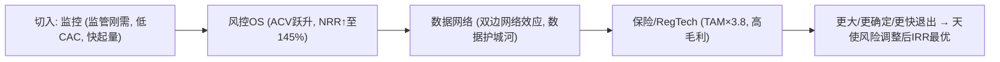

<!-- ===== File: 01-商业模式重构与价值链机会挖掘.md ===== -->

# §1 商业模式重构与价值链机会挖掘

> 本章是 v3.0 的战略核心：从"离岗监控功能"出发，沿直播经济价值链深挖机会，
> 重构出一个**天使 IRR 最优、具备网络效应与数据护城河**的商业模式。
> 收入分层口径来自 `20_business_model_layers.py`。

## Key Takeaways

1. **"监控"是功能，不是公司**：单点监控易被平台原生工具商品化（v2.0 自列头号红色风险 R04）。我们把它作为**低 CAC 的尖锐切入点（wedge）**，而非终局。
2. **重构为"直播经济实时可信与风控中台"**：四层货币化叠加——监控 SaaS → 风控 OS → 可信数据网络/API → 保险分润/RegTech。
3. **天使 IRR 最优解的逻辑链**：尖锐切入（资本高效、快速起量）→ 风控 OS（ACV 跃升、NRR 抬升）→ 数据网络（双边网络效应、更高退出倍数）→ 保险/RegTech（TAM 放大、高毛利）。
4. **Y5 收入 ¥45.27 亿**，其中扩展层贡献 **38.3%**；混合毛利率由 78% 抬升至 **80.1%**；四层 CAGR 285%–502%。

---

## §1.1 价值链机会扫描（不拘泥于原始机会）

直播经济价值链：**内容生产（主播/MCN）→ 平台 → 品牌商家 → 工具/SaaS → 监管 → 消费者**。沿链逐环识别"谁在为风险与信任买单"：

| 价值链环节 | 痛点 / 支付意愿 | 现有方案缺口 | 本公司机会 |
|-----------|----------------|-------------|-----------|
| 主播 / MCN | 离岗罚款、替身代播、话术违规封禁 | 人工监控贵、漏报高 | **监控 SaaS + 风控 OS** |
| 品牌商家 | 虚假宣传/极限词/价格合规、刷单造假 | 事后人工抽检 | **风控 OS（话术/价格/商品）** |
| 平台 | 治理压力、生态合规、需中立第三方背书 | 自营工具只覆盖本平台 | **API-PaaS + 可信认证** |
| 保险 / 金融 | 缺乏"合规直播"风险定价数据 | 无可信数据源 | **保险分润 + 风险数据** |
| 监管 / 行业协会 | 留痕、审计、透明度 | 缺标准化工具 | **RegTech / 治理报告** |

> **关键洞察**：监控数据一旦沉淀为"谁是可信主播/合规直播间"的**可信图谱**，平台、品牌、保险、监管都会消费同一份信任数据——这是一个**跨平台中立、单一平台无法复制**的网络层。

---

## §1.2 推荐模式 — 直播经济实时可信与风控中台

**定位**：守播 LiveGuard = 直播经济的"实时可信与风控中台（Trust & Risk Network）"。

### 四层货币化（land-and-expand）

| 层 | 名称 | 内容 | 货币化 | Y5 收入 | 毛利率 |
|---|------|------|--------|-------:|------:|
| ① | **核心监控 SaaS** | 离岗/替身/合规实时监控 | 三档订阅 | ¥27.95 亿 | 78% |
| ② | **风控 OS 加购** | 话术/极限词/价格/商品/刷单造假风控 | 加购模块/按量 | ¥8.38 亿 | 80% |
| ③ | **可信数据网络 / API** | 可信主播认证 + 欺诈共享名单 + 基准数据 + 平台/ISV API | 订阅+按调用 | ¥5.03 亿 | 88% |
| ④ | **保险分润 / RegTech** | 联合承保"合规直播" + 监管/平台治理 | 分润+SaaS | ¥3.91 亿 | 85% |
| | **合计** | | | **¥45.27 亿** | **80.1%** |

### §1.2.1 为什么这是天使 5 年 IRR 最优解

1. **资本高效切入** → 天使期资源需求仅 ¥1,000 万即可跑到 Seed 里程碑（§8），早期估值跃升快。
2. **扩展层抬升留存与 ACV** → NRR 由 97% 升至 **145%**（§5.4），单客户价值随时间增长。
3. **数据网络 → 网络效应 + 数据护城河** → 支撑更高退出倍数（EV/Sales 中位 4.6×）。
4. **TAM 由 ¥167 亿放大至 ¥636 亿**（×3.8，§2），天花板足够支撑 ¥200 亿+ 退出。

---

## §1.3 备选模式 — 横向实时多模态内容风控 PaaS（量化对照）

| 维度 | 主推荐（垂直可信网络）| 备选（横向 PaaS）|
|------|---------------------|-----------------|
| 切入 | 直播监控（尖锐、监管刚需）| 通用视频风控 API（分散）|
| TAM 天花板 | ¥636 亿（聚焦）| 更大但分散 |
| 获客 CAC | 低（PLG + 监管驱动）| 高（开发者教育长）|
| 竞争 | 蓝海（2–3 家）| 与商汤/旷视/云厂商正面竞争 |
| 退出速度 | 快（垂类领跑 → 战略并购/IPO）| 慢 |
| 网络效应 | 强（可信图谱双边）| 弱 |
| **天使风险调整后 IRR** | **更优** | 更低、成功概率更低 |

> 结论：横向 PaaS 上限更高但**风险调整后**天使 IRR 更低、成功概率更低。我们以垂直可信网络为主线，
> 在 Y3+ 通过 API-PaaS 层"顺势"获得横向延展（教育/政务/医疗/社交直播），而非一开始就横向铺开。

---

## §1.4 商业模式画布（精简 BMC）

- **价值主张**：让每一场直播都安全、合规、可信；让平台/品牌/保险/监管共享一份可信数据。
- **客户细分**：主播/MCN（②）、品牌自播（①②）、平台（③）、保险与监管（④）。
- **收入来源**：订阅 + 按量 + API 调用 + 保险分润 + 数据订阅（四层）。
- **关键资源**：垂类数据飞轮、算法 IP、平台合作、合规资质（§8）。
- **关键活动**：算法迭代、数据标注、平台 BD、合规备案。
- **成本结构**：算力、标注、人力、合规（§8/§9）。

> 下一章 §2 行业与市场分析（多层 TAM）。
