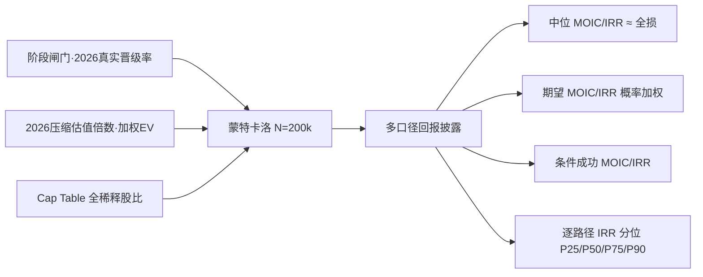

<!-- ===== File: 12-成功概率与投资回报.md · v5.0 ===== -->

# §12 成功概率与投资回报（多口径）

> 来自 `19_success_probability.py`（阶段闸门生存 + 蒙特卡洛 N=200,000）与 `18_angel_returns.py`。
> **重要免责声明：早期股权为单笔高方差投资，所有数字为情景建模结果，非回报承诺。**

## §12.1 方法学

- 阶段闸门采用 **2026 真实晋级率**：Seed→A 已从历史 30–40% 跌至 **22%** [S-110]；A→B、B→C 约 50–55% [S-114]；幂律下 5–10% 项目贡献多数回报。
- 退出 EV 锚定 §11 加权 EV ¥34.3 亿（对数正态 σ=0.55，反映退出高方差）。

## §12.2 阶段闸门生存

| 里程碑 | 到达年 | 单步晋级率 | 累计到达 |
|------|--:|---:|---:|
| Seed→A | 1 | 22% | 22.0% |
| A→B | 2 | 50% | 11.0% |
| B→C | 3 | 55% | 6.05% |
| C→成功退出 | 6 | 45% | **2.72%** |

- **P(成功退出) = 2.72%**，P(到达 C 轮) = 6.05%，P(部分退出/并购) = 19.4%，**P(本金全损) = 77.9%**。

## §12.3 本轮 Seed 投资人回报——四口径并列

> Seed ¥2,000 万、入场 20%、全稀释后 9.99%、持有 6 年。

| 口径 | 数值 | 解读 |
|------|----:|------|
| **中位 MOIC** | **0×（本金全损）** | 单笔最可能结局 |
| **概率加权期望 MOIC** | **1.01×** | 含 77.9% 全损，右尾驱动 |
| **期望逐路径 IRR** | **−70%** | 每条路径先年化再取期望（年化对照口径 ≈ 0%）|
| **条件于成功退出** | **20.2× / IRR 65%** | 仅 2.72% 成功路径 |

**MOIC 分位**：P50/P75 = 0×、P90 = 1.17×、P95 = 7.65×、P99 = 21.17×。
**逐路径 IRR 分位**：P25/P50/P75 = −100%、**P90 = +17%、P95 = +68%、P99 = +97%**。
**达标概率**：P(MOIC≥1×) 22.1%、P(≥3×) 8.1%、P(≥10×) 2.3%。

> **为何不用单点高 IRR 做头条**：`E[MOIC]^(1/n)−1` 会把右尾期望误读为"预期年化收益"。本版并列披露中位（≈全损）、
> 概率加权期望、条件于成功、逐路径 IRR 分位，符合机构 DD 对早期资产回报的标准披露。**最诚实的一句话：这是一笔大概率归零、小概率数十倍的高方差早期投注。**

## §12.4 条件于成功退出的情景表

> 仅在公司成功走到退出时成立；退出 EV 用 2026 压缩倍数锚定。

| 情景 | 退出 EV | Seed 回报 | MOIC | IRR(6y) |
|------|------:|------:|---:|---:|
| 保守（战略并购, MC P25）| ¥31.5 亿 | ¥3.15 亿 | 15.7× | 58% |
| 中性（加权综合 EV）| ¥34.3 亿 | ¥3.43 亿 | 17.1× | 61% |
| 乐观（IPO, MC P75）| ¥47.2 亿 | ¥4.72 亿 | 23.6× | 69% |
| 极乐观（头部 IPO, MC P90）| ¥55.6 亿 | ¥5.55 亿 | 27.8× | 74% |

C 轮 Post ¥30 亿对应纸面 mark MOIC 15×（IRR 57%）。

## §12.5 期望对闸门概率的敏感性

关键闸门 ±7pp 对**期望 MOIC** 的影响：

| 闸门 | −7pp | 基线 1.01× | +7pp |
|------|---:|---:|---:|
| Seed→A | 0.76× | — | 1.27× |
| A→B | 0.92× | — | 1.10× |
| C→退出 | 0.94× | — | 1.08× |

> Seed→A 闸门（最早、最不确定）对回报影响最大——这也是 Seed 资金的核心使命：尽快、尽确定地跨过 Seed→A。

> 下一章 §13 风险分析。
