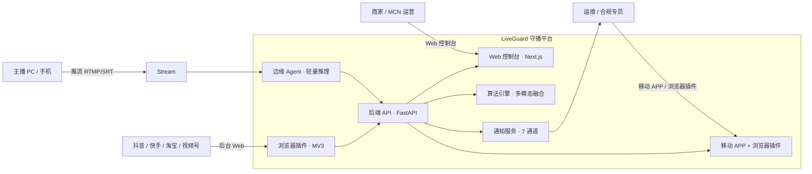
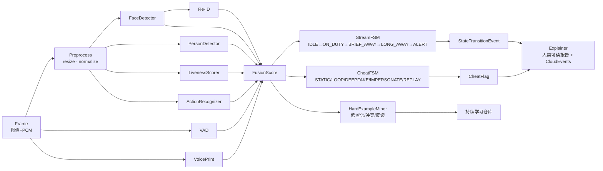
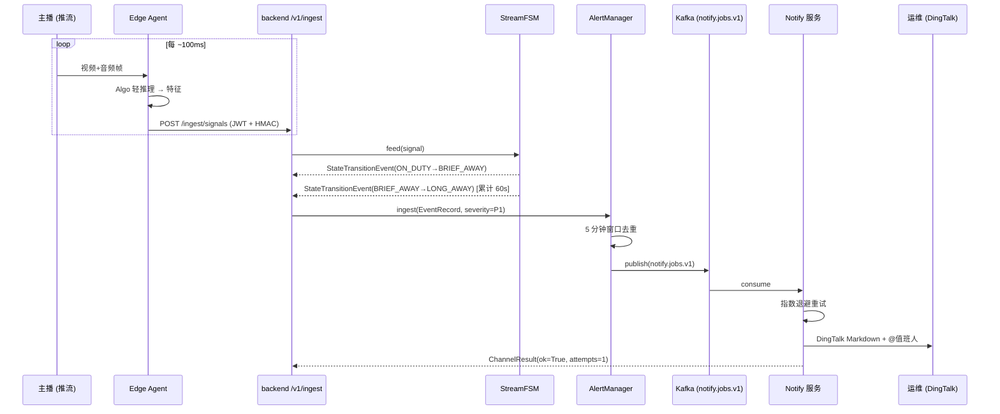
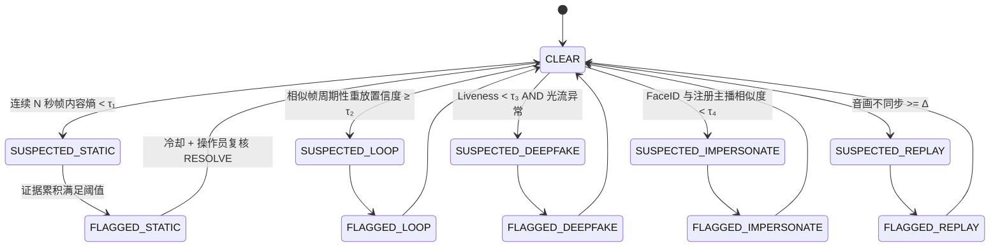
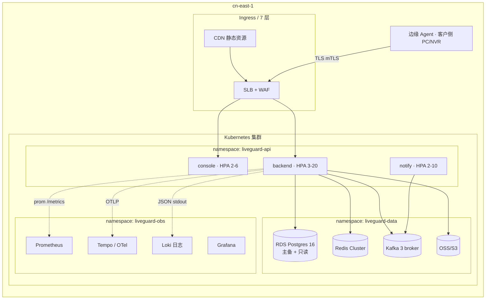
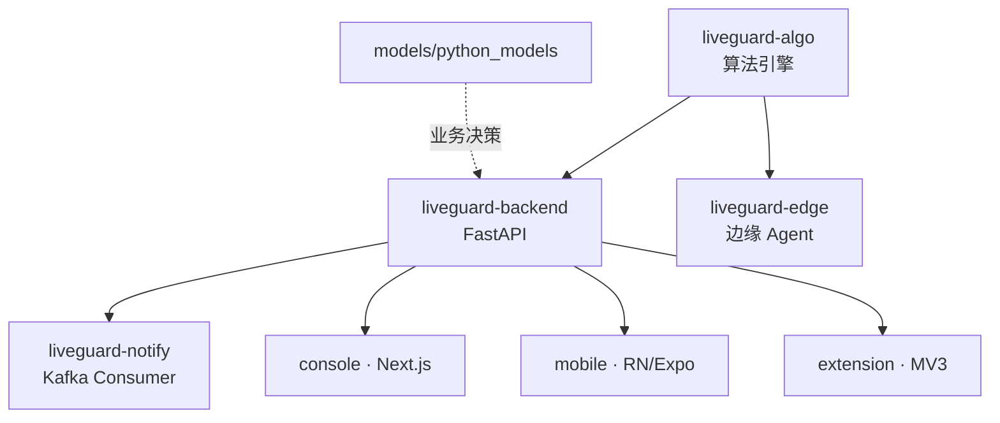
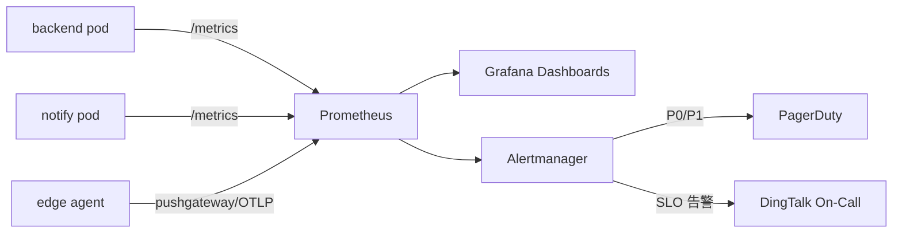

# 守播 LiveGuard AI · 架构图集

> 所有图使用 [Mermaid](https://mermaid.js.org/) 描述，GitHub / GitLab / Notion / VS Code 原生渲染。
> 配套高端渲染位图位于 `docs/images/`，可直接放入商业计划书 / 商务 PPT / 官网。

## 1. 业务上下文（Context）



## 2. 系统架构（Container）

```mermaid
flowchart TB
    classDef svc fill:#0f52db,stroke:#fff,color:#fff
    classDef data fill:#16a34a,stroke:#fff,color:#fff
    classDef bus fill:#f59e0b,stroke:#fff,color:#fff

    subgraph Edge["边缘侧"]
        E1[RTMP/SRT/WHEP<br/>拉流]
        E2[Algo 轻量推理<br/>ONNX · INT8]
        E3[特征上报<br/>httpx + tenacity]
        E1 --> E2 --> E3
    end

    subgraph Cloud["云端"]
        subgraph Gateway["网关层"]
            G1[Nginx / Envoy]
            G2[WAF + Rate Limit]
        end

        subgraph App["应用层"]
            B1[backend · FastAPI]:::svc
            B2[notify · FastAPI+Kafka consumer]:::svc
            B3[console · Next.js 14]:::svc
        end

        subgraph Algo["算法层"]
            A1[StreamFSM<br/>主播在岗状态机]
            A2[CheatFSM<br/>反作弊状态机]
            A3[多模态融合引擎<br/>Face·Person·Re-ID·Liveness·VAD·Voiceprint·Action]
            A4[难例挖掘<br/>持续学习]
            A1 --> A3
            A2 --> A3
            A3 --> A4
        end

        subgraph Data["数据层"]
            D1[(Postgres 16<br/>pgvector+TimescaleDB)]:::data
            D2[(Redis 7<br/>Cache+RateLimit)]:::data
            D3[(S3 / MinIO<br/>证据存档)]:::data
        end

        subgraph Bus["事件总线"]
            K1((Kafka<br/>events.v1))::: bus
            K2((Kafka<br/>notify.jobs.v1)):::bus
        end
    end

    E3 --> G1 --> G2 --> B1
    B1 --> A1 & A2
    B1 --> D1 & D2 & D3
    B1 --> K1 --> K2
    K2 --> B2
    B3 --> B1
    B2 -->|SMS/Voice/DingTalk/WeWork/Feishu/Webhook/Push| OPS[(运维 / 合规)]
```

## 3. 算法流水线（Algorithm Pipeline）



## 4. 数据流（Sequence · 主播离岗告警）



## 5. 反作弊检测（CheatFSM）



## 6. 部署拓扑（Production Kubernetes）



## 7. 模块依赖（Monorepo）



## 8. 观测链路（Metrics → Alerts）



---

### 渲染导出

本目录已预置 `docs/images/` 以存放品牌图、海报图。将本文件任何 ```mermaid 块 复制到 [mermaid.live](https://mermaid.live) 即可一键导出 SVG/PDF/PNG，字体建议 Inter + Noto Sans SC。
