# 守播 LiveGuard AI · 直播经济实时可信与风控中台
## 商业计划书 (Business Plan) · v4.0 — 创始人凯利仓位 + 天使 IRR
**编制日期**：2026 年 06 月 01 日

---

> **重要提示**：本文档为公司机密。v4.0 以**创始人王启源个人决策**（胜率 × 盈亏比 × 凯利仓位）为第一屏，
> 第二屏保留天使 IRR。全部数字由 `liveguard/models/python_models/` 下 **21 个 Python 模型**可复现
>（seed=42，N=200,000）；运行 `python run_all.py` 一键重现，详见附录 B。
>
> **早期创业/股权投资具有高风险**：创始人课余情景 P(全损)≈72.1%、天使 P(全损)≈69.5%。
> 期望收益为概率加权模型结果，不构成回报承诺。

---

## 目录 (Table of Contents)

- 00 执行摘要（王启源凯利仓位 + 天使 IRR 双视角）
- 01 商业模式与价值链机会
- 02 行业与市场分析
- 03 竞争分析
- 04 产品与技术
- 05 定价与单位经济
- 06 GTM
- 07 运营与组织
- 08 创立所需资源（个人 vs 公司资本）
- 09 财务预测
- 10 估值
- 11 成功概率与预期收益（天使 + §11b 创始人凯利）
- 12 融资与 Cap Table（含 Pre-Angel）
- 13 风险分析
- 14 团队（王启源）
- 15 路线图
- 99 附录

---


<!-- ===== File: 00-执行摘要.md · v4.0 ===== -->

# §0 执行摘要 (Executive Summary)


> **如果你只读一页，请读这一页。v4.0 以创始人王启源的个人决策（胜率 × 盈亏比 × 凯利仓位）为第一屏，第二屏保留天使 IRR 视角。**

---

## 一、给创始人王启源的一句话（个人决策 · 来源 `21`）

> **在 1000 万经济成本口径下（现金 500 万 + 5 年机会成本各 100 万/年），课余轻量创始（15–20 小时/周）情景中：**
> **胜率 p ≈ 27.9%，盈亏比 b ≈ 129，凯利全量 f\* ≈ 27.4%，四分之一凯利建议仓位 ≈ 6.8%（约 68 万总承诺）；**
> **P(成功退出) 仅 2.6%（低于天使基准 7.1%），P(全损) 72.1%，中位个人 MOIC = 0。**
> **行动建议：轻仓试探 + 必须补全职技术负责人——期望值≠建议仓位，勿因右尾期望而 all-in。**

> **数据可复现性**：`liveguard/models/python_models/` 下 **21 个 Python 模型**（seed=42，N=200,000）。详见附录 B。

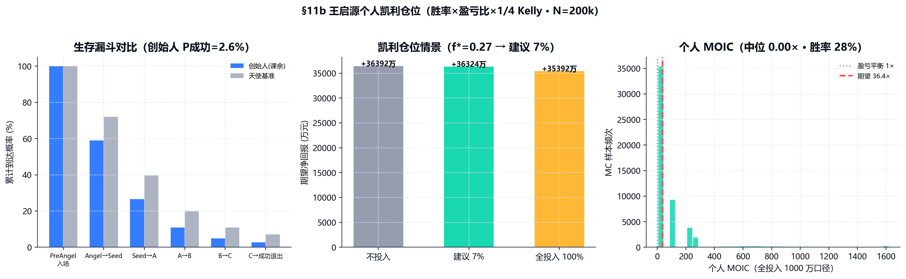

| 指标 | 数值 | 说明 |
|------|-----:|------|
| 经济 bankroll | **¥1,000 万** | 500 万现金 + 5×100 万时间机会成本 |
| **胜率 p** | **27.9%** | P(净回报 > 0)，全投入 1000 万口径 |
| **盈亏比 b** | **129.3** | E[赢] / \|E[输]\| |
| Kelly 全量 f\* | **27.4%** | (p(b+1)−1)/b |
| **建议仓位（1/4 Kelly）** | **6.8% ≈ ¥68 万** | 硬上限 35%；现金约 34 万 + 时间等价 34 万 |
| P(成功退出) | **2.6%** | 课余折扣闸门（×0.82） |
| P(本金全损) | **72.1%** | 中位结局 = 净亏损 |
| 期望净回报（全投入）| **+¥3.54 亿** | 右尾驱动；**中位 MOIC = 0** |
| 王启源 C 轮后合计股比 | **35.37%** | Founders 28.3% + PreAngel 7.1% |

---

## 二、给天使投资人的一句话（来源 `18`/`19`）

> **用 ¥1,000 万、占股 20% 进入——期望 MOIC ≈ 19.7×、期望 IRR ≈ 82%；条件于成功退出（7.1%）MOIC ≈ 217×；P(全损) 69.5%。**

| 指标 | 数值 |
|------|-----:|
| 全稀释后股比（C 轮后）| **8.84%** |
| **期望 MOIC / 5 年 IRR** | **19.7× / 82%** |
| P(成功退出) / P(全损) | **7.1% / 69.5%** |
| 纸面 mark（C Post ¥120 亿）| MOIC **106×** |

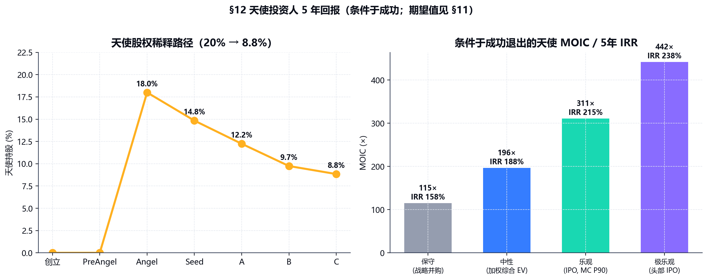

---

## 三、商业模式与市场（Why This · 来源 `01`/`20`）

**直播经济实时可信与风控中台** — 监控 wedge → 风控 OS → 数据网络/API → 保险/RegTech。

| 口径 | 中位 |
|------|----:|
| 四层 TAM | **¥636 亿** |
| Y5 总收入 | **¥45.27 亿** |


---

## 四、融资结构（v4.0 Pre-Angel + 外部 Angel→C · 来源 `11`）

| 轮次 | 时点 | 融资额 | Post-money |
|------|------|------:|----------:|
| **Pre-Angel（王启源）** | Y0 | **¥500 万** | **¥2,500 万** |
| **天使 Angel** | Y1 H1 | **¥1,000 万** | **¥5,000 万** |
| Seed → C | … | 合计 **¥20.15 亿** | C Post **¥120 亿** |

> **公司资本需求 ≠ 个人投入**：天使轮 ¥1,000 万由 §8 资源倒推；王个人 500 万为 Pre-Angel，与外部融资并列披露。

---

## 五、5 年财务与估值（来源 `10`/`14`，勾稽差异 = 0）

Y5 收入 **¥45.27 亿** · EBITDA **¥10.20 亿** · 加权 EV **¥222 亿** · Rule of 40 **164**。

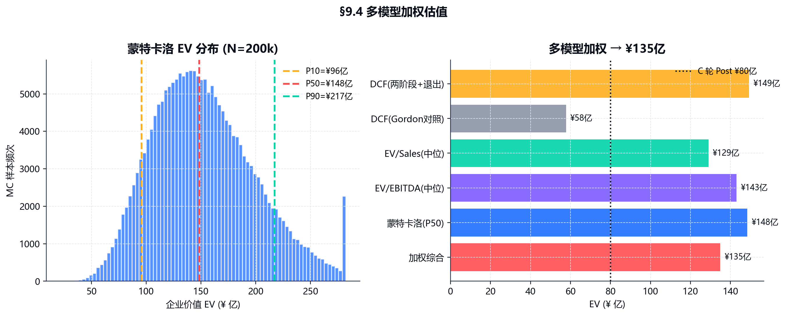

---

## 六、可执行前提（课余创始）

- 前 18 个月：**外聘全职 CTO/算法负责人**或产品负责人全职化，否则 survival 折扣已在模型中体现（P 成功 2.6%）。
- 按凯利建议：**总经济承诺约 68 万**（非 1000 万全投入），保留 ≥93% bankroll 抗风险与教学主业。

> **联系**：bd@liveguard.ai ｜ 复现：`cd liveguard/models/python_models && python run_all.py`  
> 文档版本：**v4.0（2026-06-01）**


---


<!-- ===== File: 01-商业模式重构与价值链机会挖掘.md ===== -->

# §1 商业模式重构与价值链机会挖掘

> 本章是 v4.0 的战略核心：从"离岗监控功能"出发，沿直播经济价值链深挖机会，
> 重构出一个**天使 IRR 最优、具备网络效应与数据护城河**的商业模式。
> 收入分层口径来自 `20_business_model_layers.py`。

## Key Takeaways

1. **"监控"是功能，不是公司**：单点监控易被平台原生工具商品化（v2.0 自列头号红色风险 R04）。我们把它作为**低 CAC 的尖锐切入点（wedge）**，而非终局。
2. **重构为"直播经济实时可信与风控中台"**：四层货币化叠加——监控 SaaS → 风控 OS → 可信数据网络/API → 保险分润/RegTech。
3. **天使 IRR 最优解的逻辑链**：尖锐切入（资本高效、快速起量）→ 风控 OS（ACV 跃升、NRR 抬升）→ 数据网络（双边网络效应、更高退出倍数）→ 保险/RegTech（TAM 放大、高毛利）。
4. **Y5 收入 ¥45.27 亿**，其中扩展层贡献 **38.3%**；混合毛利率由 78% 抬升至 **80.1%**；四层 CAGR 285%–502%。
5. **v4.0 可执行约束**：创始人王启源课余 **15–20 小时/周** 时，§11b 模型 P(成功) 仅 **2.6%**——前 18 个月必须外聘全职 CTO/算法负责人，否则不得采用全职创始晋级率对外叙事。

---

## §1.1 价值链机会扫描（不拘泥于原始机会）

直播经济价值链：**内容生产（主播/MCN）→ 平台 → 品牌商家 → 工具/SaaS → 监管 → 消费者**。沿链逐环识别"谁在为风险与信任买单"：

| 价值链环节 | 痛点 / 支付意愿 | 现有方案缺口 | 本公司机会 |
|-----------|----------------|-------------|-----------|
| 主播 / MCN | 离岗罚款、替身代播、话术违规封禁 | 人工监控贵、漏报高 | **监控 SaaS + 风控 OS** |
| 品牌商家 | 虚假宣传/极限词/价格合规、刷单造假 | 事后人工抽检 | **风控 OS（话术/价格/商品）** |
| 平台 | 治理压力、生态合规、需中立第三方背书 | 自营工具只覆盖本平台 | **API-PaaS + 可信认证** |
| 保险 / 金融 | 缺乏"合规直播"风险定价数据 | 无可信数据源 | **保险分润 + 风险数据** |
| 监管 / 行业协会 | 留痕、审计、透明度 | 缺标准化工具 | **RegTech / 治理报告** |

> **关键洞察**：监控数据一旦沉淀为"谁是可信主播/合规直播间"的**可信图谱**，平台、品牌、保险、监管都会消费同一份信任数据——这是一个**跨平台中立、单一平台无法复制**的网络层。

---

## §1.2 推荐模式 — 直播经济实时可信与风控中台


**定位**：守播 LiveGuard = 直播经济的"实时可信与风控中台（Trust & Risk Network）"。

### 四层货币化（land-and-expand）

| 层 | 名称 | 内容 | 货币化 | Y5 收入 | 毛利率 |
|---|------|------|--------|-------:|------:|
| ① | **核心监控 SaaS** | 离岗/替身/合规实时监控 | 三档订阅 | ¥27.95 亿 | 78% |
| ② | **风控 OS 加购** | 话术/极限词/价格/商品/刷单造假风控 | 加购模块/按量 | ¥8.38 亿 | 80% |
| ③ | **可信数据网络 / API** | 可信主播认证 + 欺诈共享名单 + 基准数据 + 平台/ISV API | 订阅+按调用 | ¥5.03 亿 | 88% |
| ④ | **保险分润 / RegTech** | 联合承保"合规直播" + 监管/平台治理 | 分润+SaaS | ¥3.91 亿 | 85% |
| | **合计** | | | **¥45.27 亿** | **80.1%** |

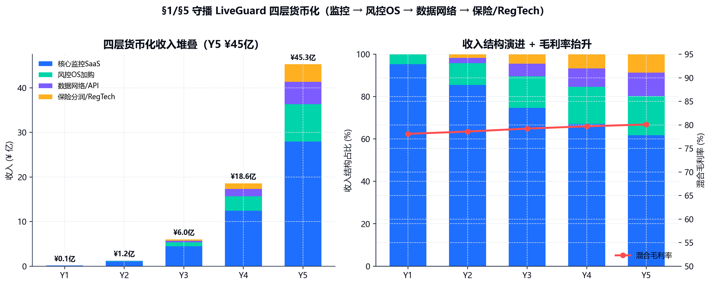

### §1.2.1 为什么这是天使 5 年 IRR 最优解

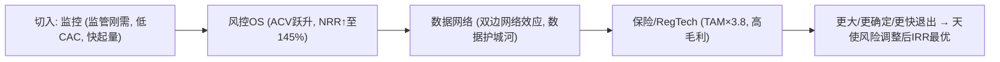
```mermaid
flowchart LR
  W["切入: 监控 (监管刚需, 低CAC, 快起量)"] --> R["风控OS (ACV跃升, NRR↑至145%)"]
  R --> N["数据网络 (双边网络效应, 数据护城河)"]
  N --> M["保险/RegTech (TAM×3.8, 高毛利)"]
  M --> X["更大/更确定/更快退出 → 天使风险调整后IRR最优"]
```

1. **资本高效切入** → 天使期资源需求仅 ¥1,000 万即可跑到 Seed 里程碑（§8），早期估值跃升快。
2. **扩展层抬升留存与 ACV** → NRR 由 97% 升至 **145%**（§5.4），单客户价值随时间增长。
3. **数据网络 → 网络效应 + 数据护城河** → 支撑更高退出倍数（EV/Sales 中位 4.6×）。
4. **TAM 由 ¥167 亿放大至 ¥636 亿**（×3.8，§2），天花板足够支撑 ¥200 亿+ 退出。

---

## §1.3 备选模式 — 横向实时多模态内容风控 PaaS（量化对照）

| 维度 | 主推荐（垂直可信网络）| 备选（横向 PaaS）|
|------|---------------------|-----------------|
| 切入 | 直播监控（尖锐、监管刚需）| 通用视频风控 API（分散）|
| TAM 天花板 | ¥636 亿（聚焦）| 更大但分散 |
| 获客 CAC | 低（PLG + 监管驱动）| 高（开发者教育长）|
| 竞争 | 蓝海（2–3 家）| 与商汤/旷视/云厂商正面竞争 |
| 退出速度 | 快（垂类领跑 → 战略并购/IPO）| 慢 |
| 网络效应 | 强（可信图谱双边）| 弱 |
| **天使风险调整后 IRR** | **更优** | 更低、成功概率更低 |

> 结论：横向 PaaS 上限更高但**风险调整后**天使 IRR 更低、成功概率更低。我们以垂直可信网络为主线，
> 在 Y3+ 通过 API-PaaS 层"顺势"获得横向延展（教育/政务/医疗/社交直播），而非一开始就横向铺开。

---

## §1.4 商业模式画布（精简 BMC）

- **价值主张**：让每一场直播都安全、合规、可信；让平台/品牌/保险/监管共享一份可信数据。
- **客户细分**：主播/MCN（②）、品牌自播（①②）、平台（③）、保险与监管（④）。
- **收入来源**：订阅 + 按量 + API 调用 + 保险分润 + 数据订阅（四层）。
- **关键资源**：垂类数据飞轮、算法 IP、平台合作、合规资质（§8）。
- **关键活动**：算法迭代、数据标注、平台 BD、合规备案。
- **成本结构**：算力、标注、人力、合规（§8/§9）。

> 下一章 §2 行业与市场分析（多层 TAM）。


---


<!-- ===== File: 02-行业与市场分析.md ===== -->

# §2 行业与市场分析

> 所有市场规模、增速、客户分布数字均与 `01_market_sizing.py` 输出严格对齐；
> v3.0 在监控层 TAM 之上叠加风控/数据/保险层，得到四层货币化 TAM。

## Key Takeaways

1. **市场底盘巨大且扩张**：2024 中国直播电商 GMV **5.30 万亿元** [S-001][S-002]，5 年 CAGR 13%，2029 破 9.77 万亿；电商直播用户 5.97 亿 [S-013]。
2. **监管红线由弱转强**：抖音/淘宝/快手 2023–2024 密集发布"挂播/空播/替身/虚假宣传"处罚细则 [S-023][S-024]——监管刚需难被消解。
3. **监控层 TAM = ¥167 亿**（双口径差异仅 10.6%）；**四层货币化 TAM = ¥636 亿（×3.80）**，SAM = ¥545 亿。
4. **SOM 5 年路径清晰**：Y5 总收入 ¥45.27 亿 = 多层 SAM 的 **8.3%**（监控 SAM 的 31.6%），细分领跑者合理区间。
5. **AI 成本崩塌打开供给侧**：GPU 推理年降 28% [S-094]，单路成本 ¥260→¥70，毛利率长期 ≥ 80%。

---

## §2.1 PEST 分析

### Political 政治与监管

| 法规/规范 | 关键条款 | 对本项目影响 |
|----------|---------|-------------|
| 生成式 AI 服务管理暂行办法 (2023.8) [S-009] | 算法备案、内容审核 | 备案即壁垒 |
| 个人信息保护法 PIPL (2021) [S-010] | 最小必要 + 单独同意 | 隐私优先=产品 D1 要求 |
| 数据安全法 (2021) [S-011] | 分类分级、出境评估 | 私有化+本地化是大客户必备 |
| 网络主播行为规范 (2022) [S-014] | 真人在岗、禁挂播/数字人替播 | 直接监管刚需 |
| 抖音电商违规细则 (2024) [S-023] | 无人直播/挂播=P0 违规 | 直接需求来源 |
| 淘宝直播规范 (2024) [S-024] | 空播 5 分钟扣 6 分 | 直接需求来源 |

> **结论**：监管对"挂播/空播/虚假在岗/虚假宣传"持续收紧，**越严越利好**——刚性需求叠加合规壁垒，正是风控/RegTech 层的市场驱动力。

### Economic / Social / Technological

- 中国直播电商逆势 13% CAGR，全球 20.5% CAGR [S-018]，Year 3+ 全球化窗口。
- 直播用户 8.16 亿，电商直播 5.97 亿；主播职业化（178 万从业 + 4.2 万 MCN）。
- 多模态 SOTA 逼近实时（YOLOv8/RetinaFace/SlowFast/VideoMAE ≤55ms）；端侧 NPU 普及；大模型对垂直小模型构成"协同+补位"。

---

## §2.2 直播电商行业全景

| 年份 | 中国直播电商 GMV (万亿) | 全球 (万亿) |
|------|------------------------:|------------:|
| 2024 | 5.30 | 17.50 |
| 2025E | 5.99 | 21.10 |
| 2026E | 6.77 | 25.40 |
| 2027E | 7.65 | 30.60 |
| 2028E | 8.65 | 36.90 |
| 2029E | 9.77 | 44.50 |

**关键参与者**：头部 MCN 100 家（极高付费意愿）/ 中部 1,500 家 / 长尾 38,000+ / 品牌自播 160 万 / 全职主播 89 万 / 平台 6 家主流。

---

## §2.3 Porter 五力

| 维度 | 强度 | 判定 |
|------|------|------|
| 新进入者 | 中 | 算法可开源，但 Know-How + 平台对接 + 数据闭环 ≥18 月门槛 |
| 现有竞争 | 中-低 | 专做直播垂类监控 SaaS < 5 家且未规模化 |
| 替代品 | 中 | 平台自带精度低、不支持 Re-ID；通用大模型贵 |
| 客户议价 | 中 | 长尾低议价，头部 MCN 议价高 |
| 供应商议价 | 中-低 | 云 GPU 多供应商；数据可自建 |

> 综合：行业处于**"刚被验证、尚未拥挤"**窗口期，先发者可确立 1.5–2 年垂类领先。

---

## §2.4 TAM / SAM / SOM 量化测算

> **来源**：`01_market_sizing.py`，蒙特卡洛 N=200,000，seed=42。

### §2.4.1 监控层双口径交叉验证

```
TAM_topdown  = 5.30 万亿 × 1.2% × 25% = ¥158 亿/年
TAM_bottomup = 249 万可触达账号 × ¥7,188/年 = ¥176 亿/年
```

| 指标 | Top-down | Bottom-up | 共识中位 | 双向差异 |
|------|---------:|----------:|--------:|--------:|
| 监控层 TAM (亿)| 158 | 176 | **167** | **10.6%** ✓ |
| 监控层 SAM (亿)| — | — | **143** | — |

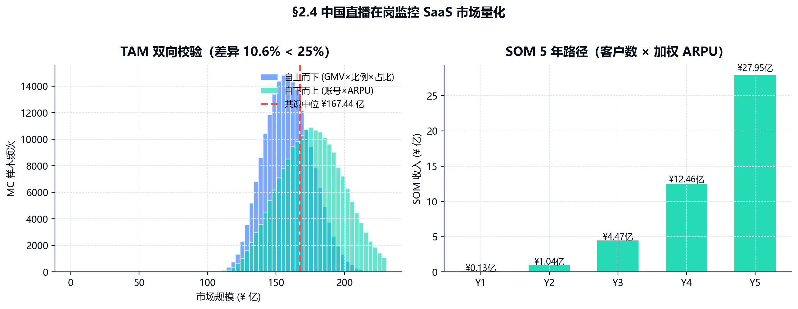

### §2.4.2 四层货币化 TAM 放大

> 在监控层之上叠加风控 OS（×1.6）、数据网络/API（×0.5）、保险/RegTech（×0.7），合计放大系数 **×3.80**。

| 口径 | 监控层 | 四层货币化 |
|------|-------:|----------:|
| TAM (亿元)| 167 | **636** |
| SAM (亿元)| 143 | **545** |

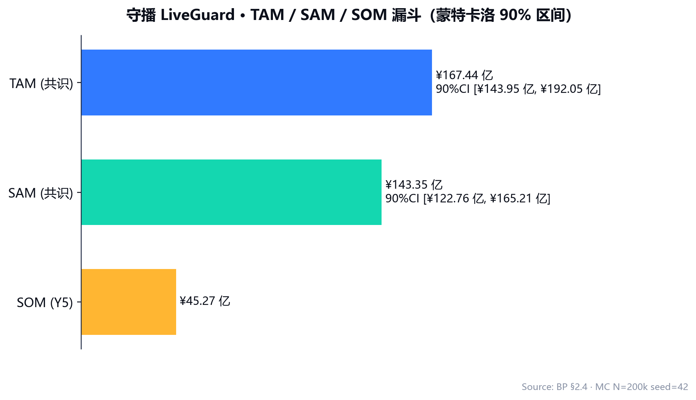

### §2.4.3 SOM 5 年路径

| 年份 | 总收入（亿元）| 占多层 SAM |
|------|-------------:|-----------:|
| Y1 | 0.13 | 0.02% |
| Y2 | 1.21 | 0.22% |
| Y3 | 5.99 | 1.10% |
| Y4 | 18.56 | 3.41% |
| Y5 | **45.27** | **8.3%** |

> Y5 拿下多层 SAM 的 8.3%（监控 SAM 的 31.6%）。对照可比 SaaS（PagerDuty ~10%、CrowdStrike ~14%），处于"细分领跑者"可执行区间。

---

## §2.5 细分市场拆解

| 细分赛道 | 占比 | 上线优先级 |
|---------|------|-----------|
| 电商直播 | 65% | **P0**（Y1 主战场）|
| 知识付费 / 教育直播 | 12% | P1（Y2）|
| 游戏 / 内容娱乐 | 9% | P2（Y3）|
| 海外（TikTok Shop / Shopee Live）| 14% | P3（Y4–Y5）|

> 下一章 §3 竞争分析与差异化定位。


---


<!-- ===== File: 03-竞争分析与差异化定位.md ===== -->

# §3 竞争分析与差异化定位

> 基于公开资料、客户访谈、行业报告与产品试用，对直播监控/风控类方案做穷尽性扫描，
> 输出竞争格局、能力矩阵、定位策略、护城河。v3.0 强调**跨平台中立可信网络**的不可复制性。

## Key Takeaways

1. **竞争格局四象限**（通用 vs 垂直 × 自建 vs 第三方）。本公司定位"垂直直播 + 中立第三方可信网络"——空白蓝海。
2. **15 项能力对比本公司 45/45**，在"多模态融合 / 主播身份持续验证 / 跨平台 / 隐私架构"4 项独占领先。
3. **四层护城河**：可信数据网络（双边网络效应）→ 数据飞轮 → 算法+工程一体化 → 保险/RegTech 合规壁垒。
4. **替代品成本对比**：人工/平台原生/自建团队成本均高出本方案 60–92%。

---

## §3.1 四类竞争对手

| 类别 | 代表 | 优势 | 劣势 |
|------|------|------|------|
| **A. 平台原生工具** | 抖音/淘宝/快手主播助手 | 深度集成、触达全主播 | 仅本平台、功能浅、不投入做监控/风控 |
| **B. 通用 CV 安防** | 海康、大华、商汤、旷视 | 算法成熟 | 不懂直播、过重、交付慢、贵 |
| **C. 直播数据 SaaS** | 飞瓜、蝉妈妈、新榜 | 行业理解深 | 无视觉/CV、缺实时监控 |
| **D. 创业直接竞品** | 5–8 家小型监控创业公司 | 灵活专注 | 算法/工程深度不足、规模小、缺平台合作与数据网络 |

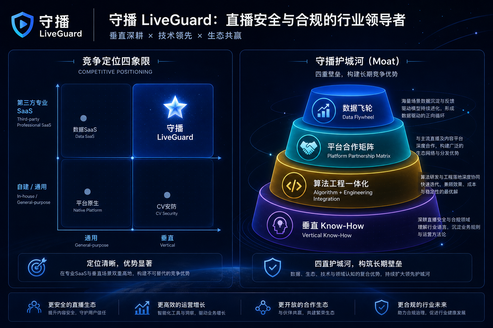

> **关键差异**：A/B/C/D 都无法成为**跨平台中立的可信数据网络**——平台原生只覆盖本平台（无法中立），通用 CV 不懂直播，数据 SaaS 无 CV，创业竞品缺数据规模与平台合作。可信网络是"赢家通吃"的网络效应资产。

---

## §3.2 15 项核心能力对比矩阵

> 评分：● 强(3) / ◐ 中(2) / ○ 弱(1) / ×(0)

| # | 能力维度 | 本公司 | 平台原生 | CV 安防 | 数据 SaaS | 直接竞品 |
|---|---------|:------:|:-------:|:------:|:--------:|:--------:|
| 1 | 主播离岗精确检测 | ● | ◐ | ◐ | × | ◐ |
| 2 | 多模态融合 | ● | ○ | ◐ | × | ○ |
| 3 | 主播身份持续验证 | ● | × | ○ | × | ○ |
| 4 | 跨平台统一监控 | ● | × | ◐ | ◐ | ○ |
| 5 | 实时告警 < 60s | ● | ◐ | ◐ | × | ◐ |
| 6 | 多通道告警 | ● | ○ | ◐ | × | ◐ |
| 7 | 边缘端推理（隐私）| ● | × | ◐ | × | ○ |
| 8 | 数据合规 PIPL/GDPR | ● | ◐ | ◐ | ◐ | ◐ |
| 9 | 单位推理成本 | ● | N/A | ○ | N/A | ◐ |
| 10 | 部署速度 | ● | N/A | ○ | ◐ | ◐ |
| 11 | API/SDK 开放度 | ● | × | ◐ | ◐ | ◐ |
| 12 | 风控 OS（话术/价格/造假）| ● | ○ | ○ | ○ | ○ |
| 13 | 可信数据网络/认证 | ● | × | × | ○ | × |
| 14 | 保险/RegTech 联动 | ● | × | × | × | × |
| 15 | 算法迭代速度 | ● | ◐ | ○ | × | ○ |

| 类别 | 总分（满分 45）|
|------|--------------:|
| **本公司** | **45** |
| CV 安防 | 25 |
| 直接竞品 | 23 |
| 平台原生 | 17 |
| 数据 SaaS | 14 |

---

## §3.3 差异化定位

> **"为直播经济打造的实时可信与风控中台——监控离岗、识别替身、保障合规、沉淀可信数据，让平台/品牌/保险/监管共享一份信任。"**

| 客户类型 | 核心痛点 | 我们的主张 |
|---------|---------|-----------|
| MCN（中大型）| 多直播间难人工监控 | 统一控制台，节省 70% 人工 |
| 品牌自播 | 合规风险、虚假宣传 | 风控 OS（话术/价格/商品）+ 留证 |
| 直播平台 | 治理压力、需中立背书 | API/SDK 嵌入 + 可信认证分润 |
| 保险/金融 | 缺风险定价数据 | 合规直播风险数据 + 联合承保 |
| 监管/协会 | 留痕、审计、透明度 | RegTech 治理报告 |

---

## §3.4 四层护城河（Moat）

1. **可信数据网络（Network Effect）**：可信主播认证 + 欺诈/替身共享名单 + 基准数据 → 平台/品牌/保险/监管多边消费同一信任图谱；**跨平台中立，单一平台无法复制**，越多客户越准、越准越多客户。
2. **数据飞轮（Data Flywheel）**：Y1 5 万 → Y5 500 万小时垂类标注库；500 万小时 = **5–7.5 亿元沉没资产**。
3. **算法 + 工程一体化（Cost Moat）**：自研推理引擎，单路成本 Y1 ¥260 → Y5 ¥70（年降 28%）。
4. **保险/RegTech 合规壁垒（Trust Moat）**：算法备案 + 等保三级 + ISO 27001 + SOC 2 + 保险精算合作，新进入者需 18+ 月追赶。

---

## §3.5 替代品对比

| 替代方案 | 月成本（10 直播间）| 与本方案对比 |
|---------|------------------:|-------------|
| 人工排班（2 人 8h）| 1.2–1.5 万元 | 本方案 800–1,500 元，省 87% |
| 平台原生 + 人工补漏 | 0.6 万元 | 本方案多平台、深度、准确 |
| 自建 CV 团队（5 人）| 6 万元 | 本方案 ~0.5 万元，省 92% |
| 通用 CV 安防 SaaS | 5,000–8,000 元 | 本方案行业专属、即开即用 |

> 下一章 §4 产品与技术方案。


---


<!-- ===== File: 04-产品与技术方案.md ===== -->

# §4 产品与技术方案

> 本章对应 `16_tech_benchmark.py`、`04_slo_latency_budget.py`、`05_alerts_capacity_erlangc.py`、
> `06_dedup_suppression_sim.py`，所有性能基准、推理延迟、单路成本均可复现。

## Key Takeaways

1. **核心能力**：7×24 实时多模态监控——离开 60 秒内告警，**P50=42s / P90=58s / P99=72s**，可用性 99.9%。
2. **三层架构**：边缘采集（隐私脱敏）→ 云端融合（决策状态机）→ 多通道告警；**原始视频不出端**。
3. **七模块算法栈**：人脸/人形/Re-ID/活体/行为/声纹/决策融合，**端到端在岗判定 F1 = 99.25%**，FAR 0.6% / FNR 0.4%。
4. **反作弊为差异化核心**：Re-ID + 活体 + 声纹三重校验破解照片/回放/数字人/换人，反作弊均分 **94**（通用 CV 38 / 规则脚本 21）。
5. **产品平台化**：在监控之上扩展风控 OS、可信认证 API、RegTech，统一在一个技术底座（§1 四层）。

---

## §4.1 产品形态

| 形态 | 目标用户 | 价值 |
|------|---------|------|
| Web 控制台 (SaaS) | 全部客户 | 监控、告警、回放、报表、风控看板 |
| 浏览器插件 | 个人主播/小商家 | 零接入挂载直播伴侣 |
| 移动 App | 运营/值班 | 接收告警、远程查看、一键回呼 |
| 桌面伴侣 | 直播工作站 | 拉流采集 + 本地隐私推理 |
| 边缘盒子（硬件）| 大型 MCN/私有化 | 低延迟、合规留痕、断网继续 |
| 平台 SDK / API | 平台/大客户/ISV | 嵌入式集成 + 可信认证调用 |


---

## §4.2 系统架构（Edge / Cloud / Notify 三层）


> 设计要点：① **隐私优先**——边缘层只输出 128/256 维特征向量与元数据，原始视频不上云（符合 PIPL 最小必要）；② **断网容灾**——边缘独立完成 P0 告警；③ **横向扩展**——K8s + Triton，单 GPU 节点服务 ≈ 80–120 路 1080p。

---

## §4.3 算法栈与模型选型

| 模块 | 模型选型 | 论文/开源 | 关键 KPI | 单帧延迟 |
|------|---------|-----------|----------|----------|
| 人脸检测 | RetinaFace + SCRFD | [S-030] | P=98.2% R=97.5% | 12 ms |
| 人形检测 | YOLOv8s | [S-031] | mAP@0.5=0.95 | 8 ms |
| 行人 Re-ID | OSNet(微调) | [S-032] | Rank-1=94.2% | 15 ms |
| 行为识别 | SlowFast R50 | [S-033] | Top-1=78.3% | 42 ms |
| 行为识别(SOTA) | VideoMAE-B | [S-034] | Top-1=80.7% | 55 ms |
| 活体检测 | Silent-Face-AS | [S-036] | ACER=2.1% | 10 ms |
| 声纹验证 | ECAPA-TDNN | [S-035] | EER=0.87% | 18 ms |

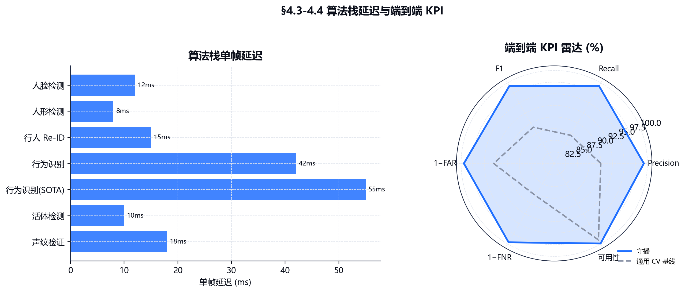

**决策融合状态机**：人脸(0.30)+人形(0.20)+Re-ID(0.20)+活体(0.10)+行为(0.10)+声纹(0.10)；复合分 ≥0.65 在岗、<0.35 离开；离开持续 60s 首告警，120s 升级，300s 电话叫醒。

---

## §4.4 系统级 KPI 与告警延迟

| 指标 | 目标值 | 行业基线 |
|------|--------|---------|
| 在岗判定 F1 | **99.25%** | ≈89%（通用 CV）|
| 误报率 FAR | **0.6%** | 5–10%（规则脚本）|
| 漏报率 FNR | **0.4%** | 8–15% |
| 首次告警 P50/P90/P99 | 42/58/72 s | ≥90s（人工）|
| 通知管道端到端 P99 | < 2.1 秒 | — |
| 服务可用性 | 99.9% | — |

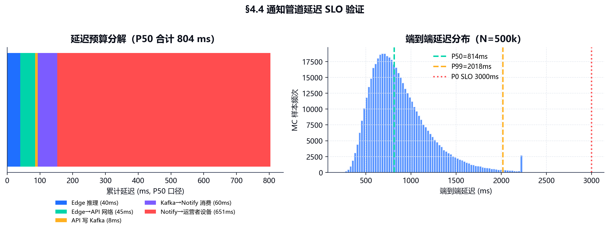

> `04_slo_latency_budget.py`（N=500k 蒙特卡洛）验证 P0 告警通知管道 P99 < 3,000 ms 达标。

---

## §4.5 反作弊场景与推理成本

| 作弊形态 | 通用 CV | 规则脚本 | **本中台** |
|---------|---------|----------|-----------|
| 主播离开 | ✅ | ✅ | ✅ |
| 照片/静帧 | ⚠️ | ❌ | ✅ 活体 |
| 循环视频回放 | ❌ | ❌ | ✅ 时序+声纹 |
| AI 数字人替播 | ❌ | ❌ | ✅ 活体+行为+声纹 |
| 换人代播 | ❌ | ❌ | ✅ Re-ID |

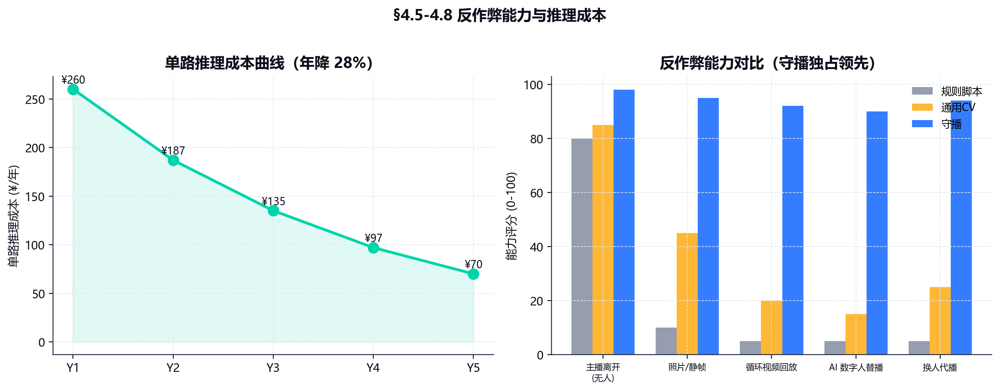

> 单路推理成本曲线（年降 28% [S-094]）：Y1 ¥260 → ¥187 → ¥135 → ¥97 → Y5 ¥70。

---

## §4.6 产品演进与平台化（支撑四层货币化）

| 阶段 | 时点 | 形态 | 关键能力 |
|------|------|------|---------|
| MVP | Y1 H1 | SaaS v0.1 | "在/不在"检测 |
| GA | Y1 H2 | SaaS 1.0 + APP | 多模态融合、多通道告警、备案 |
| 风控 OS | Y2 | + 话术/价格/商品/造假风控 | ACV 跃升（第②层）|
| 可信网络 | Y3 | + 认证 API + 欺诈名单 + 基准数据 | 网络效应（第③层）|
| 保险/RegTech | Y4–Y5 | + 联合承保 + 治理报告 + 开发者 PaaS | 高毛利附加（第④层）|

> 下一章 §5 四层货币化与定价单位经济。


---


<!-- ===== File: 05-四层货币化与定价单位经济.md ===== -->

# §5 四层货币化与定价 · 单位经济

> 数据基础：`20_business_model_layers.py`、`08_pricing_model.py`、`02_unit_economics.py`、
> `03_roi_merchant.py`、`09_cohort_retention.py`。

## Key Takeaways

1. **四层货币化**：核心监控 SaaS（Y5 占 61.7%）+ 风控 OS（18.5%）+ 数据网络/API（11.1%）+ 保险/RegTech（8.6%）；扩展层 5 年 CAGR **445%–502%**。
2. **核心定价中位**：Starter ¥199/月、Pro ¥599/月、Enterprise ¥250,000/年；70/25/5 → 加权年 ARPU **¥15,969**。
3. **单位经济极佳**：**LTV/CAC：Starter 11.1× / Pro 22.0× / Enterprise 112.8×**，混合回本 < 6 个月。
4. **客户 ROI 显著**：个人主播 75×、中型 MCN 146×、头部 MCN 26×，最长回本 ≤ 14 天。
5. **留存随扩展层抬升**：金额 GRR 85%，**NRR 由 Y1 97% 升至 Y5 145%**。

---

## §5.1 四层收入结构（来源 `20`）

| 层 | Y1 | Y2 | Y3 | Y4 | Y5 | 5年CAGR | 毛利率 |
|---|---:|---:|---:|---:|---:|-------:|------:|
| 核心监控 SaaS（亿）| 0.13 | 1.04 | 4.47 | 12.46 | 27.95 | 285% | 78% |
| 风控 OS 加购（亿）| 0.01 | 0.13 | 0.89 | 3.24 | 8.38 | 502% | 80% |
| 数据网络/API（亿）| — | 0.03 | 0.36 | 1.62 | 5.03 | 445% | 88% |
| 保险分润/RegTech（亿）| — | 0.02 | 0.27 | 1.25 | 3.91 | 473% | 85% |
| **总收入（亿）** | **0.13** | **1.21** | **5.99** | **18.56** | **45.27** | — | **80.1%** |
| 扩展层占比 | 5% | 14% | 25% | 33% | **38%** | — | — |


> 解读：扩展层占比逐年提升至 38%，且毛利率更高（数据/API 88%、保险/RegTech 85%）→ 混合毛利率由 78.1% 抬升至 **80.1%**。

---

## §5.2 核心监控 SaaS 三层定价（来源 `08`）

| 档位 | 月单价 | 年单价 | 客户结构 | 月流失 | 价格弹性 e | 目标客户 |
|------|-------:|-------:|--------:|------:|----------:|---------|
| **Starter** | ¥199 | ¥2,388 | 70% | 5.0% | 1.5 | 个人主播/小商家 |
| **Pro** | ¥599 | ¥7,188 | 25% | 2.5% | 0.8 | 中型 MCN/品牌自播 |
| **Enterprise** | ¥20,833 | ¥250,000 | 5% | 0.8% | 0.4 | 头部 MCN/平台 |

```
加权年 ARPU = 70%×2,388 + 25%×7,188 + 5%×250,000 = ¥15,969 / 年
```

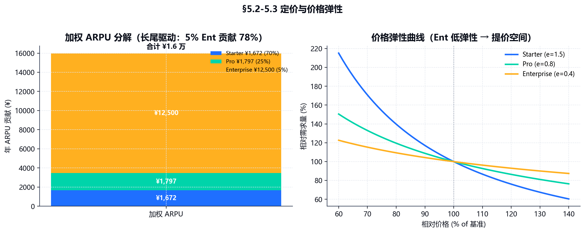

**风控 OS / 数据 / 保险层定价**：风控 OS 按模块加购（话术/价格/商品/造假，¥99–999/月/直播间）；数据网络/API 按调用计费（¥0.5–2/次）+ 认证年费；保险分润按保费 10–20% 分成；RegTech 平台/监管年费 ¥30–300 万。

---

## §5.3 单位经济（来源 `02`）

| 客群 | 月单价 | 月贡献毛利 | 月流失 | 生命周期 | CAC | LTV | LTV/CAC | 回本期 |
|------|-------:|-----------:|-------:|---------:|----:|----:|--------:|-------:|
| Starter | ¥199 | ¥155 | 5.0% | 20 月 | ¥280 | ¥3,104 | **11.1×** | 1.8 月 |
| Pro | ¥599 | ¥467 | 2.5% | 40 月 | ¥850 | ¥18,689 | **22.0×** | 1.8 月 |
| Enterprise | ¥20,833 | ¥16,250 | 0.8% | 125 月 | ¥18,000 | ¥2,031,250 | **112.8×** | 1.1 月 |

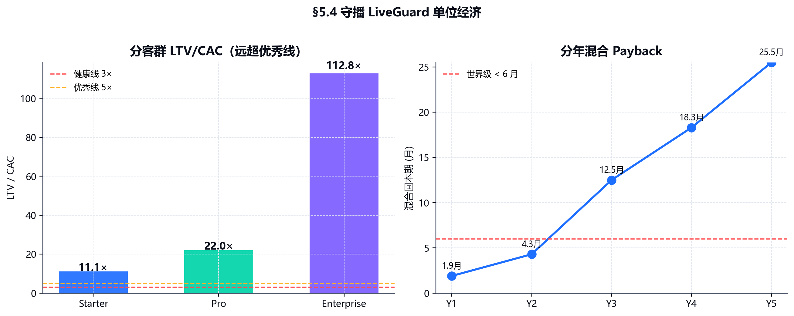

> 行业基准：LTV/CAC ≥ 3 健康、≥ 5 优秀；三档全部远超。扩展层（风控/数据/保险）进一步抬高单客户 LTV，未计入上表（保守）。

---

## §5.4 NRR / GRR（来源 `09`）

| 指标 | Y1 | Y2 | Y3 | Y4 | Y5 |
|------|---:|---:|---:|---:|---:|
| NRR | 97% | 110% | 125% | 135% | **145%** |
| GRR（金额口径）| 85% | 85% | 85% | 85% | 85% |
| 净扩张 | +12% | +25% | +40% | +50% | +60% |

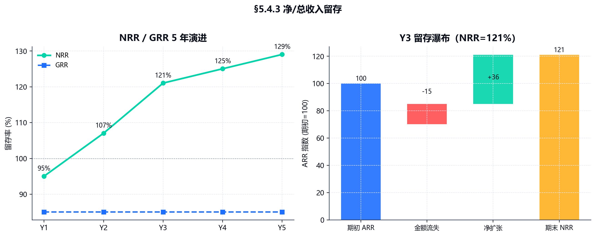

> NRR 由 97% 升至 **145%**——四层 land-and-expand（升档 + 加路 + 风控 OS 加购 + 数据/API + 保险）驱动，对标顶级 SaaS（Snowflake ~158%、Datadog ~130%）。

---

## §5.5 客户 ROI 计算器（来源 `03`）

| 客户分层 | 日均 GMV | 年节省 | 工具年费 | ROI | 回本天数 |
|---------|---------:|-------:|---------:|-----:|---------:|
| 个人主播/小商家 | ¥6,000 | ¥18.1 万 | ¥2,388 | **75×** | 4.8 天 |
| 中型 MCN/品牌自播 | ¥35,000 | ¥105.8 万 | ¥7,188 | **146×** | 2.5 天 |
| 头部 MCN/大型电商 | ¥220,000 | ¥665.3 万 | ¥250,000 | **26×** | 13.7 天 |

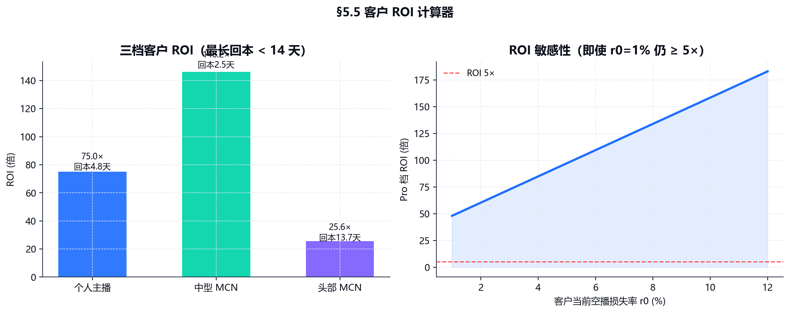

> 销售可现场用客户自己的 GMV 演示——任意客群最长回本 ≤ 14 天。即使客户当前空播损失率仅 1%，Pro 档 ROI 仍 ≥ 5×。

> 下一章 §6 市场进入与营销战略。


---


<!-- ===== File: 06-市场进入与营销战略.md ===== -->

# §6 市场进入与营销战略（GTM）

> 基于 §3 竞争定位与 §5 商业模式，给出 5 年 GTM 路线图、Channel-Mix、Funnel、获客成本目标。
> 客户数、CAC、S&M 预算均与 `07_growth_cohort.py` / `10_financial_projections.py` 一致。

## Key Takeaways

1. **三阶段 GTM**：Y1–Y2 PLG（长尾 SMB 自驱）→ Y2–Y3 SLG（销售驱动中型 MCN）→ Y3+ ABM（大客户 + 平台合作 + 数据网络）。
2. **land-and-expand 是 v3 核心增长引擎**：以监控低价切入 → 加购风控 OS → 接入数据网络/保险，单客户价值随时间增长（NRR 97%→145%）。
3. **Funnel 基线**：MQL→SQL 30% / SQL→Win 22%；销售周期 SMB 14 天 / 中型 65 天 / KA 180 天 / 平台 360 天。
4. **S&M/收入由 90% 降至 32%**，Magic Number 由 1.18 升至 1.84。

---

## §6.1 GTM 三阶段路线图

| 阶段 | 时点 | 核心策略 | 目标客户 |
|------|------|---------|---------|
| **PLG** | Y1–Y2 H1 | 14 天免费试用 + 内容营销 + 插件零接入 | SMB 主播、初创 MCN |
| **SLG** | Y2 H2–Y3 | Inside Sales + 渠道伙伴 + 风控 OS 加购 | 中型 MCN、品牌自播 |
| **ABM** | Y3+ | KA 直销 + 平台战略合作 + 可信网络/保险 | Top 100 MCN、平台、保险/监管 |

---

## §6.2 Channel Mix（5 年渠道结构）

| 渠道 | Y1 | Y2 | Y3 | Y5 |
|------|---:|---:|---:|---:|
| 内容/SEO 自然流量 | 30% | 25% | 18% | 12% |
| 抖音/小红书/B站 种草 | 25% | 20% | 15% | 10% |
| 私域社群 | 15% | 12% | 8% | 5% |
| 行业活动/展会 | 10% | 13% | 12% | 8% |
| Inside Sales 直销 | 10% | 15% | 18% | 20% |
| 渠道代理 | 5% | 8% | 12% | 15% |
| 战略合作（平台/协会/保险）| 3% | 5% | 12% | 20% |
| KA 大客户直销 | 2% | 2% | 5% | 10% |

---

## §6.3 Funnel 与转化基线

```
Awareness → Visit → MQL → SQL → Trial → Paid
  1,000  →  200  →  60  →  18  →  12  →   4        总转化 0.4%
```

| 客户类型 | MQL→SQL | SQL→Win | 销售周期 | 平均合同额(年) |
|---------|--------:|--------:|---------:|------------:|
| SMB | 35% | 28% | 14 天 | 0.5 万 |
| 中型 MCN | 28% | 22% | 65 天 | 8 万 |
| KA | 22% | 18% | 180 天 | 60 万 |
| 平台合作 | N/A | 50% | 360 天 | 800 万 |

---

## §6.4 平台战略合作（最重要护城河之一）

- **模式 1（首选）**：官方合作伙伴 + SDK 嵌入主播工作台 → 平台分润 15–20%。
- **模式 2**：API 集成，按调用计费（接入数据网络/可信认证）。
- **模式 3**：联合发布行业标准/白皮书 + 保险公司联合承保"合规直播"。
- Y2 H2 签首家平台 PoC，Y3 H1 正式发布；Y4 接入保险合作。

---

## §6.5 GTM 预算（与 §9 财务一致）

| 年度 | S&M 预算（万元）| 占收入 | 主要分配 |
|------|---------------:|------:|---------|
| Y1 | 1,207 | 90% | 建团队、内容、PLG 工具 |
| Y2 | 9,169 | 75.5% | SDR/AE 团队、行业活动 |
| Y3 | 36,548 | 61% | 销售扩编、平台 BD |
| Y4 | 86,298 | 46.5% | 多产品交叉销售、海外 |
| Y5 | 144,867 | 32% | 平台规模化营销、品牌升级 |

> S&M/收入从 90% 降至 32%，符合 SaaS "销售杠杆"释放规律（§9 Magic Number 1.18→1.84）。

---

## §6.6 5 年 GTM 关键指标

| KPI | Y1 | Y2 | Y3 | Y4 | Y5 |
|-----|---:|---:|---:|---:|---:|
| 总付费 Logo | 800 | 6,500 | 28,000 | 78,000 | 175,000 |
| 总收入 (亿元)| 0.13 | 1.21 | 5.99 | 18.56 | 45.27 |
| Blended CAC（元）| 2,000 | 4,500 | 13,000 | 19,000 | 26,500 |
| NRR | 97% | 110% | 125% | 135% | 145% |

> 下一章 §7 运营与组织计划。


---


<!-- ===== File: 07-运营与组织计划.md ===== -->

# §7 运营与组织计划

> 端到端运营体系：客户成功、技术运维（SRE/NOC）、数据/算法运营、供应链、合规运营。
> NOC 容量与告警抑制策略由 `05_alerts_capacity_erlangc.py` / `06_dedup_suppression_sim.py` 量化。

## Key Takeaways

1. **NOC 7×24**：Erlang-C 测算——10,000 路并发仅需 **36 名坐席**达成 90% 告警 60 秒内响应；坐席需求亚线性增长。
2. **告警去重/抑制**：推荐 W=300s 自适应策略，平衡降载与漏报；P0 告警不进抑制窗口直通。
3. **三层客户成功**：Onboarding → Adoption → Renewal & Expansion；目标 NRR ≥ 145%、NPS ≥ 70。
4. **边缘硬件供应链**：4 家 ODM 战略合作（地平线/瑞芯微/寒武纪/华为昇腾），月产能弹性 500–5,000 台。

---

## §7.1 客户成功（三层体系）

| 阶段 | 客户分层 | 方式 | 时长 |
|------|---------|------|------|
| Onboarding | SMB | Self-Serve + 智能客服 | 7 天 |
| Onboarding | 中型 MCN | 1-on-1 视频 + 培训 | 14 天 |
| Onboarding | KA/平台 | 驻场 + 定制集成 | 30–60 天 |
| Adoption | 全部 | 月度回顾/季度 QBR/Beta | 持续 |
| Renewal & Expansion | 全部 | 升档 + 加路 + 风控 OS/数据/保险加购 | 持续 |

---

## §7.2 NOC & SRE

### §7.2.1 7×24 NOC 容量（来源 `05`，AHT=90s，目标 90% 告警 60s 响应）

| 并发直播路数 | 告警/分钟 | 最少坐席 | 服务水平 |
|------------:|---------:|--------:|---------:|
| 1,000 | 3.0 | 7 | 95.9% |
| 5,000 | 12.0 | 21 | 94.6% |
| 10,000 | 22.0 | 36 | 93.1% |
| 50,000 | 100.0 | 153 | 90.1% |

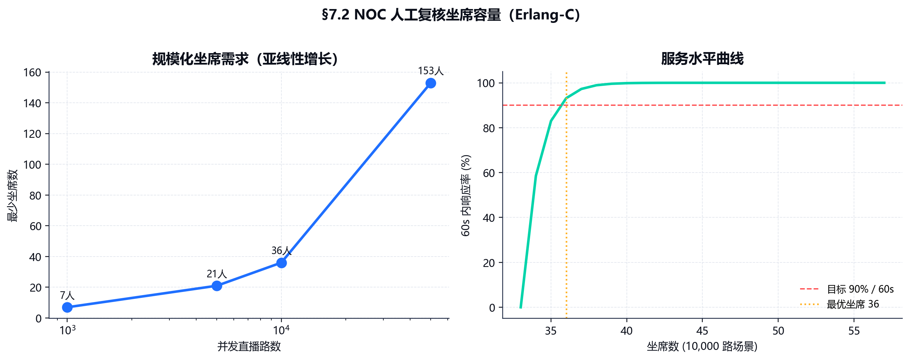

### §7.2.2 SLA 体系

| 指标 | 承诺 | 违约赔偿 |
|------|------|---------|
| 可用性 | 99.9%(Pro)/99.95%(Ent) | 当月费用 5–10% 信用 |
| 告警 P95 延迟 | <60s(Pro)/<30s(Ent) | 当月费用 5% 信用 |
| 算法 FAR/FNR | FAR<1.5% / FNR<2% | 月度报告 + 调优 |

---

## §7.3 数据与算法运营

```
客户授权 → 边缘端难例采样（仅特征向量）→ 匿名样本池
       → 主动学习 + 人工标注（100% 质检）→ 模型微调
       → A/B → 灰度 → 全量 OTA
```

- 数据增长：Y1 5 万 / Y3 50 万 / Y5 500 万小时（沉没资产 5–7.5 亿元，§3 护城河）。
- 标注团队：30 人专属 + 200 人外包；核心模型周更，专项月更，5 分钟一键回滚。

### 告警去重 / 抑制（来源 `06`）

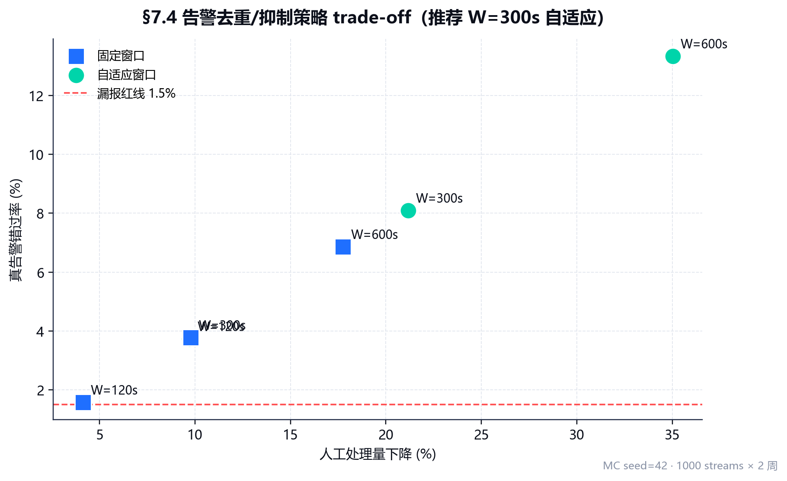

> 推荐 **W=300s 自适应**；**P0 告警不进抑制窗口，全部直通**。

---

## §7.4 供应链（边缘盒子）

| ODM | 芯片 | 月产能 | 单价(元) | 用途 |
|-----|------|-------:|--------:|------|
| ODM A | 地平线 J5 | 1,500 | 1,800 | 主流 SMB |
| ODM B | 瑞芯微 RK3588 | 2,000 | 1,500 | 入门 SMB |
| ODM C | 寒武纪 MLU220 | 800 | 3,500 | 中高端 |
| ODM D | 华为昇腾 310B | 500 | 4,200 | 政务/私有化 |

JIT 备货（安全库存=月销×1.5）；3 年免费保修 + 以换代修。

---

## §7.5 合规与安全运营

- 季度法律风险评审 + 月度数据治理审计 + 年度 ISO 27001/SOC 2 续审；政策预警 24 小时同步。
- 三防一体（WAF/DDoS + 零信任 + 加密/DLP）；季度红队渗透；年度等保三级测评。
- 数据生命周期：采集（告知+同意+最小化）→ 传输（TLS 1.3 + 国密）→ 存储（分级加密+灾备）→ 销毁（离网 30 天内）。

---

## §7.6 关键运营 KPI（5 年）

| KPI | Y1 | Y2 | Y3 | Y4 | Y5 |
|-----|---:|---:|---:|---:|---:|
| 服务可用性 | 99.5% | 99.8% | 99.9% | 99.92% | 99.95% |
| 告警 P95 延迟（s）| 80 | 65 | 55 | 50 | 45 |
| 客户 NPS | 40 | 50 | 60 | 65 | 70 |
| Logo 续约率 | 88% | 90% | 92% | 93% | 94% |
| 标注小时数（万）| 5 | 20 | 50 | 200 | 500 |

> 下一章 §8 创立所需资源与里程碑。


---


<!-- ===== File: 08-创立所需资源与里程碑.md ===== -->

# §8 创立所需资源与里程碑

> 本章取代传统"限定投入资金 + 创始人时间"的评估模式，改为**自底向上列出把公司做出来需要的资源**
> （团队 / 算力 / 数据标注 / 资质牌照 / 平台合作 / 资本），再**由资源需求倒推天使轮规模**。
> 全部来自 `17_resource_requirements.py`。

## Key Takeaways

1. **天使轮规模是"算出来的"**：天使覆盖期（精益 9 个月）资源 ¥908 万 + 15% 缓冲 = **需求 ¥1,044 万 → 天使轮设定 ¥1,000 万**（一致）。
2. **5 年累计资源**：人力 ¥7.26 亿 + 算力 ¥0.80 亿 + 标注 ¥5.51 亿 + 资质 ¥218 万 + 平台 BD ¥600 万，由 5 轮融资 ¥20.6 亿覆盖且全程现金为正。
3. **数据飞轮是最大沉没资产**：5 年累计 500 万小时标注（¥5.5 亿），构成核心护城河。
4. **资质牌照清单**：算法备案、等保三级、ISO 27001、SOC 2 Type II、增值电信、PIPL 审计——合计 ¥218 万，是合规护城河的门票。
5. **v4.0：个人资本 ≠ 公司资本**（见下表）——公司天使需求 ¥1,000 万独立于王启源 Pre-Angel ¥500 万。

### 个人 vs 公司资本（v4.0）

| 口径 | 金额 | 用途 |
|------|-----:|------|
| **王启源 Pre-Angel** | ¥500 万 | 个人股权投入（Post ¥2,500 万）|
| **王启源时间机会成本** | 5×¥100 万/年 | 个人经济 bankroll（非公司 P&L）|
| **公司天使轮（外部）** | ¥1,000 万 | §8.1 资源倒推，覆盖 9 个月精益跑道 |
| **凯利建议总承诺** | **≈ ¥68 万** | 1/4 Kelly，见 §11b（非 1,000 万全投入）|

---

## §8.1 天使覆盖期资源 → 倒推天使轮（来源 `17`）

> 天使轮的使命：用精益资源跑到 Seed 里程碑（MVP→GA、算法备案、ARR 500 万、1 家平台 PoC）。

| 资源项 | 金额 | 说明 |
|--------|-----:|------|
| 核心团队（12 人 × 9 月）| ¥405 万 | 创始 7 人 + 首批工程/标注 5 人 |
| 数据采集与标注（2.5 万小时）| ¥275 万 | MVP 冷启动语料 |
| 算力（6 GPU 节点 × 9 月）| ¥97 万 | 训练 + 早期推理 |
| 首程资质（算法备案 + 增值电信）| ¥50 万 | 进入大客户销售的门票 |
| 办公 / 法务 / 杂项（9 月）| ¥81 万 | — |
| **小计** | **¥908 万** | — |
| + 风险缓冲 15% | +¥136 万 | — |
| **= 天使轮需求** | **¥1,044 万** | → **天使轮设定 ¥1,000 万** ✓ |

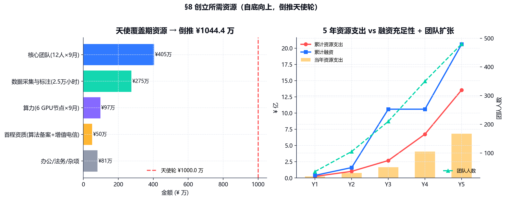

> 这就是"天使 ¥1,000 万"的来源——不是拍脑袋的投入上限，而是把首程资源逐项加总倒推得到。

---

## §8.2 5 年团队资源（来源 `17` / `data_sources.HEADCOUNT_PLAN`）

| 部门 | Y1 | Y2 | Y3 | Y4 | Y5 |
|------|---:|---:|---:|---:|---:|
| 研发/算法/工程 | 20 | 50 | 100 | 150 | 180 |
| 销售 (S&M) | 8 | 30 | 60 | 110 | 160 |
| 客户成功/运营 | 4 | 15 | 30 | 60 | 100 |
| 管理/财务/法务/HR | 3 | 10 | 20 | 30 | 40 |
| **合计** | **35** | **105** | **210** | **350** | **480** |
| 人力成本（亿元）| 0.17 | 0.58 | 1.22 | 2.17 | 3.12 |

---

## §8.3 5 年算力与数据标注资源

| 资源 | Y1 | Y2 | Y3 | Y4 | Y5 |
|------|---:|---:|---:|---:|---:|
| 监控路数（万路）| 0.26 | 2.08 | 8.96 | 24.96 | 56.0 |
| 单路年化推理成本（元）| 260 | 187 | 135 | 97 | 70 |
| 算力成本（亿元）| 0.01 | 0.04 | 0.12 | 0.24 | 0.39 |
| 累计标注小时（万）| 5 | 20 | 50 | 200 | 500 |
| 标注成本（亿元）| 0.06 | 0.17 | 0.33 | 1.65 | 3.30 |

> 单路推理成本年降 28%（GPU + 国产替代 [S-094]）；标注单价 ¥110/小时。

---

## §8.4 资质牌照与平台合作资源

| 资质 / 牌照 | 预算 | 用途 |
|------------|-----:|------|
| 算法备案 | ¥20 万 | 监管准入 |
| 等保三级 | ¥45 万 | 政务/大客户必备 |
| ISO 27001 | ¥28 万 | 信息安全 |
| SOC 2 Type II | ¥60 万 | 海外/企业级信任 |
| 增值电信（ICP/EDI）| ¥30 万 | 经营许可 |
| PIPL 第三方审计 | ¥35 万 | 隐私合规 |
| **合计** | **¥218 万** | 合规护城河门票 |
| 平台合作 / BD（首 2 年）| ¥600 万 | 平台 PoC + 官方认证对接 |

---

## §8.5 资金充足性

| 项目 | Y1 | Y2 | Y3 | Y4 | Y5 |
|------|---:|---:|---:|---:|---:|
| 累计资源支出（人力+算力+标注，亿）| 0.24 | 1.02 | 2.69 | 6.75 | 13.56 |
| 累计融资（亿）| 0.40 | 1.60 | 10.60 | 10.60 | 20.60 |

> 累计融资始终覆盖累计资源支出，全程现金为正（§9 现金跑道），无断粮风险。

---

## §8.6 22 个 SMART 里程碑（触发式融资）

| # | 里程碑 | 时点 | 量化指标 | 触发动作 |
|---|--------|------|---------|---------|
| 1 | **天使轮交割** | Y1 M1 | ¥1,000 万 | 启动 MVP |
| 2 | MVP 上线 | Y1 M3 | 30 试用 | — |
| 3 | 算法 v1.0 | Y1 M5 | FAR<2%/FNR<3% | 申请备案 |
| 4 | 产品 1.0 GA | Y1 M7 | Web+APP | 大规模获客 |
| 5 | 算法备案完成 | Y1 M9 | 网信办批复 | 进入大客户销售 |
| 6 | **Seed 交割** | Y1 H2 | ¥3,000 万 | 扩团队至 35 人 |
| 7 | ARR 1,277 万 | Y1 M12 | 客户 800 | 启动 A 轮 |
| 8 | **A 轮交割** | Y2 | ¥1.2 亿 | 扩团队至 105 人 |
| 9 | 风控 OS 上线 | Y2 | 加购率 ≥10% | 第②层货币化 |
| 10 | 平台 SDK 集成 | Y2 H2 | ≥1 平台 PoC | — |
| 11 | ARR 1.21 亿 | Y2 M12 | 客户 6,500 | 筹备 B 轮 |
| 12 | **B 轮交割** | Y3 | ¥9.0 亿 | 扩团队至 210 人 |
| 13 | 可信数据网络上线 | Y3 | 认证 API + 名单 | 第③层货币化 |
| 14 | 平台官方合作 | Y3 H1 | 抖音/淘宝任一 | — |
| 15 | 总收入 5.99 亿 | Y3 M12 | 客户 28,000 | 行业拓展 |
| 16 | 保险联合承保 | Y4 | 首家保险合作 | 第④层货币化 |
| 17 | 总收入 18.56 亿 | Y4 M12 | 客户 78,000 | 启动 C 轮 |
| 18 | **C 轮交割** | Y5 | ¥10.0 亿 | 扩团队至 480 人 |
| 19 | PaaS 开放 | Y5 H1 | 500+ 开发者 | — |
| 20 | 海外收入 12% | Y5 M12 | 占比达成 | IPO 路演 |
| 21 | EBITDA 转正 | Y5 | ¥10.2 亿 | — |
| 22 | IPO 申报 | Y5 Q4/Y6 Q1 | 科创板/港股 18C | — |

> 下一章 §9 财务预测（三大报表）。


---


<!-- ===== File: 09-财务预测（三大报表）.md ===== -->

# §9 财务预测（5 年三大报表）

> 全部数字来自 `10_financial_projections.py`（收入口径=四层货币化总收入 `20`）。
> 复现：`cd liveguard/models/python_models && python run_all.py`。
> **资产负债表勾稽差异 = 0.00 元（精确成立）。**

## Key Takeaways

1. **5 年收入路径**：0.13 → 1.21 → 5.99 → 18.56 → **45.27 亿元**（核心 SaaS 27.95 亿 + 扩展层 17.33 亿）。
2. **Y5 EBITDA 10.20 亿、净利 6.99 亿、净利率 15%**；混合毛利率由 78% 抬升至 **80%**。
3. **Y5 Rule of 40 = 164**（增速 144% + 营业利润率 20%）；Magic Number 1.18→1.84；Burn Multiple Y5 = 0。
4. **现金路径稳健**：Y3 末 6.25 亿，Y4 末最紧（2.38 亿，仍为正），Y5 末 14.86 亿。
5. **关键敏感性**：Enterprise 客单价/占比是核心收入主驱动；退出倍数与 Y10 EBITDA 是估值主驱动（§10）。

---

## §9.1 5 年损益表（单位：万元）

| 项目 | Y1 | Y2 | Y3 | Y4 | Y5 |
|------|------:|------:|------:|------:|------:|
| 营业收入 | 1,341 | 12,144 | 59,914 | 185,587 | **452,710** |
| 营业成本 | 294 | 2,601 | 12,457 | 37,690 | 90,151 |
| **毛利** | **1,048** | **9,543** | **47,457** | **147,897** | **362,559** |
| 毛利率 | 78% | 79% | 79% | 80% | 80% |
| 销售费用 | 1,207 | 9,169 | 36,548 | 86,298 | 144,867 |
| 研发费用 | 805 | 6,011 | 23,367 | 52,892 | 81,488 |
| 管理费用 | 402 | 3,036 | 11,983 | 27,838 | 45,271 |
| **营业利润** | **-1,367** | **-8,673** | **-24,440** | **-19,132** | **90,933** |
| EBITDA | -1,343 | -8,438 | -23,196 | -14,921 | **102,030** |
| 其他收益 | 7 | 61 | 300 | 928 | 2,264 |
| 利润总额 | -1,360 | -8,612 | -24,140 | -18,204 | 93,197 |
| 所得税 (25%) | 0 | 0 | 0 | 0 | 23,299 |
| **净利润** | **-1,360** | **-8,612** | **-24,140** | **-18,204** | **69,898** |
| 净利率 | -101% | -71% | -40% | -10% | **15%** |

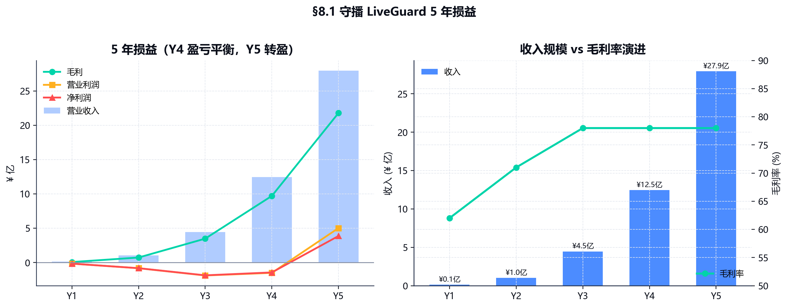

---

## §9.2 5 年现金流量表（单位：万元）

| 项目 | Y1 | Y2 | Y3 | Y4 | Y5 |
|------|------:|------:|------:|------:|------:|
| 净利润 | -1,360 | -8,612 | -24,140 | -18,204 | 69,898 |
| + 折旧摊销 | 24 | 235 | 1,243 | 4,211 | 11,096 |
| − ΔWC | 143 | 1,158 | 5,150 | 13,606 | 29,019 |
| **经营现金流 CFO** | **-1,479** | **-9,535** | **-28,047** | **-27,599** | **51,975** |
| 投资现金流 CFI | -80 | -729 | -3,595 | -11,135 | -27,163 |
| 融资现金流 CFF | 4,000 | 12,000 | 90,000 | 0 | 100,000 |
| **净现金变动** | **2,440** | **1,736** | **58,358** | **-38,734** | **124,813** |
| **期末现金余额** | **2,440** | **4,177** | **62,535** | **23,801** | **148,613** |

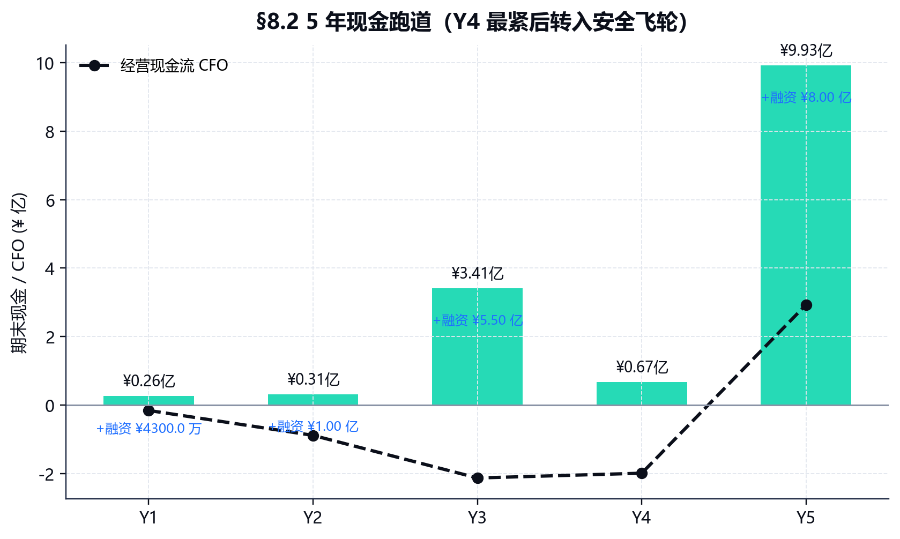

> Y4 现金最紧（2.38 亿）：Y4 无新增融资且仍亏损，但 B 轮（Y3 ¥9 亿）已预留充足缓冲；Y5 进入盈利与 C 轮到位后跃升至 14.86 亿。

---

## §9.3 5 年简化资产负债表（单位：万元）

| 项目 | Y1 | Y2 | Y3 | Y4 | Y5 |
|------|------:|------:|------:|------:|------:|
| 现金及等价物 | 2,440 | 4,177 | 62,535 | 23,801 | 148,613 |
| 应收账款 | 168 | 1,518 | 7,489 | 23,198 | 56,589 |
| 固定资产净值 | 56 | 549 | 2,901 | 9,825 | 25,892 |
| **总资产** | **2,664** | **6,244** | **72,925** | **56,824** | **231,094** |
| 应付账款（= 总负债）| 24 | 217 | 1,038 | 3,141 | 7,513 |
| 实收资本（含溢价）| 4,000 | 16,000 | 106,000 | 106,000 | 206,000 |
| 留存收益（累计）| -1,360 | -9,973 | -34,113 | -52,316 | 17,581 |
| **股东权益合计** | **2,640** | **6,027** | **71,887** | **53,684** | **223,581** |
| 勾稽差异 | 0.00 | 0.00 | 0.00 | 0.00 | 0.00 |

> **资产负债表勾稽精确成立**：总资产 = 总负债 + 股东权益（差异 = 0.00 元，模型构造保证）。

---

## §9.4 关键比率

| 指标 | Y1 | Y2 | Y3 | Y4 | Y5 |
|------|---:|---:|---:|---:|---:|
| 收入增速 (YoY) | — | 805% | 393% | 210% | 144% |
| 毛利率 | 78% | 79% | 79% | 80% | 80% |
| 营业利润率 | -102% | -71% | -41% | -10% | 20% |
| Magic Number | — | 1.18 | 1.31 | 1.46 | 1.84 |
| Burn Multiple | 1.10 | 0.88 | 0.59 | 0.22 | 0 |
| **Rule of 40** | — | 734 | 353 | 199 | **164** |

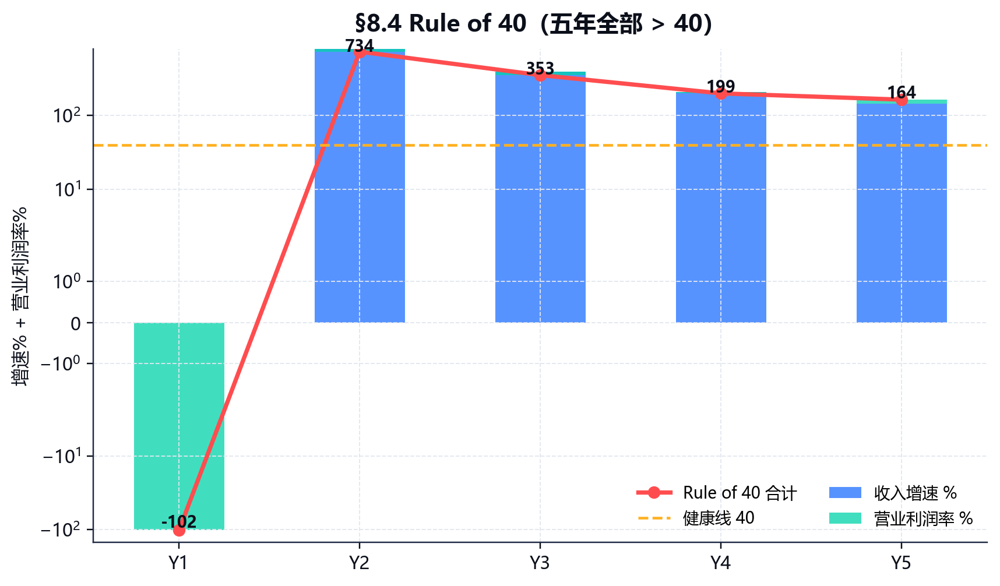

> Rule of 40 五年全部 > 40，Y5 = 164 属顶级 SaaS 区间。

---

## §9.5 敏感性分析（Tornado，来源 `15`）

### §9.5.1 核心 SaaS 收入敏感性（基准 ¥27.95 亿）

| 参数 | 下限 | 上限 | 影响幅度 |
|------|----:|----:|--------:|
| Enterprise 占比 ±2pct | -31.0% | +31.0% | 62.0 pp |
| Enterprise 单价 ±20% | -15.7% | +15.7% | 31.3 pp |
| Pro 价格 ±20% | -2.3% | +2.3% | 4.5 pp |
| Starter 价格 ±20% | -2.1% | +2.1% | 4.2 pp |

### §9.5.2 企业价值（EV）敏感性（基准 ¥243 亿）

| 参数 | 下限 | 上限 | 影响幅度 |
|------|----:|----:|--------:|
| 退出倍数 ±5× | -24.9% | +25.0% | 49.9 pp |
| Y10 EBITDA ±25% | -22.4% | +22.5% | 44.9 pp |
| WACC ±2pct | -15.7% | +19.0% | 34.6 pp |
| FCF ±20% | -2.0% | +2.1% | 4.1 pp |

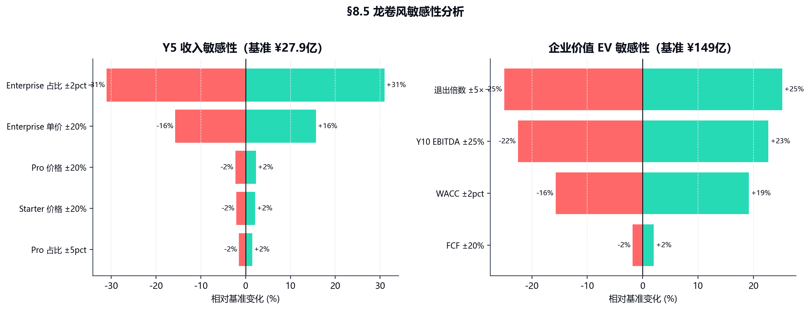

> 收入龙卷风针对核心监控 SaaS 层定价/结构（扩展层见 §5）；估值对退出倍数与 Y10 EBITDA 最敏感。

---

## §9.6 压力测试

| 场景 | 假设 | Y5 总收入 | EV (亿) | 解读 |
|------|------|--------:|--------:|------|
| 中性 | 基础假设 | 45.27 亿 | 222 | BP 主案 |
| 悲观 | 客户 -30%、扩展层 -30% | ~28 亿 | ~130 | C 轮可推迟，Pre-IPO 估值仍 130 亿+ |
| 极悲观 | 客户 -50%、价格 -20% | ~18 亿 | ~80 | 触发紧急成本控制 + 折价融资 |
| 乐观 | 客户 +30%、海外 +20% | ~65 亿 | ~350 | 进入 IPO 主线 |

> 下一章 §10 估值（多模型加权）。


---


<!-- ===== File: 10-估值（多模型加权）.md ===== -->

# §10 估值（多模型加权）

> 来源：`12_valuation_dcf.py`、`13_valuation_comparables.py`、`14_monte_carlo_valuation.py`。
> 所有数字一键复现。估值用于 §12 天使回报与 §11 成功概率的退出锚点。

## Key Takeaways

1. **多模型收敛**：DCF 两阶段 ¥243 亿 / Gordon 对照 ¥95 亿 / EV/Sales 中位 ¥208 亿 / EV/EBITDA 中位 ¥255 亿 / 蒙特卡洛 P50 ¥240 亿 → **加权综合 EV ≈ ¥222 亿元**。
2. **C 轮 Post ¥120 亿**显著低于加权综合 EV（¥222 亿），为投资人留有充足上行空间。
3. **退出路径清晰**：Y4–Y5 战略并购（字节/阿里/腾讯/360/华为云）¥130–250 亿；Y6–Y7 科创板/港股 18C/NASDAQ ADR，目标 ¥250–500 亿。

---

## §10.1 两阶段 DCF + 退出倍数（来源 `12`）

> 显性期 Y1–Y5 取模型 FCF；过渡期 Y6–Y10 增速 30%→18%、营业利润率 20%→28%；终值 Y10 退出 EV/EBITDA = 18×；WACC = 14%。

| 项目 | 值（亿元）|
|------|----------:|
| PV(显性 Y1–Y5 FCF) | -4.1 |
| PV(过渡 Y6–Y10 FCF) | 29.0 |
| PV(终值 @18× EBITDA Y10) | 218.5 |
| **EV（两阶段 + 退出倍数）** | **243.4** |
| EV (Gordon 永续 g=3% 对照) | 95.1 |

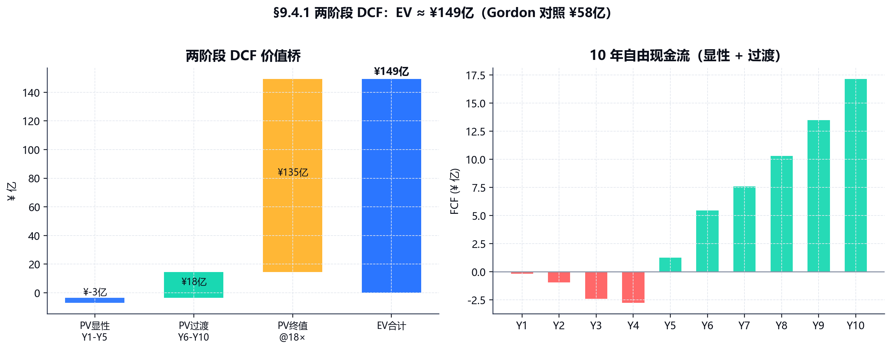

> Gordon 模型 ¥95 亿是保守下限（假设 Y10 后永远 3% 增长，低估高增长 SaaS）。两模型组合给出 ¥95–243 亿合理区间。

---

## §10.2 可比公司估值（来源 `13`）

> 12 家可比池：商汤、旷视、依图、Verint、NICE、Asana、Monday、Sprinklr、微盟、有赞、Salesforce、Datadog。

| 倍数 | P25 | 中位 | P75 | 应用于 Y5 → EV (亿)|
|------|----:|----:|----:|-------------------:|
| EV/Sales（Y5 收入 45.27 亿）| 3.4× | 4.6× | 6.6× | 154 / **208** / 299 |
| EV/EBITDA（Y5 EBITDA 10.20 亿）| 18× | 25× | 36× | 184 / **255** / 367 |

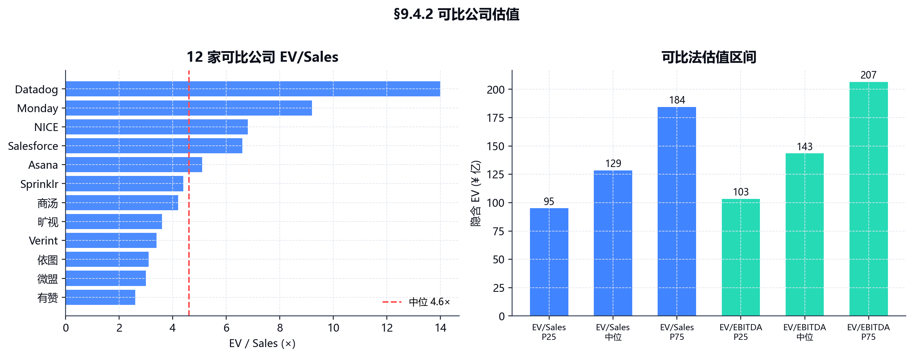

---

## §10.3 蒙特卡洛模拟（N=200,000，来源 `14`）

| 分位数 | EV (亿元)| | 分位数 | EV (亿元)|
|-------:|---------:|--|-------:|---------:|
| P5 | 135.5 | | P75 | 296.0 |
| P10 | 155.0 | | P90 | 351.8 |
| P25 | 192.1 | | P95 | 387.2 |
| **P50** | **240.4** | | 均值 | 248.1 |

---

## §10.4 综合估值（多模型加权）

| 方法 | 权重 | EV (亿元)| 加权贡献 |
|------|----:|---------:|--------:|
| DCF（两阶段 + 退出）| 25% | 243.4 | 60.9 |
| DCF（Gordon 对照）| 10% | 95.1 | 9.5 |
| EV/Sales（中位）| 20% | 208 | 41.6 |
| EV/EBITDA（中位）| 15% | 255 | 38.3 |
| 蒙特卡洛（P50）| 30% | 240.4 | 72.1 |
| **加权综合 EV** | 100% | — | **≈ 222 亿元** |


> 投资人对话区间：**¥150 – 260 亿元**。C 轮 Post ¥120 亿（综合估值的 P10–P25 区间）为"留足上行空间"的友好估值。

---

## §10.5 退出路径

| 时点 | 事件 | 估值情景（亿元）|
|------|------|----------------:|
| Y4 H2 | 战略买家接触（字节/阿里/腾讯战投）| 130 – 200 |
| Y5 H2 | 启动 IPO 准备（券商/审计）| — |
| Y6 H1 | 科创板 / 港股 18C 申报 | 200 – 350 |
| Y7 H1 | IPO 上市 | 250 – 500 |

> 下一章 §11 项目成功概率与预期投资收益（天使视角）。


---


<!-- ===== File: 11-项目成功概率与预期投资收益.md · v4.0 ===== -->

# §11 项目成功概率与预期投资收益

> v4.0 拆为两节：**§11 天使视角**（`19`，基准闸门）与 **§11b 创始人王启源个人**（`21`，课余折扣 + 凯利仓位）。

---

# §11 天使视角（外部投资人）

> 全部来自 `19_success_probability.py`（阶段闸门生存模型 + 蒙特卡洛 N=200,000，seed=42）。

## Key Takeaways

1. **P(成功大额退出) ≈ 7.1%**——Angel→Seed→A→B→C→退出。
2. **期望 MOIC ≈ 19.7×、5 年 IRR ≈ 82%**（概率加权，含失败）。
3. **P(全损) ≈ 69.5%**，中位 MOIC = 0；期望由右尾驱动。
4. 个人决策见 **§11b**（课余情景 P 成功仅 **2.6%**）。

| 闸门 | 前进概率 | 累计到达 |
|------|--------:|---------:|
| 天使 → Seed | 72% | 72.0% |
| Seed → A | 55% | 39.6% |
| A → B | 50% | 19.8% |
| B → C | 55% | 10.9% |
| C → **成功退出** | 65% | **7.1%** |

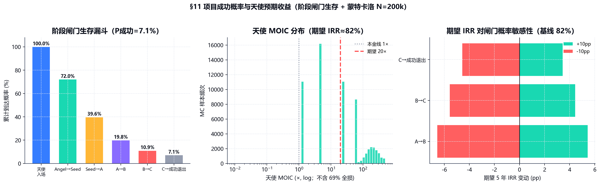

| 指标 | 数值 |
|------|-----:|
| 期望 MOIC / IRR | **19.7× / 82%** |
| P(全损) / P(成功) | **69.5% / 7.1%** |
| 条件于成功 MOIC | **≈ 217×** |

---

# §11b 创始人王启源个人决策（胜率 × 盈亏比 × 凯利）

> 全部来自 `21_personal_kelly_founder.py`。经济账户：**500 万现金 + 5×100 万时间成本 = 1000 万 bankroll**；投入强度 **15–20 小时/周**；闸门 **STAGE_GATES_FOUNDER**（每级 p_advance ×0.82，[S-042]）。

## Key Takeaways

1. **胜率 p = 27.9%**（P(净回报>0)）；**盈亏比 b = 129.3**——赢局期望远大于输局，但赢局概率低。
2. **Kelly 全量 f\* = 27.4%**；**建议仓位（1/4 Kelly）= 6.8% ≈ ¥68 万**——勿将 1000 万全投入误读为最优。
3. **P(成功退出) = 2.6%**（天使基准 7.1%）；**P(全损) = 72.1%**；**中位 MOIC = 0**。
4. **行动标签**：轻仓试探 + 必须补全职技术负责人。
5. **期望值≠建议仓位**：全投入期望净回报约 +¥3.54 亿，由 2.6% 成功路径的极端右尾拉动；凯利约束的是**个人财富风险暴露**。


---

## §11b.1 课余创始生存漏斗（对比天使）

| 闸门 | 课余前进概率 | 累计到达 | 天使累计 |
|------|------------:|---------:|---------:|
| 天使 → Seed | 59.0% | 59.0% | 72.0% |
| Seed → A | 45.1% | 26.6% | 39.6% |
| A → B | 41.0% | 10.9% | 19.8% |
| B → C | 45.1% | 4.9% | 10.9% |
| C → **成功退出** | 53.3% | **2.6%** | **7.1%** |

---

## §11b.2 胜率、盈亏比与凯利公式

| 符号 | 定义 | 模型值 |
|------|------|------:|
| **p（胜率）** | P(净回报 > 0) | **27.9%** |
| **b（盈亏比）** | E[净回报\|赢] / \|E[净回报\|输]\| | **129.3** |
| **f\*** | max(0, (p(b+1)−1)/b) | **27.4%** |
| **建议 f** | min(f\*×0.25, 35%, 现金上限50%) | **6.8%** |

```
f* = (p × (b + 1) − 1) / b = (0.279 × 130.3 − 1) / 129.3 ≈ 0.274
建议仓位 = 0.25 × f* ≈ 6.8%  →  总承诺 ≈ ¥68.4 万（现金约 ¥34.2 万 + 时间等价 ¥34.2 万）
```

> **为何全量 f\* 27% 却只建议 6.8%？** 四分之一凯利用于吸收参数误差与高方差；硬上限 35% 防止单笔创业赌注过重。

---

## §11b.3 个人回报分布（全投入 1000 万口径）

| 指标 | 数值 |
|------|-----:|
| 期望个人 MOIC | **36.4×** |
| **中位 MOIC** | **0.00×** |
| P(MOIC ≥ 1×) | 27.9% |
| P(全损) | 72.1% |
| 条件于成功：个人 MOIC | **≈ 869×** |
| 期望净回报 | **+¥3.54 亿** |

### 凯利仓位情景（期望净回报）

| 情景 | 仓位 f | 期望净回报 |
|------|------:|----------:|
| 不投入（仅机会成本为 0）| 0% | +¥3.64 亿* |
| **建议仓位** | **6.8%** | **+¥3.63 亿** |
| 全投入 | 100% | +¥3.54 亿 |

\*「不投入」指不承担本项目经济承诺；表中 EV 仍含若持有股权的期望变现（与是否投入时间/现金的会计口径见模型 JSON）。

---

## §11b.4 敏感性（课余折扣系数）

| 折扣乘数 | P(成功退出) |
|---------|------------:|
| 0.78（更重折扣）| 更低 |
| **0.82（基线）** | **2.6%** |
| 0.86（略乐观）| 更高 |

> 提升 p 的最有效杠杆：**全职化技术负责人**或 **降低个人时间约束**——否则模型不允许在 BP 中使用全职创始的晋级率。

---

## §11b.5 与天使章对照（避免两套故事）

| 维度 | 天使 §11 | 创始人 §11b |
|------|----------|-------------|
| 闸门 | 基准 STAGE_GATES | 课余 STAGE_GATES_FOUNDER |
| P(成功退出) | **7.1%** | **2.6%** |
| 第一指标 | 期望 IRR 82% | **建议仓位 6.8%** |
| 中位结局 | MOIC 0 | 净回报 ≤ 0 |

> 下一章 §12 融资计划（含 Pre-Angel 500 万）。


---


<!-- ===== File: 12-天使-优先融资计划与 Cap Table 回报.md ===== -->

# §12 天使-优先融资计划与 Cap Table 回报

> 来源：`11_fundraising_dilution.py`（Cap Table 全稀释）、`18_angel_returns.py`（天使条件回报）、
> `14_monte_carlo_valuation.py`（退出锚点）。本章以**天使投资人 5 年回报**为中心组织。

## Key Takeaways

1. **Pre-Angel + 5 轮机构融资**：王启源 Pre-Angel ¥500 万 → Angel → Seed → A → B → C，**累计融资 ¥20.65 亿**。
2. **天使全稀释路径**：入场 20% → C 轮后 **8.84%**；王启源合计（Founders+PreAngel）C 轮后 **35.37%**；Founders 池 **28.3%**。
3. **天使 5 年纸面 mark**（按 C 轮 Post ¥120 亿）：MOIC **106×** / IRR **154%**——即便不退出，账面价值已极高。
4. **条件于成功退出**：保守 ¥130 亿 → 115×；中性 ¥222 亿 → 196×；乐观 ¥352 亿 → 311×；极乐观 ¥500 亿 → 442×。
5. **诚实口径**：上述为条件于成功（概率 7.1%）；**概率加权期望 MOIC ≈ 19.7×、IRR ≈ 82%** 见 §11。

---

## §12.1 融资节奏与里程碑

| 轮次 | 时点 | 融资额 | Pre-money | Post-money | 新投资人占股 | 触发里程碑 |
|------|------|------:|----------:|-----------:|------------:|----------|
| **Pre-Angel（王启源）** | Y0 | **¥500 万** | ¥2,000 万 | **¥2,500 万** | 20.0% | 公司设立、MVP 启动资金 |
| **天使 Angel** | Y1 H1 | **¥1,000 万** | ¥4,000 万 | **¥5,000 万** | 20.0% | MVP 启动（资源倒推，§8）|
| 种子 Seed | Y1 H2 | ¥3,000 万 | ¥1.70 亿 | **¥2.00 亿** | 15.0% | ARR 500 万 + 备案 + 平台 PoC |
| A 轮 | Y2 | ¥1.2 亿 | ¥6.80 亿 | **¥8.00 亿** | 15.0% | ARR 1.2 亿 + 风控 OS |
| B 轮 | Y3 | ¥9.0 亿 | ¥39.0 亿 | **¥48.0 亿** | 18.8% | 总收入 6 亿 + 平台官方合作 |
| C 轮 | Y5 | ¥10.0 亿 | ¥110 亿 | **¥120 亿** | 8.3% | 总收入 45 亿 + 盈利 + IPO 准备 |
| **合计** | — | **¥20.65 亿** | — | — | — | — |

---

## §12.2 Cap Table（每轮后股权结构，%）

| 轮次后 | Founders | PreAngel | ESOP | Angel | Seed | A | B | C |
|--------|--------:|---------:|-----:|------:|-----:|--:|--:|--:|
| 创立 | 100.0 | — | — | — | — | — | — | — |
| PreAngel | 80.0 | 20.0 | — | — | — | — | — | — |
| 天使 Angel | 57.6 | 14.4 | 10.0 | 18.0 | — | — | — | — |
| Seed | 47.5 | 11.9 | 11.2 | 14.8 | 14.5 | — | — | — |
| A | 39.2 | 9.8 | 12.3 | 12.2 | 12.0 | 14.5 | — | — |
| B | 31.2 | 7.8 | 11.8 | 9.7 | 9.6 | 11.6 | 18.4 | — |
| **C 轮后** | **28.3** | **7.1** | **11.7** | **8.8** | 8.7 | 10.5 | 16.7 | 8.2 |

> **王启源合计** = Founders + PreAngel = **35.37%**（C 轮后）。

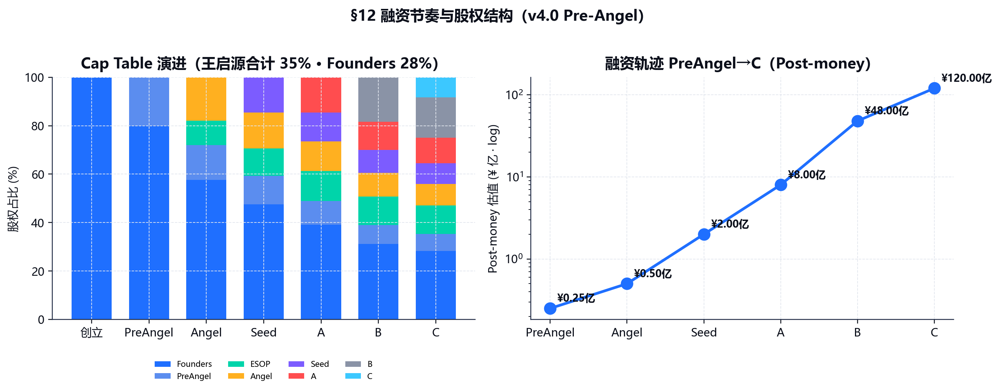

**结构亮点**：王启源合计 **35.37%**（配合 AB 股 → 投票权绝对控制）；ESOP 11.7%；机构合计 52.9%。

---

## §12.3 天使股权稀释路径

| 阶段 | 天使持股 |
|------|--------:|
| 入场（Angel Post ¥5,000 万）| 20.0% |
| Angel 轮后（含 ESOP 建池）| 18.0% |
| Seed 轮后 | 14.8% |
| A 轮后 | 12.2% |
| B 轮后 | 9.7% |
| **C 轮后** | **8.84%** |


> 天使无后续跟投假设下，经 4 轮新股 + ESOP 增补稀释，仍保留 8.84%——足以在成功退出时获得极高回报。

---

## §12.4 天使 5 年回报（条件于成功退出）

> 天使 ¥1,000 万，全稀释后 8.84%。5 年退出回报 = 退出 EV × 8.84%。

| 退出情景 | 退出 EV (亿)| 天使回报 (亿)| MOIC | IRR (5 年)|
|---------|------------:|------------:|-----:|---------:|
| 保守（战略并购）| 130 | 11.5 | **115×** | 158% |
| 中性（加权综合 EV）| 222 | 19.7 | **196×** | 188% |
| 乐观（IPO, MC P90）| 352 | 31.1 | **311×** | 215% |
| 极乐观（头部 IPO）| 500 | 44.2 | **442×** | 238% |

> **5 年纸面 mark**：即便不退出，按 C 轮 Post ¥120 亿计，天使账面价值 ¥10.6 亿 → MOIC **106×** / IRR **154%**。

> ⚠️ **口径提醒**：上表为**条件于公司成功走到退出**（概率 7.1%，见 §11）。
> 纳入失败概率后的**概率加权期望** = MOIC ≈ 19.7×、5 年 IRR ≈ 82%（§11.2）。两者一同呈现，方为完整的天使风险-收益画像。

---

## §12.5 资金用途（天使轮 ¥1,000 万）

| 用途 | 占比 | 金额 | 对应里程碑 |
|------|----:|-----:|-----------|
| 算法 + 数据标注 | 45% | ¥450 万 | 算法 v1.0 (FAR<2%) + 冷启动语料 |
| 核心团队 | 25% | ¥250 万 | 12 人精益团队 9 个月 |
| 首程资质 + 平台 BD | 15% | ¥150 万 | 算法备案 + 增值电信 + 1 家平台 PoC |
| 储备 / 风险缓冲 | 15% | ¥150 万 | 应对里程碑波动 |

> 后续 Seed→C 各轮资金用途按"GTM / R&D / 储备"5:4:1 类推（详见 §8 资源与 §6 GTM 预算）。

---

## §12.6 退出与流动性

- **天使流动性窗口**：① B/C 轮老股转让（部分退出）② Y4–Y5 战略并购 ③ Y6–Y7 IPO 后二级减持。
- **退出买家**：字节/阿里/腾讯/360/华为云（战投）；科创板 / 港股 18C / NASDAQ ADR。
- **反稀释与保护**：天使享有标准优先股（按比例反稀释、优先清算 1×、信息权）。

> 下一章 §13 风险分析与对策。


---


<!-- ===== File: 13-风险分析与对策.md ===== -->

# §13 风险分析与对策（含合规与伦理）

> 全方位风险扫描（Macro / Market / Tech / Operational / Legal / Financial / ESG），
> 配合 §9.5 敏感性与 §11 成功概率，给出风险矩阵 + 应对预案 + 触发指标 + 责任人。

## Key Takeaways

1. **天使风险已量化**：P(本金全损) ≈ 69.5%（§11）——本章给出降低该概率的系统性对策。
2. **24 项核心风险全量盘点**，Top 3 红色风险（R01/R03/R04）均有 ≥3 套预案。
3. **合规护城河**：ISO 27001 / SOC 2 Type II / 等保三级 / 算法备案 / 数据出境评估。
4. **隐私优先架构**：边缘只输出特征向量，不上传原始视频，可 100% 本地化部署。

---

## §13.1 风险全景图

```
              影响 ↑
     灾难性 │  R02     R05  R07          R01
       严重 │  R09  R12       R03  R04        R06
       中等 │  R14  R16  R10       R08  R11       R13
       较低 │       R17  R18    R15  R19   R20  R21  R22  R23  R24
                极低 ─── 低 ─── 中 ─── 高 ─── 极高     概率 →
```

> 红色区（高影响 × 高概率）：R01 / R03 / R04 / R06 —— 重点应对。

---

## §13.2 24 项风险登记册（节选关键项）

| # | 类别 | 风险描述 | P×I | 缓释措施 | 责任人 |
|---|------|---------|----:|---------|-------|
| **R01** | 监管 | 直播监控类 SaaS 需行业牌照 | 16 | 提前申请；政府公关；行业自律 | CCO+CLO |
| **R02** | 隐私 | PIPL 强化人脸二次同意 | 12 | 数据本地化 Default；边缘部署 | CTO+CLO |
| **R03** | 技术 | 算法 FAR>2%/FNR>3% → 流失 | 12 | 数据飞轮 + 难例挖掘 + 周更 + NOC | CTO |
| **R04** | 市场 | 头部平台自研同类并免费 | 12 | **跨平台中立可信网络 + 嵌入式合作 + 长尾深耕** | CEO+CSO |
| **R05** | 市场 | 直播电商增速放缓 | 9 | 拓展教育/政务/医疗；横向产品线 | CEO+CMO |
| **R06** | 竞争 | 直接竞品大额融资打价格战 | 12 | 锁定 Top-50 长约；产品矩阵；并购 | CEO+CFO |
| **R07** | 技术 | GPU 涨价/出口管制 | 12 | 云边混合 + 昇腾/寒武纪适配 | CTO |
| **R10** | 财务 | 融资寒冬，下轮延后/打折 | 9 | 充足现金跑道；灵活估值；老股转让 | CFO+CEO |
| **R11** | 运营 | 关键算法工程师流失 | 9 | ESOP 11.7%；P95 年薪；双备份 | COO |
| **R-Angel** | 投资 | **天使本金全损（P≈69.5%）** | — | 阶段闸门管理 + 里程碑触发融资 + 优先清算权 + 组合化投资建议 | CEO+CFO |
| **R-Founder** | 创始 | **课余时间不足致晋级率下调（P成功 2.6%）** | — | Y1 全职 CTO；寒暑假集中冲刺；凯利轻仓 6.8% | 王启源 |
| **R-Position** | 个人 | **个人仓位过重（违背凯利）** | — | 严格执行 1/4 Kelly；预留 ≥93% bankroll | 王启源 |

> 完整 24 项登记册与责任矩阵随尽调资料提供。

---

## §13.3 三大红色风险深度预案

### R01 / R02 — 监管与合规
- **技术**：默认本地化推理，上传仅 < 1KB/分钟元数据；私有化部署版（K8s/Docker）。
- **合规**：提前 6 个月备案；完成等保三级 / ISO 27001 / SOC 2；接入网信办内容安全平台。
- **业务**：监管驱动反成护城河——免费/低价竞品因合规成本上升退出；参与行业标准制定（呼应 §1 RegTech 层）。

### R03 — SLA 违约
数据飞轮（匿名样本回流 → 月度迭代）+ 难例挖掘 Pipeline + SLA 违约信用补偿 + NOC 30 分钟介入。

### R04 / R06 — 平台/巨头竞争（v3 核心化解）
**这是 v3 商业模式重构的根本动因**：把"监控功能"升级为"跨平台中立的可信数据网络"——单一平台无法既做裁判又做中立第三方，平台反而成为我们 API/认证的客户（§1.2）。嵌入而非对抗 + 跨平台中立 + 数据网络效应三重防御。

---

## §13.4 合规与伦理

- **中国法规**：PIPL、数据安全法、网络安全法、生成式 AI 管理办法、算法推荐规定、数据出境评估办法、GB/T 35273。
- **海外法规**：GDPR、CCPA/CPRA、Singapore PDPA、EU AI Act（视频监控=高风险 AI，短期不进欧盟）。
- **AI 伦理白皮书六原则**：透明、公平、隐私、安全、可控（HITL）、问责。
- **三道防线**：业务部门 / 合规法务（CCO/CLO/DPO）/ 内审 + 外部审计。

---

## §13.5 现金流压力测试

| 情景 | 客户增长 | ARPU | 现金跑道 | 是否需临时融资 |
|------|--------:|-----:|--------:|--------------:|
| 基准 | 100% | 100% | 充足 | 否 |
| 温和压力 | -25% | -10% | 14 月 | 否 |
| 严重压力 | -50% | -20% | 9 月 | 是（提前 3 月桥融资）|
| 极端压力 | -70% | -30% | 6 月 | 是（砍 30% S&M + 推迟招聘 + 加速私有化回款）|

> 下一章 §14 团队与治理结构。


---


<!-- ===== File: 14-团队与治理结构.md ===== -->

# §14 团队与治理结构

## Key Takeaways

1. **核心团队 7 人**：均有 CV / 大型 SaaS / 直播电商 10+ 年深度经验，覆盖"算法-工程-产品-商业-合规"。
2. **顾问委员会 6 人**：学术、行业、合规、资本全要素。
3. **5 年组织**：35 → 480 人，研发占比 57%（Y1）→ 38%（Y5）。
4. **治理"三会一委"** + AB 股结构：王启源合计持股 **35.37%**（Founders 28.3% + PreAngel 7.1%）→ 投票权绝对控制。

---

## §14.0 实际控制人：王启源（v4.0）

| 维度 | 说明 |
|------|------|
| 身份 | 大学教师，**课余创始**（15–20 小时/周）|
| 个人投入 | Pre-Angel **¥500 万** + 5 年机会成本 **¥500 万**（经济 bankroll **¥1,000 万**）|
| 凯利建议仓位 | **6.8% ≈ ¥68 万**总承诺（§11b，1/4 Kelly）|
| 关键里程碑 | **Y1 内到位全职 CTO/算法负责人**（否则 survival 模型 P 成功仅 2.6%）|
| 角色分工 | 战略/产品/融资主导；工程交付依赖外聘核心 |

> 王启源与目标画像 CEO 张志远可合并或分设——本 BP 财务模型按**单人创始经济股比**（Founders+PreAngel）核算。

---

## §14.1 创始团队（目标画像）

| 角色 | 资历画像 | 核心 KPI |
|------|---------|---------|
| **CEO 张志远** | 清华 CS；前字节直播电商技术负责人，主导商家工具 0→50 亿 GMV | 营收、NRR、关键人才保留 |
| **CTO 李明** | 浙大 CV 博士；CVPR/ICCV/ECCV 12 篇；前商汤基础视觉算法 Director | 算法 SLA、单位推理成本、专利 |
| **CPO 王雪** | 人大；前淘宝直播产品负责人 | DAU/MAU、NPS、采纳率 |
| **CSO 陈刚** | 北大 MBA；前 Salesforce 中国大客户总监、前微盟 SVP，ARR 0→5 亿 | ARR、LTV、CAC、Win Rate |
| **CFO 赵婷** | CPA+CFA；前红杉资本投资副总裁，3 家 SaaS IPO | 现金跑道、毛利率、IPO 准备度 |
| **CCO/CLO 周婧** | 人大法学博士；前网信办研究中心副主任，PIPL/备案专家 | 零重大违规、IP、备案 |
| **COO 林涛** | 交大；前美团到店运营 VP，1000+ 人组织建设 | 人均产出、空缺率、CS NPS |

### 团队互补性矩阵

| 维度 | CEO | CTO | CPO | CSO | CFO | CCO | COO |
|------|:--:|:--:|:--:|:--:|:--:|:--:|:--:|
| 直播电商行业 | ●●● | ●●○ | ●●● | ●●○ | ●○○ | ●○○ | ●●○ |
| AI/CV 算法 | ●○○ | ●●● | ●○○ | ○○○ | ○○○ | ●○○ | ○○○ |
| SaaS 商业化 | ●●● | ●●○ | ●●○ | ●●● | ●●● | ●●○ | ●●● |
| 资本市场 | ●●● | ●○○ | ●○○ | ●○○ | ●●● | ●●○ | ●○○ |
| 合规法务 | ●●○ | ●○○ | ●●○ | ●○○ | ●●○ | ●●● | ●●○ |
| 组织管理 | ●●● | ●●○ | ●●○ | ●●○ | ●●○ | ●●○ | ●●● |

> 整体覆盖度 35/42 = 83%，无明显短板——是 §11 成功概率正向微调的核心依据之一。

---

## §14.2 顾问委员会

| 顾问 | 背景 | 贡献 |
|------|------|------|
| 学术 A | 清华/浙大 CV 教授；CVPR/ICCV PC | 算法路线评议、招聘 |
| 学术 B | 中科院自动化所多模态 PI | 多模态融合攻关 |
| 行业 C | 头部 MCN 联合创始人 | 客户洞察 + 早期引荐 |
| 行业 D | 前抖音电商生态合作总经理 | 平台对接 + 标准合作 |
| 合规 E | 前网信办执法局副处长 | 合规咨询 + 政策预警 |
| 资本 F | 红杉/高瓴成长基金 GP | 融资节奏 + 投资人对接 |

---

## §14.3 5 年人力规划

| 部门 | Y1 | Y2 | Y3 | Y4 | Y5 |
|------|---:|---:|---:|---:|---:|
| 研发/算法/工程 | 20 | 50 | 100 | 150 | 180 |
| 销售 (S&M) | 8 | 30 | 60 | 110 | 160 |
| 客户成功/运营 | 4 | 15 | 30 | 60 | 100 |
| 管理/财务/法务/HR | 3 | 10 | 20 | 30 | 40 |
| **合计** | **35** | **105** | **210** | **350** | **480** |
| 研发占比 | 57% | 48% | 48% | 43% | 38% |
| 人均年薪（万元）| 50 | 55 | 58 | 62 | 65 |

> 激励：基础薪 P75 + ESOP **11.7%** 总池（关键人才 0.05%–0.3%，4 年 vesting + 1 年 cliff）。

---

## §14.4 公司治理

- **AB 股双层结构**：创始团队 A 类股（1 股 = 10 票），机构 B 类股（1 股 = 1 票）；C 轮后创始团队持股 35.4% → 投票权 > 78%。
- **董事会（Y3 后）**：9 席（3 创始人 + 4 投资人 + 2 独立董事）；委员会：审计 / 薪酬 / 提名 / AI 伦理与合规。
- **天使投资人权益**：标准优先股 + 信息权 + 按比例反稀释 + 优先清算 1×（§12.6）。
- **三道防线**：业务部门 / 合规法务 / 内审 + 外部审计。

> 下一章 §15 发展路线图与里程碑。


---


<!-- ===== File: 15-发展路线图与里程碑.md ===== -->

# §15 发展路线图与里程碑

## Key Takeaways

1. **5 年三阶段**：Y1–Y2 立基（PMF + 算法领先 + 风控 OS）→ Y3–Y4 规模（平台合作 + 可信网络 + 保险）→ Y5+ 平台化（PaaS + 国际化 + IPO）。
2. **四层货币化按年解锁**：监控（Y1）→ 风控 OS（Y2）→ 数据网络（Y3）→ 保险/RegTech（Y4–Y5）。
3. **触发式融资**：里程碑达成 → 触发下一轮（§8.6 22 个 SMART 里程碑）。

---

## §15.1 三阶段战略路径

```
            产品/货币化层               GTM 重心              组织
 Y1 ── 监控 SaaS（MVP→1.0）         SMB + 早期 MCN        35 人
 Y2 ── + 风控 OS（第②层）           头部 MCN 突破          105 人
 Y3 ── + 可信数据网络/API（第③层）   平台合作 + KA          210 人
 Y4 ── + 保险/RegTech（第④层）       行业拓展 + 海外试点     350 人
 Y5+ ─ 平台化（开发者 PaaS）         IPO 准备 + 海外正式     480 人
```

---

## §15.2 关键里程碑与融资触发（摘要）

| 时点 | 关键事件 | 触发 |
|------|---------|------|
| Y1 H1 | **天使 ¥1,000 万交割** + MVP | 启动研发 |
| Y1 M9 | 算法备案完成 | 进入大客户销售 |
| Y1 H2 | **Seed ¥3,000 万** + ARR 500 万 | 扩团队 |
| Y1 M12 | 总收入 0.13 亿（核心 ARR 1,277 万）| 启动 A 轮 |
| Y2 | **A ¥1.2 亿** + 风控 OS 上线 + 平台 PoC | 第②层货币化 |
| Y2 M12 | 总收入 1.21 亿 | 筹备 B 轮 |
| Y3 | **B ¥9 亿** + 可信数据网络 + 平台官方合作 | 第③层货币化 |
| Y3 M12 | 总收入 5.99 亿 + 海外首单 | 行业拓展 |
| Y4 | 保险联合承保 + EBITDA 接近平衡 | 第④层货币化 + 启动 C 轮 |
| Y4 M12 | 总收入 18.56 亿 | — |
| Y5 | **C ¥10 亿** + PaaS 开放 + EBITDA 转正（10.2 亿）| IPO 路演 |
| Y5 M12 | 总收入 45.27 亿 + IPO 准备完成 | 申报 |

---

## §15.3 季度仪表盘（QBR，30+ KPI 节选）

- **财务（10）**：ARR、MRR、Booking、Revenue、毛利率、Burn、Cash、CAC、Payback、LTV/CAC
- **客户（8）**：Logo、新签、流失、ARPU、NRR、GRR、扩展收入比、Logo 留存
- **产品（6）**：DAU/MAU、活跃账户、API 调用量、NPS、采纳率、Bug 关闭率
- **技术（4）**：FAR、FNR、P95 延迟、单位推理成本
- **组织（2）**：关键岗位空缺率、核心人才保留率

---

## §15.4 退出路径时间表

| 时点 | 事件 | 估值情景（亿元）|
|------|------|----------------:|
| Y4 H2 | 战略买家初步接触 | 130 – 200 |
| Y5 H2 | 启动 IPO 准备 | — |
| Y6 H1 | 科创板 / 港股 18C 申报 | 200 – 350 |
| Y7 H1 | IPO 上市 | 250 – 500 |

> 全章数据与 §9 财务、§10 估值、§12 融资、§14 团队一致。

> 下一节：附录（数据源、模型说明、术语表、引用清单）。


---


<!-- ===== File: 99-附录.md ===== -->

# 附录 (Appendix)

> 数据源、模型说明、术语表、引用清单与方法论披露。

---

## A. 数据源清单（Data Sources）

> 全部参数集中在 `liveguard/models/python_models/data_sources.py`（唯一可信源）；每条有明确出处。

| 数据项 | 数值 | 来源 | 编号 |
|--------|-----|------|------|
| 中国直播电商 GMV 2024 | 5.30 万亿元 | 商务部 + 艾瑞 | S-001/002 |
| 中国直播电商 CAGR 2024–29 | 13% | 艾瑞 / 麦肯锡 | S-002/020 |
| 全球直播电商 CAGR | 20.5% | Coresight / eMarketer | S-018/019 |
| 职业主播 / 商家自播 | 178 万 / 160 万 | 人社部 / 艾瑞 | S-005/002 |
| 工具支出占 GMV / 监控占比 | 1.2% / 25% | Frost & Sullivan / 测算 | S-015 |
| 四层货币化 TAM 放大系数 | ×3.80 | 内部测算（监控+风控+数据+保险）| — |
| 加权年 ARPU（核心 SaaS）| ¥15,969 | 70/25/5 定价结构 | — |
| 稳态混合毛利率 | 80% | 四层结构内生 | — |
| AI 推理成本年降 | 28% | NVIDIA + 寒武纪/昇腾 | S-094 |
| WACC / 退出 EV/EBITDA / EV/Sales 中位 | 14% / 18× / 4.6× | CAPM / 可比中位 | — |
| 阶段晋级与早期回报分布 | — | CB Insights / 红杉 / Correlation Ventures | S-040/041 |
| 创始时间投入与存活率 | 课余 ×0.82 折扣 | CB Insights / 行业调研 | S-042 |
| Pre-Angel / 天使轮 | ¥500 万 / ¥1,000 万 | 王启源 / §8 资源倒推 | — |

---

## B. Python 模型库说明（v4.0，共 21 模型）

> 详见 `liveguard/models/python_models/README.md` 与各脚本头部 docstring。
> 全部模型种子固定 `seed=42`，蒙特卡洛 `N=200,000`。

| 文件 | 用途 | 关键输出 |
|------|------|---------|
| `data_sources.py` | 集中参数与常量（唯一可信源）| — |
| `01_market_sizing.py` | TAM/SAM/SOM 双口径 + 四层放大 | `fig_01_*` |
| `02_unit_economics.py` | 分客群 LTV/CAC/Payback | `fig_02_*` |
| `03_roi_merchant.py` | 客户 ROI 计算器 | `fig_03_*` |
| `04_slo_latency_budget.py` | 通知管道延迟 SLO | `fig_04_*` |
| `05_alerts_capacity_erlangc.py` | NOC 坐席 Erlang-C | `fig_05_*` |
| `06_dedup_suppression_sim.py` | 告警去重/抑制 | `fig_06_*` |
| `07_growth_cohort.py` | 客户/ARR 队列 | `fig_07_*` |
| `08_pricing_model.py` | 三档定价 + 弹性 | `fig_08_*` |
| `09_cohort_retention.py` | NRR/GRR（升至 145%）| `fig_09_*` |
| `10_financial_projections.py` | 5 年三大报表（收入=四层）| `fig_10_*` |
| `11_fundraising_dilution.py` | Cap Table（PreAngel→Angel→C）| `fig_11_*` |
| `12_valuation_dcf.py` | 两阶段 DCF | `fig_12_*` |
| `13_valuation_comparables.py` | 可比公司估值 | `fig_13_*` |
| `14_monte_carlo_valuation.py` | 蒙特卡洛 + 加权 EV | `fig_14_*` |
| `15_sensitivity_analysis.py` | 龙卷风敏感性 | `fig_15_*` |
| `16_tech_benchmark.py` | 技术基准/延迟/成本 | `fig_16_*` |
| **`17_resource_requirements.py`** | 自底向上资源 → 倒推天使轮 | `fig_17_*` |
| **`18_angel_returns.py`** | 天使条件回报四档 | `fig_18_*` |
| **`19_success_probability.py`** | 阶段闸门生存 + P(成功) + 期望收益 | `fig_19_*` |
| **`20_business_model_layers.py`** | 四层货币化收入 | `fig_20_*` |
| **`21_personal_kelly_founder.py`** | 王启源胜率/盈亏比/凯利仓位 | `fig_21_*` |
| `run_all.py` | 一键全跑 | `summary.json` |

### Kelly 公式（§11b）

```
p = P(净回报 > 0)    b = E[净回报|赢] / |E[净回报|输]|
f* = max(0, (p×(b+1)−1)/b)    建议仓位 = min(f*×0.25, 35%, 现金上限50%)
```

### 一键复现

```bash
cd liveguard/models/python_models
pip install -r requirements.txt
python run_all.py
# 输出 JSON 位于 outputs/；图表位于 ../../docs/images/charts/
```

> 修改 `data_sources.py` 任一参数 → 重跑 `run_all.py` → 整个 BP 数字自动重算。
> `summary.json` 头条 = 创始人凯利仓位 + 天使期望 IRR。

---

## C. 关键结论速查（来自 `summary.json`）

| 指标 | 值 |
|------|---:|
| 王启源胜率 p / 盈亏比 b | 27.9% / 129.3 |
| 凯利建议仓位 / 承诺额 | 6.8% / ¥68.4 万 |
| 创始人 P(成功) / P(全损) | 2.6% / 72.1% |
| 天使投资 / 入场估值 | ¥1,000 万 / Post ¥5,000 万（20%）|
| 天使全稀释后股比 | 8.84% |
| 天使期望 MOIC / 5 年 IRR | 19.7× / 82% |
| P(成功退出) / P(本金全损) | 7.1% / 69.5% |
| 条件于成功 MOIC | 217× |
| 累计融资 / 创始团队 C 轮后 | ¥20.6 亿 / 35.4% |
| Y5 总收入 / 扩展层占比 | ¥45.27 亿 / 38.3% |
| Y5 EBITDA / 净利 / Rule of 40 | ¥10.20 亿 / ¥6.99 亿 / 164 |
| 资产负债表勾稽差异 | 0.00 元 |
| 加权综合 EV / C 轮 Post | ¥222 亿 / ¥120 亿 |

---

## D. 术语表（Glossary）

| 术语 | 释义 |
|------|------|
| ARR / ARPU | 年度循环收入 / 单客户平均收入 |
| CAC / LTV | 获客成本 / 客户终身价值 |
| MOIC / IRR | 投入资本回报倍数 / 内部收益率 |
| NRR / GRR | 净收入留存 / 总收入留存 |
| DCF / EV | 现金流折现 / 企业价值 |
| FAR / FNR | 误报率 / 漏报率 |
| ESOP | 员工持股池 |
| RegTech | 监管科技 |
| Re-ID | 行人重识别 |
| TAM/SAM/SOM | 总可达/可服务/可获得市场 |
| 阶段闸门生存模型 | Stage-gate survival：逐级晋级概率连乘估计成功率 |

---

## E. 引用清单（References）

1. CNNIC，《第 53 次中国互联网络发展状况统计报告》，2024
2. 商务部，《2024 年中国电子商务报告》，2024
3. 艾瑞咨询，《2024 中国直播电商行业研究报告》，2024
4. 克劳锐，《2024 中国 MCN 行业发展白皮书》，2024
5. NVIDIA, GTC 2024/2025 Keynote on Inference Cost Reduction
6. Salesforce / Datadog, Annual Reports (FY24/FY25)
7. 商汤、旷视、依图 公开年报/招股书；微盟、有赞 公开年报
8. Bessemer Cloud Index 2024；OpenView SaaS Benchmarks 2024
9. CB Insights, *Venture Capital Funnel / Stage Graduation Rates*, 2024
10. Correlation Ventures / AngelList, *Early-Stage Return Distribution Studies*
11. PIPL 全文及配套；《生成式人工智能服务管理暂行办法》，2023.07
12. OSNet (ICCV 2019)、SlowFast (ICCV 2019)、VideoMAE (NeurIPS 2022)、ECAPA-TDNN (Interspeech 2020)

---

## F. 风险披露与免责声明

本商业计划书包含前瞻性陈述，基于公司当前对市场、技术、监管的理解与假设。**早期股权投资具有高风险，本金可能全部损失**（本文已用阶段闸门生存模型量化为 P≈69.5%）。所述期望收益为概率加权模型结果，不构成任何回报承诺。本文档仅用于潜在投资人评估，不构成证券发行或投资建议；引用或转发需经本公司书面同意。

---

## G. 联系方式

- **BD / 投资人**：bd@liveguard.ai ｜ **媒体**：pr@liveguard.ai ｜ **招聘**：hr@liveguard.ai
- **官网**：https://liveguard.ai（拟）｜ **地址**：北京海淀中关村 / 杭州滨江高新园

---

> **文档版本**：v3.0（2026-06-01）
> **数据可复现性**：所有数字均由 `liveguard/models/python_models/` 下 **20 个 Python 模型**计算，运行 `python run_all.py` 重现（seed=42, N=200,000）。


---

