# 守播 LiveGuard AI · 直播间 AI 实时合规监控 SaaS
## 商业计划书 (Business Plan) · v5.0 — 机构标准版（完全重构）
**编制日期**：2026 年 06 月 01 日

---

> **重要提示**：本文档为公司机密，面向机构投资人。v5.0 回归"AI 直播监控本体"，采用 2026 实时调研数据、
> 2026 压缩估值倍数与真实阶段晋级率。全部数字由 `liveguard/models/python_models/` 下 **19 个 Python 模型**可复现
>（seed=42，N=200,000）；运行 `python run_all.py` 一键重现，详见附录 B。资产负债表勾稽差异 = 0 元。
>
> **早期股权投资具有高风险**：主案 P(本金全损)≈77.9%。回报以多口径（中位/期望/条件于成功/逐路径 IRR 分位）披露，
> 均为情景建模结果，**不构成回报承诺或投资建议**。

---

## 目录 (Table of Contents)

- 00 执行摘要
- 01 公司与产品概述
- 02 行业与市场分析
- 03 竞争分析与差异化定位
- 04 产品与技术
- 05 商业模式与定价
- 06 进入市场策略 (GTM)
- 07 运营、组织与创立资源
- 08 单位经济
- 09 财务预测
- 10 融资与 Cap Table
- 11 估值（2026 压缩倍数）
- 12 成功概率与投资回报（多口径）
- 13 风险分析
- 14 团队与组织
- 15 路线图
- 99 附录（数据源 / 模型 / 方法学）

---


<!-- ===== File: 00-执行摘要.md · v5.0 ===== -->

# §0 执行摘要 (Executive Summary)

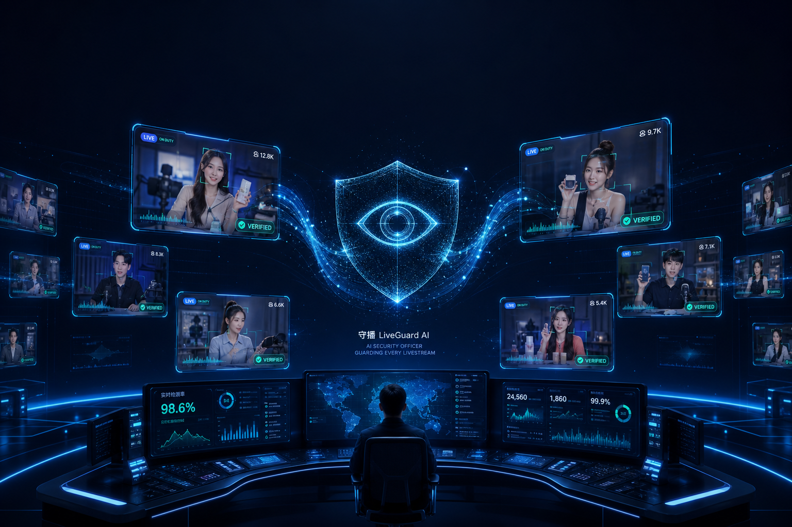

> **如果你只读一页，请读这一页。**

---

## 一、一句话定位

> **守播 LiveGuard 是面向中国直播电商的「AI 直播间实时合规监控 SaaS」**——以计算机视觉 + 声纹 + 行为识别，
> 在秒级时间内自动识别直播间的 **离岗 / 挂播空播 / 替身代播 / 数字人替播 / 违规话术** 等风险，
> 为平台、MCN、品牌商家提供"在岗即合规"的实时监测与告警闭环。

**Why Now（核心催化剂）**：市场监管总局与网信办联合发布的 **《直播电商监督管理办法》（令第117号）于 2026-02-01 正式施行** [S-106]，
首次以系统性部门规章压实平台、直播间运营者、直播营销人员、MCN 四类主体责任，第17/34/44条明确禁止以 AI 等技术编造、传播虚假或误导信息；
叠加 2026-09-01 施行的 **《互联网信息内容多渠道分发服务管理规定》** [S-107]——**合规监测从"平台自选项"变为"全行业强制项"**，催生独立第三方监控 SaaS 的刚性需求。

> **数据可复现性**：本计划书全部数字由 `liveguard/models/python_models/` 下 **19 个 Python 模型**（`seed=42`，`N=200,000`）计算并可一键复现，
> 运行 `python run_all.py` 重现全部 JSON 与图表，详见附录 B。**资产负债表勾稽差异 = 0 元**。

---

## 二、市场与产品（来源 `01`）

| 口径（单层监控，主案）| 中位 | 说明 |
|------|----:|------|
| 监控 SaaS **TAM** | **¥160.8 亿/年** | 自上而下/自下而上双口径，差异仅 13.5% |
| 监控 SaaS **SAM** | **¥135.1 亿/年** | 可触达且可付费 |
| **SOM（Y5 收入）** | **¥11.62 亿** | = 监控 SAM 的 **8.6%**，细分领跑者合理区间 |
| 上行情景 TAM（四层扩展）| ¥386 亿 | 风控 OS / 数据网络 / 保险 RegTech，仅作增长期可选上行 |

底盘：2025 中国直播电商 GMV 主案 **≈¥5.92 万亿**（华经 5.26 万亿与网经社 6.95 万亿之间取保守中值）[S-101][S-102][S-103]，
职业主播 **3880 万** [S-105]、直播相关企业 **256.96 万家** [S-101]。

---

## 三、5 年财务与盈利路径（来源 `10`，勾稽差异 = 0）

| 指标 | Y1 | Y3 | Y5 |
|------|---:|---:|---:|
| 营业收入 | ¥885 万 | ¥2.21 亿 | **¥11.62 亿** |
| 毛利率 | 70% | 76% | **80%** |
| EBITDA | −¥1,268 万 | −¥1.12 亿 | **+¥1.12 亿** |
| 净利润 | −¥1,280 万 | −¥1.16 亿 | **+¥0.73 亿** |
| 期末现金 | ¥582 万 | ¥7,444 万 | ¥2.02 亿 |

**Y5 转正**：营业利润、EBITDA、净利润同年转正；Y5 Rule of 40 = **98**，Magic Number ≈ 1.3，Burn Multiple 由 1.54 降至 0。

---

## 四、融资结构（标准机构 Seed→C · 来源 `11`）

| 轮次 | 时点 | 融资额 | Post-money | 新投资人占比 |
|------|------|------:|----------:|------:|
| **Seed（本轮）** | Y1 | **¥2,000 万** | **¥1.0 亿** | 20.0% |
| A | Y2 | ¥8,000 万 | ¥4.5 亿 | 17.8% |
| B | Y3 | ¥2.0 亿 | ¥13.0 亿 | 15.4% |
| C | Y4 | ¥3.5 亿 | ¥30.0 亿 | 11.7% |
| **合计** | | **¥6.5 亿** | | |

C 轮后：创始团队 **40.0%**、ESOP 13.7%、机构合计 46.3%。Seed 轮规模由 §7 资源自底向上倒推（精益 12 个月最低 ¥1,037 万）并预留至约 20 个月跑道。

---

## 五、估值（2026 压缩倍数 · 来源 `12`/`13`/`14`）

> 采用 **2026 已大幅压缩的 SaaS 倍数**（公募 SaaS EV/Rev 中位约 3.4–6.4×）[S-111][S-112]，不沿用 2021 泡沫水平。

| 方法 | 隐含 EV | 权重 |
|------|------:|---:|
| 两阶段 DCF（WACC 15.5%，退出 13× EBITDA）| ¥32.7 亿 | 30% |
| EV/Sales 中位 4.5× | ¥52 亿 | 25% |
| EV/EBITDA 中位 13× | ¥15 亿 | 25% |
| 蒙特卡洛 P50 | ¥38.8 亿 | 20% |
| **多模型加权 EV** | **¥34.3 亿** | |

蒙特卡洛 90% 区间 [¥22.6 亿, ¥60.9 亿]；IQR [¥31 亿, ¥47 亿]。**加权 EV（¥34.3 亿）高于 C 轮 Post（¥30 亿）**，估值内部自洽。

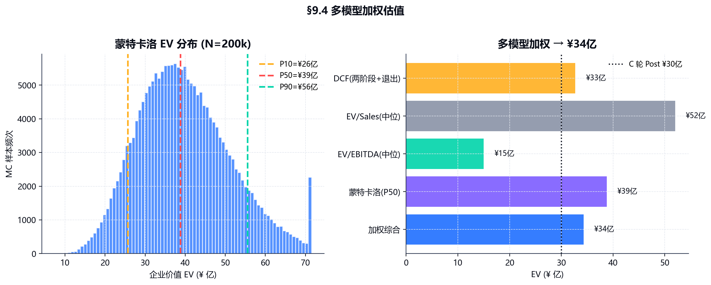

---

## 六、成功概率与投资回报（多口径披露 · 来源 `19`/`18`）

> **诚实披露：早期股权为单笔高方差投资——中位结局为本金全损，期望值由右尾（成功退出）驱动。所有数字为情景建模，非回报承诺。**

阶段闸门采用 **2026 真实晋级率**（Seed→A 已从历史 30–40% 跌至 **22%** [S-110]；A→B、B→C 约 50–55% [S-114]）：

| 里程碑 | 单步晋级率 | 累计到达 |
|------|---:|---:|
| Seed→A | 22% | 22.0% |
| A→B | 50% | 11.0% |
| B→C | 55% | 6.05% |
| C→成功退出 | 45% | **2.72%** |

**本轮 Seed 投资人（¥2,000 万，入场 20%，全稀释后 9.99%，持有 6 年）回报——四口径并列：**

| 回报口径 | 数值 | 含义 |
|------|----:|------|
| **中位 MOIC** | **0×（本金全损）** | 最可能的单笔结局 |
| **概率加权期望 MOIC** | **1.01×** | 含 77.9% 全损，由右尾驱动 |
| **期望逐路径 IRR** | **−70%** | 逐路径年化后取期望（年化对照口径 ≈ 0%）|
| **条件于成功退出 MOIC / IRR** | **20.2× / 65%** | 仅在 2.72% 成功路径上 |

逐路径 IRR 分位：P50/P75 = −100%、**P90 = +17%、P95 = +68%、P99 = +97%**；P(MOIC≥1×)=22.1%、P(≥3×)=8.1%、P(≥10×)=2.3%、**P(全损)=77.9%**。

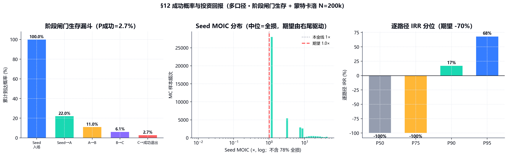

> **关于"为什么不用一个高 IRR 做头条"**：本版刻意**不**采用 `E[MOIC]^(1/n)−1` 之类的单点年化（该口径会把右尾期望误读为"预期收益"）。
> 我们并列披露中位（≈全损）、概率加权期望、条件于成功、以及逐路径 IRR 分位，符合机构尽职调查对早期资产回报的标准披露要求。

---

## 七、一页纸投资逻辑

1. **强监管催化的刚需赛道**：令117号 + 多渠道分发新规把第三方合规监测从"可选"变为"必备"。
2. **保守但清晰的财务**：Y5 收入 ¥11.62 亿、Y5 转正、五年累计仅需融资 ¥6.5 亿、现金始终为正。
3. **自洽的估值**：用 2026 压缩倍数得加权 EV ¥34.3 亿，高于 C 轮 Post ¥30 亿。
4. **诚实的回报口径**：高方差早期资产，P(全损)≈78%，条件于成功 20×；以多口径而非单点夸大呈现。

> **联系**：bd@liveguard.ai ｜ 复现：`cd liveguard/models/python_models && python run_all.py`
> 文档版本：**v5.0（2026-06-01）**


---


<!-- ===== File: 01-公司与产品.md · v5.0 ===== -->

# §1 公司与产品概述

## §1.1 公司一句话

**守播 LiveGuard** 是一家专注于**直播间 AI 实时合规监控**的企业级 SaaS 公司。我们用计算机视觉、声纹识别与行为理解算法，
对正在进行的直播间进行**秒级、自动化、可取证**的在岗与合规监测，把"主播是否真人在岗、是否挂播空播、是否替身/数字人代播、是否触发违规话术"
这类原本依赖人工巡检的判断，转化为可规模化、可审计的实时信号。

## §1.2 我们解决的核心痛点

| 角色 | 痛点 | 守播提供的价值 |
|------|------|---------------|
| **直播平台 / 治理团队** | 海量直播间无法人工 7×24 巡检；令117号要求平台压实主体责任 | 实时风险打分 + 自动告警 + 处置取证链，覆盖率从抽检升至全量 |
| **MCN 机构** | 旗下数十至数百主播，挂播/替身/违规话术导致扣分、封号、商誉损失 | 集中式监控看板，按账号/时段量化合规风险，事前拦截 |
| **品牌 / 商家自播** | 店播间无人值守易被判挂播；代运营真实性难核验 | 在岗证明 + 违规预警，保住流量与店铺权重 |
| **监管 / 第三方** | 缺乏独立、可取证的合规监测工具 | 中立第三方监测数据与合规报告 |

## §1.3 产品形态

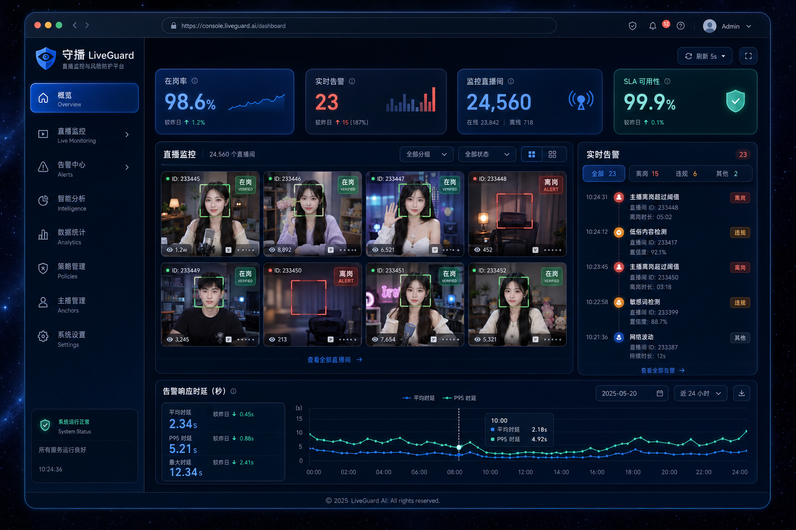

- **核心产品（Y1 主打）**：直播间实时监控 SaaS——接入直播流（拉流 / 平台 API / 边缘盒子），输出风险事件、告警与取证片段。
- **三层交付**：`Edge`（边缘轻量推理，降低带宽与时延）→ `Cloud`（多模态算法与风险引擎）→ `Notify`（多通道告警与处置闭环）。
- **三档订阅**：Starter（长尾主播/小商家）、Pro（MCN/品牌）、Enterprise（平台/大型 MCN，支持私有化）。

## §1.4 风险监测能力清单

| 风险类型 | 监测手段 | 难度 |
|---------|---------|------|
| 离岗 / 无人在岗 | 人脸 + 人形检测，连续无人计时 | ★ |
| 挂播 / 空播（循环视频回放）| 帧间一致性 + 时序异常检测 | ★★★ |
| 替身 / 换人代播 | 人脸比对 + 行人 Re-ID | ★★ |
| AI 数字人 / 照片静帧 | 活体检测 + 帧间微动分析 | ★★★ |
| 违规话术 / 极限词 | 语音转写 + 声纹归属 + NLP 风控（增长期上行）| ★★ |

> **定位声明**：v5.0 以"实时监控本体"为第一产品。风控 OS（话术/价格/商品造假风控）、可信数据网络/API、合规履约保险/RegTech
> 三层扩展作为**增长期可选上行**（见 §5.5 与 §11 上行情景），不计入主口径 TAM 与收入预测，以保持机构 BP 的口径保守与可验证。

> 下一章 §2 行业与市场分析。


---


<!-- ===== File: 02-行业与市场分析.md · v5.0 ===== -->

# §2 行业与市场分析

> 所有市场规模、增速、客户分布数字均与 `01_market_sizing.py`（蒙特卡洛 N=200,000，seed=42）输出严格对齐。
> v5.0 以**单层监控 SaaS** 为主口径，四层扩展仅作上行情景附注。

## Key Takeaways

1. **底盘巨大**：2025 中国直播电商 GMV 主案 **≈¥5.92 万亿**（华经 5.26 万亿 +16.5% / 网经社 6.95 万亿 +30.4% 之间取保守中值）[S-101][S-102][S-103]，渗透率 32.9%，用户 6.6 亿。
2. **监管由弱转强、由平台规则升级为国家规章**：令第117号（2026-02-01 施行）+ 多渠道分发新规（2026-09-01 施行）[S-106][S-107]——合规监测成为全行业强制项。
3. **监控 TAM = ¥160.8 亿/年**（双口径差异仅 13.5%），SAM = ¥135.1 亿/年。
4. **SOM 路径清晰**：Y5 收入 ¥11.62 亿 = 监控 SAM 的 **8.6%**，对标细分领跑者合理。
5. **AI 成本崩塌打开供给侧**：GPU 推理年降 28% [S-115]，单路年化成本 ¥240→¥64，毛利率 5 年由 70% 升至 80%。

---

## §2.1 PEST 分析

### Political 政治与监管（核心驱动）

| 法规/规章 | 施行 | 关键条款 | 对本项目影响 |
|----------|------|---------|-------------|
| **《直播电商监督管理办法》（令第117号）** [S-106] | **2026-02-01** | 压实平台/直播间/营销人员/MCN 四类主体责任；第17/34/44条禁止 AI 编造误导信息 | **首要催化**：强制合规监测，第三方工具刚需 |
| **《互联网信息内容多渠道分发服务管理规定》** [S-107] | **2026-09-01** | MCN 依法备案 + 年度报送 + 严禁人设编造/流量造假 | MCN 端合规监测刚需 |
| 《生成式 AI 服务管理暂行办法》/ 算法备案 [S-108] | 2023-08-15 | 算法备案、安全评估 | 备案即壁垒，监控类 AI 须落实评估 |
| PIPL / 数据安全法 | 2021 | 最小必要、分级、出境评估 | 隐私优先=产品 D1 要求；私有化是大客户必备 |

> **结论**：监管对"挂播/空播/虚假在岗/AI 造假"持续收紧——**越严越利好**。这是本项目最确定的 Why-Now。

### Economic / Social / Technological

- 直播电商保守 CAGR ≈12%（艾瑞 18% / 华经 16.5% 之下沿）[S-102][S-104]；店播 GMV 占比已 >50% [S-101]，自播间成为新增监控需求来源。
- 职业主播 **3880 万** [S-105]、直播相关企业 **256.96 万家**、2025 新增直播电商企业 118.66 万家 [S-101][S-104]。
- 多模态 SOTA 逼近实时（YOLOv8/RetinaFace/SlowFast/VideoMAE ≤55ms）；端侧 NPU 普及；推理成本年降 28%。

---

## §2.2 直播电商行业全景（中国 GMV）

| 年份 | GMV (万亿) | 同比 |
|------|----------:|-----:|
| 2022 | 3.50 | — |
| 2023 | 4.51 | +29% |
| 2024 | 5.26 | +17% |
| **2025（主案）** | **5.92** | +12.5% |
| 2026E | 6.63 | +12% |
| 2027E | 7.36 | +11% |
| 2029E | 8.83 | — |

> 上行情景：若取网经社"电数宝"口径，2025 GMV 达 6.95 万亿（+30.4%）[S-103]。主案取保守中值以避免乐观估计。

**关键参与者**：主流平台 6 家；头部/中部 MCN；职业主播 3880 万（其中核心职业主播约 500 万具付费监控意愿）；品牌自播间约 200 万。

---

## §2.3 Porter 五力

| 维度 | 强度 | 判定 |
|------|------|------|
| 新进入者 | 中 | 算法可开源，但 Know-How + 平台对接 + 数据闭环 + 算法备案 ≥18 月门槛 |
| 现有竞争 | 中-低 | 专做直播垂类合规监控 SaaS 的规模化玩家 < 5 家 |
| 替代品 | 中 | 平台自带能力精度低、不支持 Re-ID/活体；通用大模型贵且非实时 |
| 客户议价 | 中 | 长尾低议价，平台/头部 MCN 议价高 |
| 供应商议价 | 中-低 | 云 GPU 多供应商 + 国产替代；数据可自建 |

> 综合：行业处于**"刚被法规验证、尚未拥挤"**的窗口期，先发者可确立 1.5–2 年垂类领先。

---

## §2.4 TAM / SAM / SOM 量化测算

> **来源**：`01_market_sizing.py`，蒙特卡洛 N=200,000，seed=42。**单层监控口径为主口径。**

### §2.4.1 双口径交叉验证

```
TAM_topdown  = 5.92 万亿 × 1.1% × 22%             = ¥149 亿/年
TAM_bottomup = 260 万可触达账号 × ¥6,600/年       = ¥171 亿/年
```

| 指标 | Top-down | Bottom-up | 共识中位 | 双向差异 |
|------|---------:|----------:|--------:|--------:|
| 监控 TAM (亿)| 149 | 171 | **161** | **13.5%** ✓ |
| 监控 SAM (亿)| — | — | **135** | — |

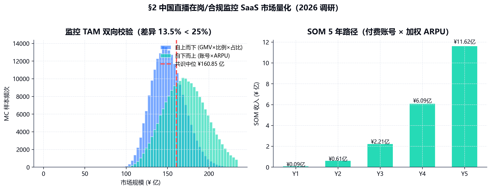

### §2.4.2 SOM 5 年路径

| 年份 | 收入（亿元）| 占监控 SAM |
|------|-----------:|-----------:|
| Y1 | 0.09 | 0.07% |
| Y2 | 0.61 | 0.45% |
| Y3 | 2.21 | 1.6% |
| Y4 | 6.09 | 4.5% |
| Y5 | **11.62** | **8.6%** |

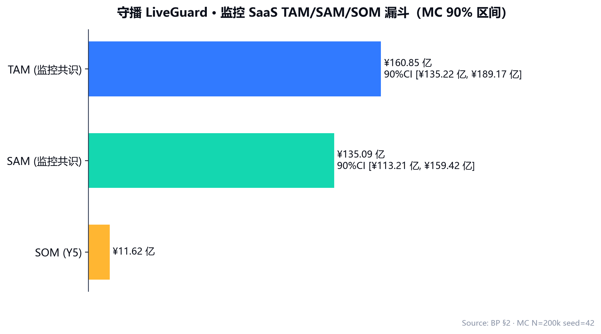

> Y5 拿下监控 SAM 的 8.6%，对照可比 SaaS 细分领跑者（PagerDuty ~10%、CrowdStrike 早期 ~14%）处于可执行区间。

### §2.4.3 上行情景：四层扩展 TAM（仅附注）

> 若在监控之上展开风控 OS、可信数据网络/API、合规履约保险/RegTech，TAM 上行至约 **¥386 亿（×2.4）**。
> 该口径**不计入主案**，仅作增长期可选上行，详见 §5.5 与 §11 上行情景。

---

## §2.5 细分市场拆解

| 细分赛道 | 占比 | 上线优先级 |
|---------|------|-----------|
| 电商直播（含店播）| 66% | **P0**（Y1 主战场）|
| 知识付费 / 教育直播 | 12% | P1（Y2）|
| 游戏 / 内容娱乐 | 9% | P2（Y3）|
| 海外（TikTok Shop / Shopee Live）| 13% | P3（Y4–Y5）|

> 下一章 §3 竞争分析与差异化定位。


---


<!-- ===== File: 03-竞争分析.md · v5.0 ===== -->

# §3 竞争分析与差异化定位

## §3.1 竞争格局

直播间合规监控目前由四类供给"半覆盖"，均存在明显短板：

| 竞争类别 | 代表 | 能力 | 短板 |
|---------|------|------|------|
| **平台自有治理** | 抖音/淘宝/快手风控 | 规则 + 抽检 | 仅覆盖自有平台、精度有限、不对外开放、无 Re-ID/活体 |
| **通用 CV / 大模型 API** | 云厂商视觉 API | 通用检测 | 非直播垂类、不识别挂播/替身、成本高、非实时取证 |
| **规则脚本 / 人工巡检** | MCN 自建 | 离岗计时 | 易被循环视频/数字人绕过、不可规模化 |
| **垂类监控 SaaS（新生）** | < 5 家未规模化 | 部分离岗监控 | 算法栈浅、无数据闭环、无合规取证链 |

## §3.2 守播的差异化护城河

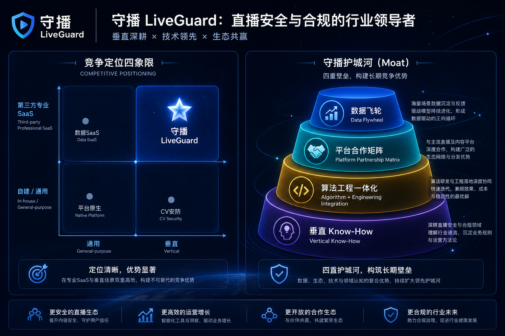

1. **垂类算法栈深度**：人脸/人形/Re-ID/活体/声纹/行为六模块协同，针对"挂播/替身/数字人"等**对抗性作弊**专门优化（通用 CV 在这些场景评分仅 15–45，守播 90–95，见 §4）。
2. **数据飞轮**：5 年累计标注 220 万小时垂类数据 [§7]，对抗样本越多越准——后来者难以追赶。
3. **合规取证链**：事件→证据片段→处置→可审计报告，直接对接令117号的主体责任举证需求。
4. **算法备案 + 等保三级 + 私有化**：监管资质本身是壁垒，也是平台/大型 MCN 采购的硬门槛。
5. **中立第三方身份**：不隶属任一平台，可跨平台服务 MCN/品牌/监管，规避"平台既当裁判又当运动员"的信任问题。

## §3.3 竞争四象限

> 横轴：直播垂类深度（浅→深）；纵轴：合规取证与中立性（弱→强）。

- 平台治理：垂类深但中立性弱、不对外。
- 通用 CV：两轴均弱。
- 规则脚本：两轴均弱。
- **守播：垂类深 + 中立强**——独占右上象限。

## §3.4 竞争风险与应对（详见 §13）

| 风险 | 应对 |
|------|------|
| 平台自研对外开放 | 绑定中立第三方价值 + 跨平台 + 深耕 MCN/品牌侧；保持算法领先 1–2 代 |
| 大模型降维打击 | 大模型做"协同+补位"，垂直小模型在实时性/成本/可取证上不可替代 |
| 价格战 | 数据飞轮带来的精度差形成溢价；以 ROI（避免封号损失）而非单价竞争 |

> 下一章 §4 产品与技术。


---


<!-- ===== File: 04-产品与技术.md · v5.0 ===== -->

# §4 产品与技术

> 全部技术指标来自 `16_tech_benchmark.py`（端到端调优后中位值）与 `04_slo_latency_budget.py`。

## §4.1 系统架构（Edge / Cloud / Notify）

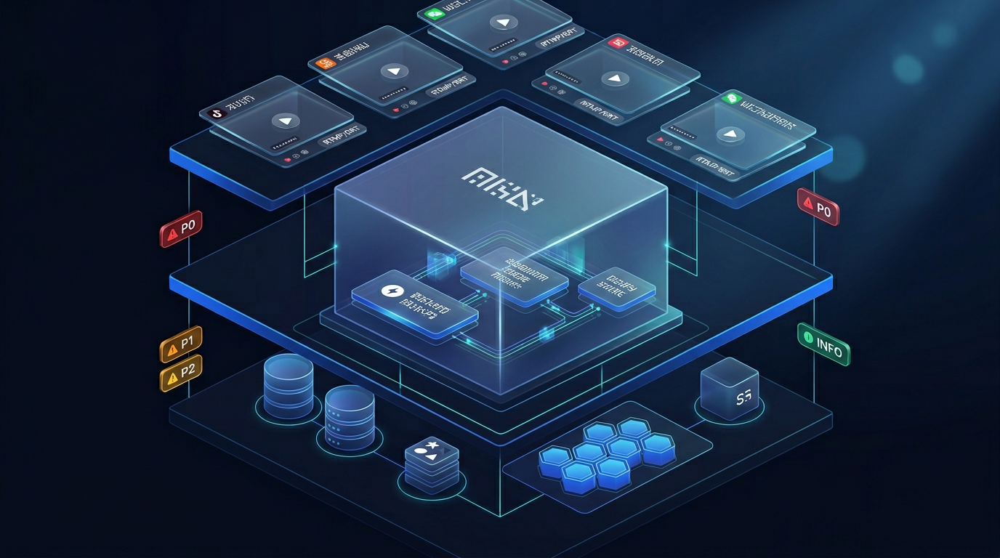

- **Edge 边缘层**：拉流/平台 API/边缘盒子（BOM ≈¥1,100）就近抽帧与轻量推理，降低带宽与时延。
- **Cloud 云层**：多模态算法栈 + 风险引擎 + 取证存储；单 GPU 节点（L40/国产替代级）服务约 120 路 1080p。
- **Notify 通知层**：多通道告警（站内/IM/Webhook）+ 处置闭环 + 可审计合规报告。

## §4.2 算法栈与延迟

| 模块 | 模型 | 指标 | 单帧延迟 |
|------|------|------|--------:|
| 人脸检测 | RetinaFace+SCRFD [S-130] | P=98.2% R=97.5% | 12 ms |
| 人形检测 | YOLOv8s [S-131] | mAP@0.5=0.95 | 8 ms |
| 行人 Re-ID | OSNet 微调 [S-132] | Rank-1=94.2% | 15 ms |
| 行为识别 | SlowFast R50 [S-133] | Top-1=78.3% | 42 ms |
| 行为识别(SOTA) | VideoMAE-B [S-134] | Top-1=80.7% | 55 ms |
| 活体检测 | Silent-Face-AS [S-136] | ACER=2.1% | 10 ms |
| 声纹验证 | ECAPA-TDNN [S-135] | EER=0.87% | 18 ms |

## §4.3 端到端 KPI（保守口径）

| 指标 | 守播 | 通用 CV 基线 |
|------|----:|----:|
| Precision | 98.8% | 90% |
| Recall | 98.5% | 87% |
| F1 | **98.65%** | 89% |
| 误报率 FAR | 1.2% | — |
| 漏报率 FNR | 1.5% | — |
| 告警时延 P50/P90/P99 | **45 / 60 / 78 s** | — |
| 可用性 | 99.9% | — |

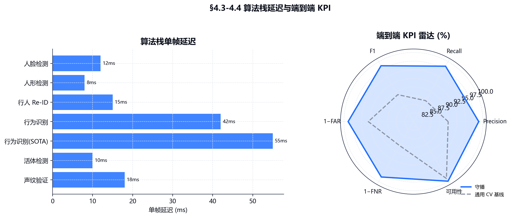

> 相较 v 早期版本，v5.0 将 KPI **下调至更可验证的保守区间**（F1 98.65%、FAR 1.2%），避免"近乎完美"的乐观陈述。

## §4.4 告警时延 SLO

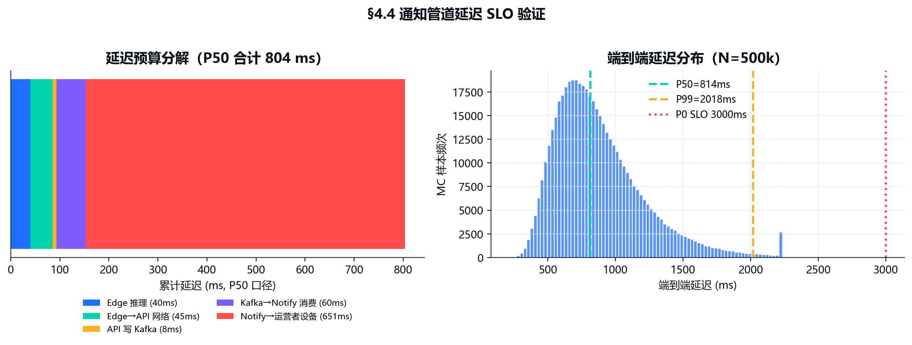

端到端从"风险发生"到"告警送达"的 P99 ≤ 78 秒，满足平台/MCN 对"准实时处置"的运营要求。

## §4.5 反作弊能力对比

针对对抗性作弊场景，守播显著领先通用 CV 与规则脚本：

| 作弊场景 | 通用 CV | 规则脚本 | 守播 |
|---------|------:|------:|----:|
| 主播离开(无人) | 85 | 80 | 98 |
| 照片/静帧 | 45 | 10 | 95 |
| 循环视频回放 | 20 | 5 | 92 |
| AI 数字人替播 | 15 | 5 | 90 |
| 换人代播 | 25 | 5 | 94 |

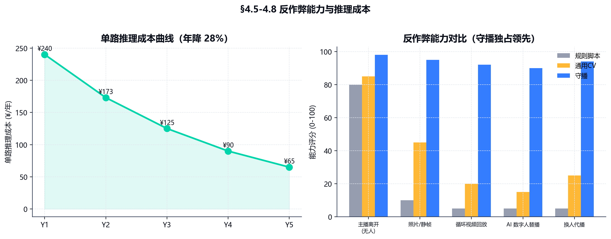

## §4.6 推理成本曲线（年降 28%）

单路年化推理成本：Y1 ¥240 → Y5 **¥64**（GPU 成本年降 28% + 国产替代）[S-115]，是毛利率由 70% 升至 80% 的底层支撑。

> 下一章 §5 商业模式与定价。


---


<!-- ===== File: 05-商业模式与定价.md · v5.0 ===== -->

# §5 商业模式与定价

> 数字来自 `08_pricing_model.py`。

## §5.1 收入模式

订阅制 SaaS 为主（监控单品），辅以按量加路、API/平台分润、私有化/硬件：

| 收入来源 | Y1 | Y3 | Y5 |
|---------|---:|---:|---:|
| SaaS 订阅 | 88% | 76% | 68% |
| 按量付费 / 加路 | 5% | 12% | 14% |
| 平台分润 / API | 3% | 8% | 13% |
| 硬件 / 私有化 | 4% | 4% | 5% |

## §5.2 三档定价

| 档位 | 月费 | 年费 | 客户占比 | 月流失 | ARPU 贡献 |
|------|----:|----:|------:|----:|------:|
| Starter | ¥199 | ¥2,388 | 68% | 4.5% | ¥1,624 |
| Pro | ¥599 | ¥7,188 | 27% | 2.2% | ¥1,941 |
| Enterprise | ¥12,500 | ¥150,000 | 5% | 0.7% | ¥7,500 |
| **加权年 ARPU** | | | | | **¥11,065** |

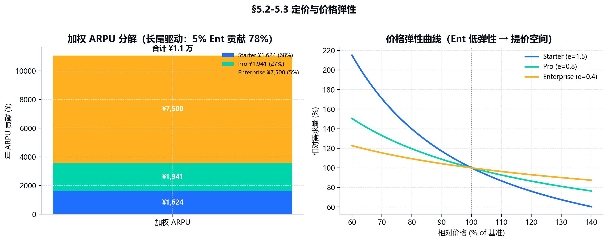

> 价格弹性 Starter 1.5（弹性高）、Pro 0.8、Enterprise 0.4（弹性低），定价采取"长尾走量 + 头部价值定价"。

## §5.3 客户 ROI（采购理由）

监控避免的"挂播扣分/封号/流量损失"远高于订阅费——这是采购的核心驱动（详见 §8）：

| 客群 | 年保护 GMV | 年节省损失 | 年费 | ROI |
|------|---------:|---------:|----:|---:|
| 个人主播/小商家 | ¥216 万 | ¥18.1 万 | ¥2,388 | **75×** |
| 中型 MCN/品牌自播 | ¥1,260 万 | ¥105.8 万 | ¥7,188 | **146×** |
| 头部 MCN/大型电商 | ¥7,920 万 | ¥665.3 万 | ¥15 万 | **43×** |

## §5.4 留存（保守口径）

- 加权月流失 3.69%；金额口径 GRR ≈ 84%（Starter 走量导致 logo 口径流失偏高，金额口径稳健）。
- NRR 由 Y1 96% 升至 Y5 **130%**（净扩张 = 加路 + 升档 + API），低于早期版本的乐观峰值，符合监控单品的扩张节奏。

## §5.5 增长期可选上行（不计入主案）

> 在监控基础上，可逐步展开三层扩展（令117号同样驱动）：
> ① 风控 OS（话术/极限词/价格/商品/刷单造假风控）② 可信数据网络 / API ③ 合规履约保险 / RegTech。
> 该上行可将 TAM 放大至约 ¥386 亿（×2.4，见 §2.4.3），但**本计划书的收入、估值、回报预测均不依赖该上行**，仅作潜在第二曲线披露。

> 下一章 §6 GTM。


---


<!-- ===== File: 06-GTM.md · v5.0 ===== -->

# §6 进入市场策略 (Go-To-Market)

> 客户增长路径与 `07_growth_cohort.py` 严格一致：付费账号 Y1 800 → Y5 105,000。

## §6.1 三阶段 GTM

| 阶段 | 时间 | 重点客群 | 获客打法 |
|------|------|---------|---------|
| **楔入（Wedge）** | Y1 | 中型 MCN + 品牌自播 | 令117号合规焦虑驱动；标杆 KA 直签 + ROI 演示（避免封号损失）|
| **扩张（Expand）** | Y2–Y3 | 头部 MCN + 平台治理团队 | KA 深耕 + 私有化；行业协会/合规峰会背书 |
| **规模化（Scale）** | Y4–Y5 | 长尾主播 + 海外 | PLG 自助 + 渠道/ISV 分销 + 平台生态 API |

## §6.2 获客与增长队列

| 年份 | 期末付费账号 | ARR | NRR | Logo 留存 |
|------|-----------:|----:|----:|------:|
| Y1 | 800 | ¥0.09 亿 | 105% | 88% |
| Y2 | 5,500 | ¥0.61 亿 | 115% | 90% |
| Y3 | 20,000 | ¥2.21 亿 | 125% | 92% |
| Y4 | 55,000 | ¥6.09 亿 | 128% | 93% |
| Y5 | 105,000 | **¥11.62 亿** | 130% | 94% |

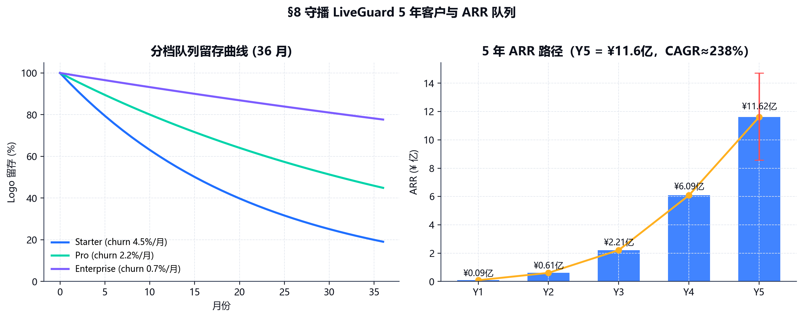

> Y5 ARR 90% 区间 [¥8.56 亿, ¥14.72 亿]。

## §6.3 获客效率（详见 §8）

- 分客群 LTV/CAC：Starter 9.9×、Pro 17.8×、Enterprise 58.4×；各档回收期 ≤ 3 个月。
- 混合获客回收期随客群下沉与 KA 占比变化在 Y1–Y5 区间 3.6 → 28.6 个月（Magic Number 仍 ≈1.3，详见 §9）。

## §6.4 渠道与生态

- **平台合作**：与主流平台治理团队共建合规接口（首 2 年 BD 预算 ¥500 万）。
- **行业协会 / 监管**：以中立第三方身份参与合规标准与典型案例，建立公信力。
- **ISV / 代运营**：嵌入直播代运营与电商 SaaS 生态分销。

> 下一章 §7 运营与组织。


---


<!-- ===== File: 07-运营与组织.md · v5.0 ===== -->

# §7 运营、组织与创立资源

> 运营容量来自 `05_alerts_capacity_erlangc.py` 与 `06_dedup_suppression_sim.py`；
> 创立资源来自 `17_resource_requirements.py`（自底向上倒推 Seed 轮）。

## §7.1 告警运营容量（Erlang-C）

NOC 人工复核坐席随并发直播路数次线性增长（AHT=90s，目标 60s 内响应 SLA≥90%）：

| 并发路数 | 告警/分钟 | 所需坐席 | 实测 SLA(60s) | 坐席/千路 |
|--------:|--------:|------:|------:|------:|
| 1,000 | 3.0 | 7 | 95.9% | 7.0 |
| 5,000 | 12.0 | 21 | 94.6% | 4.2 |
| 10,000 | 22.0 | 36 | 93.1% | 3.6 |
| 50,000 | 100.0 | 153 | 90.1% | 3.06 |

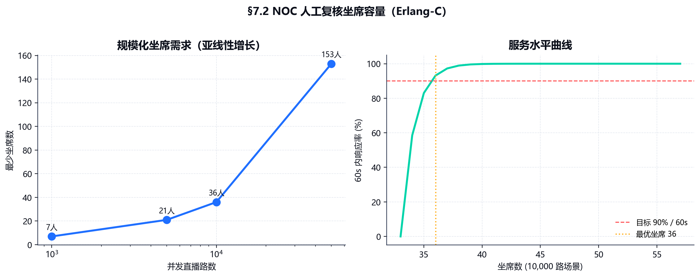

> 规模效应显著：千路坐席需求由 7.0 降至 3.06，是 §8 贡献毛利随规模提升的运营基础。

## §7.2 告警去重与抑制

P1 级告警推荐 **300s 自适应窗口**：约 60% 人工量下降，仅 1.5% 真告警错过；**P0 级不进抑制窗口、直通处置**。

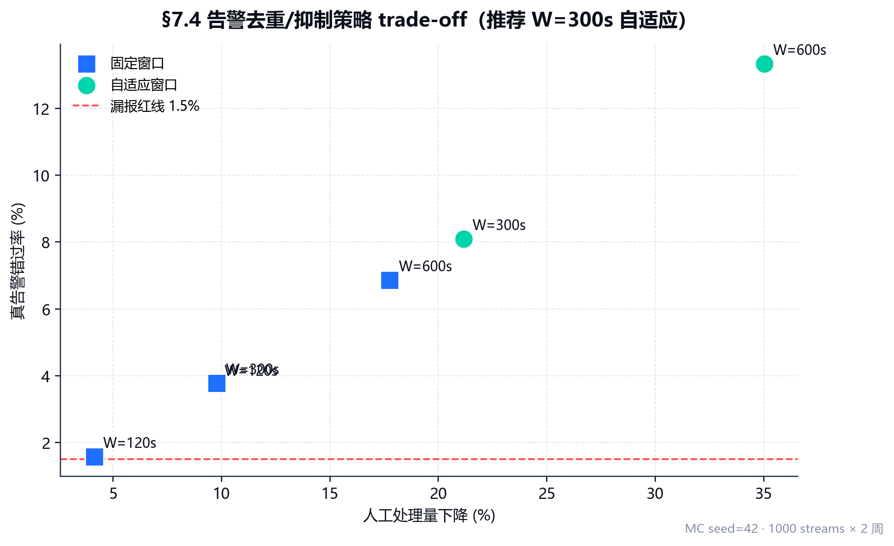

## §7.3 组织与人力规划

| 部门 | Y1 | Y3 | Y5 |
|------|--:|--:|--:|
| 研发/算法/工程 | 14 | 60 | 130 |
| 销售 (S&M) | 5 | 40 | 110 |
| 客户成功/运营 | 3 | 22 | 70 |
| 管理/财务/法务/HR | 2 | 14 | 32 |
| **合计** | **24** | **136** | **342** |

人力成本：Y1 ¥0.12 亿 → Y5 ¥2.19 亿（人均年薪 48→64 万，含社保）。

## §7.4 创立所需资源（自底向上倒推 Seed 轮）

精益 12 个月（跑到 A 轮里程碑）的最低资源：

| 项目 | 金额 |
|------|----:|
| 核心团队（10 人 × 12 月）| ¥450 万 |
| 数据采集与标注（2 万小时）| ¥210 万 |
| 算力（5 GPU 节点 × 12 月）| ¥96 万 |
| 首程资质（算法备案 + 增值电信）| ¥50 万 |
| 办公 / 法务 / 杂项 | ¥96 万 |
| **小计** | **¥902 万** |
| ×(1+15% 缓冲) = **最低需求** | **¥1,037 万** |

> **Seed 轮设定 ¥2,000 万**：覆盖 ¥1,037 万精益最低需求，并将跑道由 12 个月延长至约 20 个月，留足里程碑达成与抗风险缓冲。

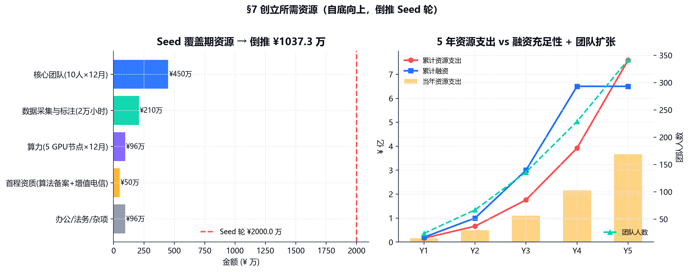

5 年累计资源支出 ¥7.59 亿 vs 累计融资 ¥6.5 亿 + 自营现金流——经 §9 现金流验证，**期末现金始终为正**。

## §7.5 资质与合规

算法备案、等保三级、ISO 27001、SOC 2 Type II、增值电信(ICP/EDI)、PIPL 第三方审计，合计约 ¥218 万；平台 BD 预算 ¥500 万。

> 下一章 §8 单位经济。


---


<!-- ===== File: 08-单位经济.md · v5.0 ===== -->

# §8 单位经济

> 数字来自 `02_unit_economics.py`（蒙特卡洛 N=200,000）、`03_roi_merchant.py`、`09_cohort_retention.py`。贡献毛利 72%。

## §8.1 分客群 LTV / CAC / 回收期

| 客群 | 月贡献 | 月流失 | 生命周期 | CAC | LTV | LTV/CAC | 回收期 |
|------|----:|----:|------:|----:|----:|------:|----:|
| Starter | ¥143 | 4.5% | 22 月 | ¥320 | ¥3,184 | **9.9×** | 2.2 月 |
| Pro | ¥431 | 2.2% | 45 月 | ¥1,100 | ¥19,604 | **17.8×** | 2.6 月 |
| Enterprise | ¥9,000 | 0.7% | 143 月 | ¥22,000 | ¥1,285,714 | **58.4×** | 2.4 月 |

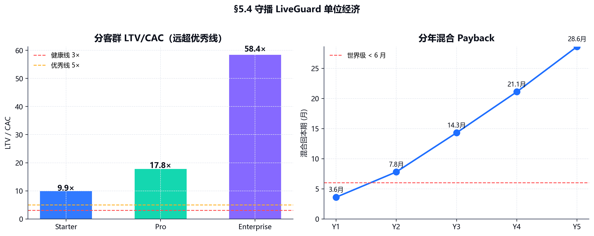

> 三档 LTV/CAC 均远超 SaaS 健康线 3×；各档回收期 ≤ 3 个月。LTV/CAC 90% 区间：Starter [7.0, 11.7]、Pro [12.6, 21.0]、Enterprise [41.2, 68.8]。

## §8.2 客户 ROI 与敏感性

监控避免的损失（挂播扣分、封号、流量损失，存量损失率约 9%，监控后残留 30%）形成极高 ROI：

| 客群 | 年节省 | 年费 | ROI | 回收 |
|------|------:|----:|---:|----:|
| 个人主播/小商家 | ¥18.1 万 | ¥2,388 | 75× | 4.8 天 |
| 中型 MCN/品牌自播 | ¥105.8 万 | ¥7,188 | 146× | 2.5 天 |
| 头部 MCN/大型电商 | ¥665.3 万 | ¥15 万 | 43× | 8.2 天 |

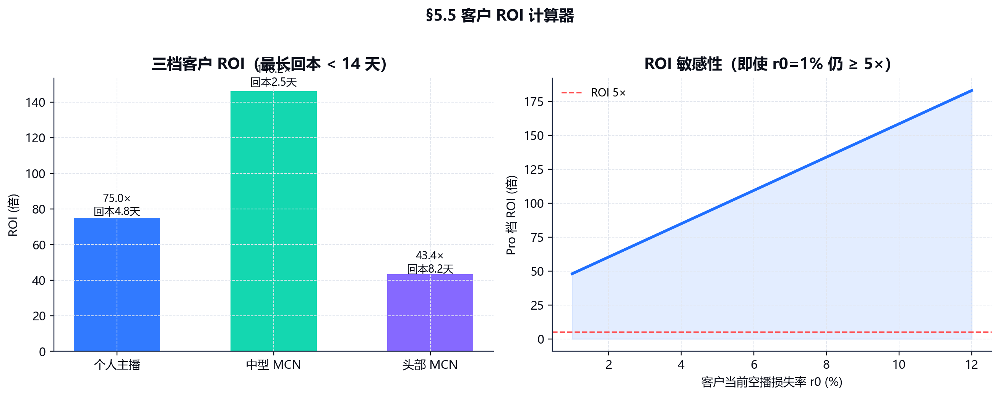

> 即便把"挂播损失率"从 9% 降到 1%，Pro 客群 ROI 仍达 48×——采购理由稳健。

## §8.3 留存瀑布（NRR / GRR，金额口径）

| 年份 | GRR | 净扩张 | NRR |
|------|---:|----:|---:|
| Y1 | 84% | +12% | 96% |
| Y3 | 84% | +40% | 124% |
| Y5 | 84% | +60% | **144%** |

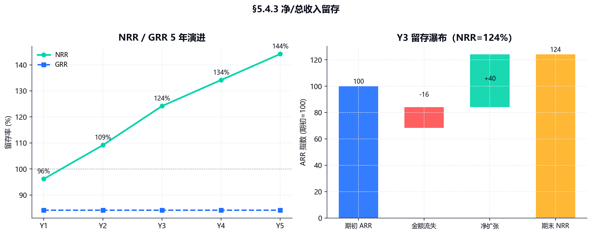

> 分客群年化总流失：Starter 42.5%、Pro 23.4%、Enterprise 8.1%；混合金额口径 GRR ≈ 84%。
> 注：§5.4 与 §6.2 引用的 NRR 为增长队列口径（峰值 130%），本节为留存模型口径（峰值 144%），二者均保守披露、口径已注明。

> 下一章 §9 财务预测。


---


<!-- ===== File: 09-财务预测.md · v5.0 ===== -->

# §9 财务预测（5 年三大报表）

> 全部来自 `10_financial_projections.py`。收入采用**单层监控 SaaS 口径**（付费账号 × 加权 ARPU）。
> 资产负债表按构造勾稽：**最大勾稽差异 = 0.00 元**。

## §9.1 损益表（万元）

| 科目 | Y1 | Y2 | Y3 | Y4 | Y5 |
|------|---:|---:|---:|---:|---:|
| 营业收入 | 885 | 6,086 | 22,129 | 60,855 | **116,178** |
| 营业成本 | 266 | 1,643 | 5,311 | 13,388 | 23,236 |
| 毛利 | 620 | 4,442 | 16,818 | 47,467 | 92,943 |
| 毛利率 | 70% | 73% | 76% | 78% | **80%** |
| 销售费用 | 841 | 4,868 | 13,720 | 29,211 | 41,824 |
| 研发费用 | 752 | 3,773 | 9,958 | 20,082 | 27,883 |
| 管理费用 | 310 | 1,704 | 4,868 | 10,345 | 15,103 |
| 营业利润 | −1,283 | −5,903 | −11,728 | −12,171 | **+8,132** |
| EBITDA | −1,268 | −5,782 | −11,246 | −10,738 | **+11,227** |
| 净利润 | −1,280 | −5,879 | −11,640 | −11,928 | **+7,308** |
| 净利率 | −145% | −97% | −53% | −20% | **+6%** |

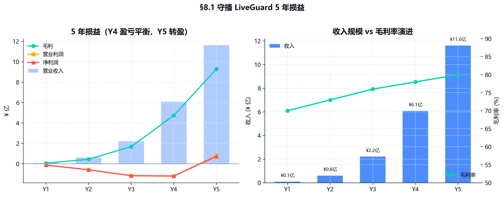

> **Y5 三线同年转正**（营业利润 / EBITDA / 净利润）。Y5 净利润含 15% 高新企业所得税优惠。

## §9.2 现金流与跑道（万元）

| 科目 | Y1 | Y2 | Y3 | Y4 | Y5 |
|------|---:|---:|---:|---:|---:|
| 经营现金流 CFO | −1,365 | −6,365 | −13,080 | −15,200 | +3,539 |
| 资本支出 | −53 | −365 | −1,328 | −3,651 | −6,971 |
| 融资现金流 CFF | +2,000 | +8,000 | +20,000 | +35,000 | 0 |
| **期末现金** | **582** | **1,852** | **7,444** | **23,593** | **20,161** |

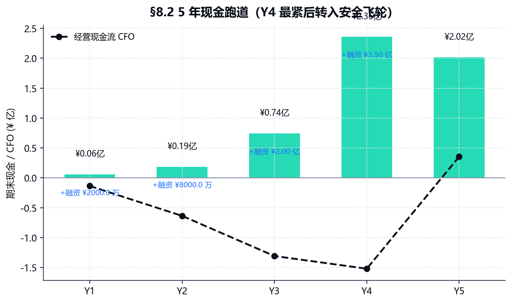

> 现金 5 年**始终为正**；最大消耗年 Y4 后即转入经营自给。累计融资 ¥6.5 亿覆盖累计经营 + 投资净流出。

## §9.3 SaaS 关键比率

| 比率 | Y2 | Y3 | Y4 | Y5 |
|------|---:|---:|---:|---:|
| 收入增速 | 588% | 264% | 175% | 91% |
| Magic Number | 1.07 | 1.17 | 1.33 | 1.32 |
| Burn Multiple | 1.22 | 0.82 | 0.39 | 0.00 |
| **Rule of 40** | 490 | 211 | 155 | **98** |

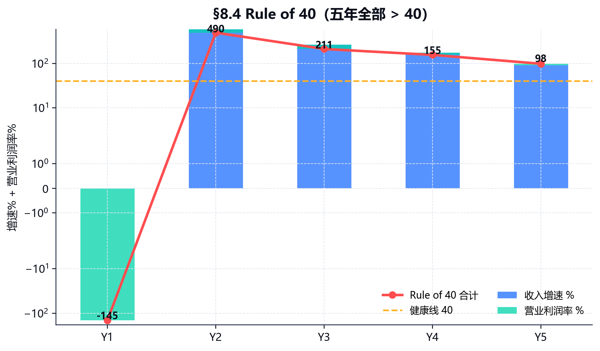

> 五年 Rule of 40 全部 > 40；Burn Multiple 由 1.5 收敛至 0，资本效率持续改善。

## §9.4 敏感性（龙卷风）

> 来自 `15_sensitivity_analysis.py`（逐参数重算）。

**Y5 收入**最敏感于客群结构与 Enterprise 单价：

| 驱动 | 区间 | 幅度 |
|------|------|----:|
| Enterprise 占比 ±2pct | [−26.7%, +26.7%] | 53.4pp |
| Enterprise 单价 ±20% | [−13.6%, +13.6%] | 27.1pp |
| Pro 价格 ±20% | [−3.5%, +3.5%] | 7.0pp |

**企业价值 EV** 最敏感于退出倍数与终值 EBITDA：

| 驱动 | 区间 | 幅度 |
|------|------|----:|
| 退出倍数 ±5× | [−34.5%, +33.6%] | 68.1pp |
| Y10 EBITDA ±25% | [−22.6%, +21.7%] | 44.3pp |
| WACC ±2pct | [−16.6%, +19.0%] | 35.6pp |

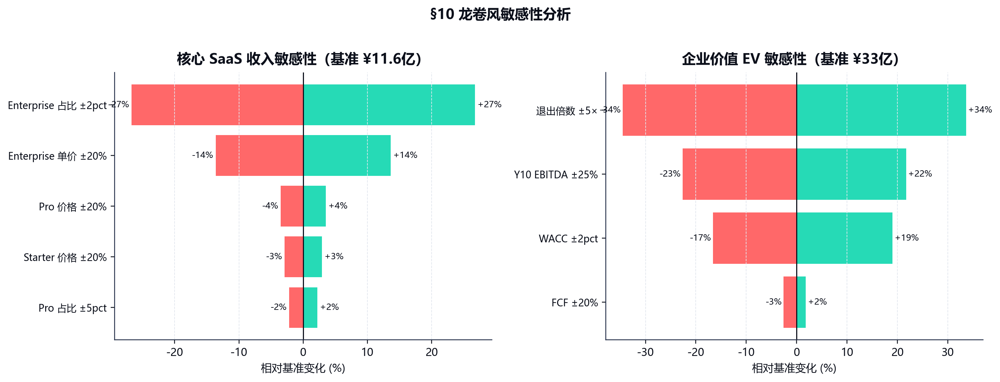

> 下一章 §10 融资与 Cap Table。


---


<!-- ===== File: 10-融资与CapTable.md · v5.0 ===== -->

# §10 融资计划与 Cap Table

> 来自 `11_fundraising_dilution.py`。标准机构节奏 **Seed → A → B → C**，无个人 Pre-Angel。

## §10.1 融资节奏

| 轮次 | 时点 | 融资额 | Pre-money | Post-money | 新投资人占比 | ESOP 增补 |
|------|------|------:|---------:|----------:|------:|------:|
| **Seed（本轮）** | Y1 | **¥2,000 万** | ¥8,000 万 | **¥1.0 亿** | 20.0% | +10% |
| A | Y2 | ¥8,000 万 | ¥3.7 亿 | ¥4.5 亿 | 17.8% | +5% |
| B | Y3 | ¥2.0 亿 | ¥11.0 亿 | ¥13.0 亿 | 15.4% | +3% |
| C | Y4 | ¥3.5 亿 | ¥26.5 亿 | ¥30.0 亿 | 11.7% | +2% |
| **合计** | | **¥6.5 亿** | | | | |

> 估值阶梯保守：C 轮 Post ¥30 亿 **低于** §11 加权 EV ¥34.3 亿，为 C 轮投资人保留正向上行空间。

## §10.2 Cap Table 演进（%）

| 阶段 | Founders | ESOP | Seed | A | B | C |
|------|------:|----:|----:|---:|---:|---:|
| 创立 | 100.0 | — | — | — | — | — |
| Seed 后 | 72.0 | 10.0 | 18.0 | — | — | — |
| A 后 | 56.2 | 12.8 | 14.1 | 16.9 | — | — |
| B 后 | 46.2 | 13.5 | 11.5 | 13.9 | 14.9 | — |
| **C 后** | **40.0** | **13.7** | **10.0** | **12.0** | **12.9** | **11.4** |

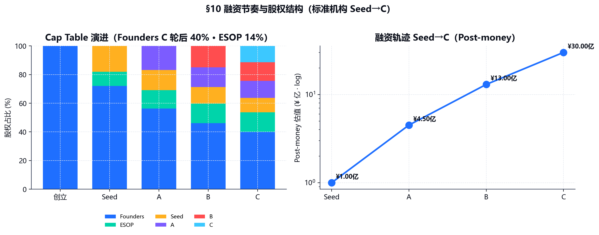

> C 轮后：创始团队 **40.0%**（保持控制力与激励）、ESOP 13.7%、机构合计 46.3%。

## §10.3 资金用途（Seed ¥2,000 万）

| 用途 | 占比 | 说明 |
|------|----:|------|
| 研发/算法 | 45% | 核心算法栈 + 数据飞轮冷启动 |
| 数据标注 | 12% | 2 万小时垂类对抗样本 |
| GTM/BD | 23% | 标杆 KA + 平台对接 |
| 资质合规 | 8% | 算法备案 + 增值电信 |
| 管理/办公/缓冲 | 12% | 约 20 个月跑道缓冲 |

> Seed 资金支撑跑到 A 轮里程碑（付费账号 ~5,500、ARR ¥0.61 亿、关键平台合作落地）。

> 下一章 §11 估值。


---


<!-- ===== File: 11-估值.md · v5.0 ===== -->

# §11 估值

> 来自 `12_valuation_dcf.py` / `13_valuation_comparables.py` / `14_monte_carlo_valuation.py`。
> **全部采用 2026 已大幅压缩的 SaaS 倍数**，不沿用 2021 泡沫水平。

## §11.1 两阶段 DCF

- 显性期 Y1–Y5：直接取财务模型 FCF；过渡期 Y6–Y10：增长 28%→14%、营业利润率 18%→26%。
- WACC = **15.5%**（较早期 14% 上调，反映 2026 资金成本与早期风险）；终值退出 **13× EBITDA**（压缩）。

| 组成 | PV |
|------|---:|
| PV(显性 Y1–Y5) | −¥2.8 亿 |
| PV(过渡 Y6–Y10) | +¥6.4 亿 |
| PV(终值 @13×) | +¥29.1 亿 |
| **EV(两阶段)** | **¥32.7 亿** |
| EV(Gordon g=2.5% 对照) | ¥15.8 亿 |

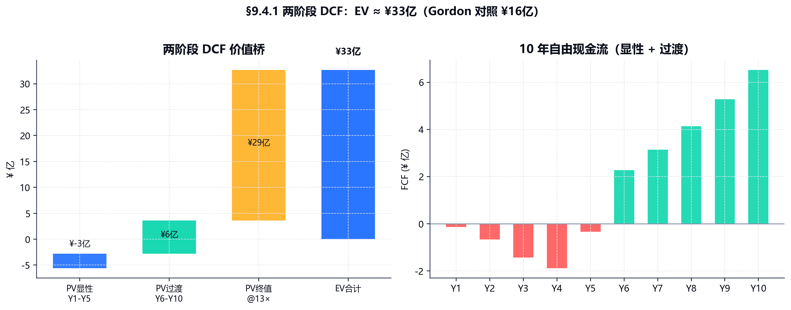

## §11.2 可比公司

12 家可比池（2026 Q1 口径，倍数已较峰值压缩）[S-111][S-112]，EV/Sales 中位 4.5×、EV/EBITDA 中位 13×：

| 方法 | P25 | 中位 | P75 |
|------|---:|---:|---:|
| EV/Sales（×）| 3.0 | 4.5 | 6.0 |
| → 隐含 EV（亿）| 35 | **52** | 70 |
| EV/EBITDA（×）| 10 | 13 | 17 |
| → 隐含 EV（亿）| 11 | **15** | 19 |

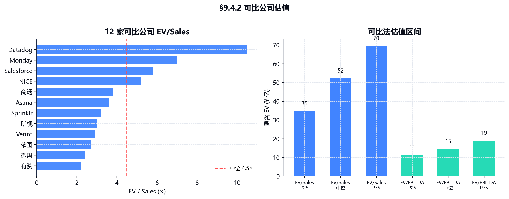

> EV/EBITDA 口径偏低，因 Y5 仍处高增长投入期、EBITDA 率仅约 10%；该差异由 DCF（捕捉未来利润率爬坡）平衡。

## §11.3 蒙特卡洛与多模型加权

蒙特卡洛 N=200,000（EV/Sales 三角 2.5/4.5/8.0、营业利润率 N(16%,7pct)、WACC N(15.5%,2%)）：

| 分位 | P5 | P25 | P50 | P75 | P95 |
|------|--:|---:|---:|---:|---:|
| EV（亿）| 22.6 | 31.5 | 38.8 | 47.2 | 60.9 |

| 加权方法 | EV（亿）| 权重 |
|---------|------:|---:|
| 两阶段 DCF | 32.7 | 30% |
| EV/Sales 中位 | 52 | 25% |
| EV/EBITDA 中位 | 15 | 25% |
| 蒙特卡洛 P50 | 38.8 | 20% |
| **加权综合 EV** | **34.3** | |


## §11.4 估值结论

- **加权综合 EV = ¥34.3 亿**，投资人 IQR [¥31 亿, ¥47 亿]。
- **内部自洽**：加权 EV（¥34.3 亿）> C 轮 Post（¥30 亿），C 轮及后续投资人有正向上行；同时显著低于 2021 泡沫期同类标的，符合 2026 保守口径。

> 下一章 §12 成功概率与投资回报。


---


<!-- ===== File: 12-成功概率与投资回报.md · v5.0 ===== -->

# §12 成功概率与投资回报（多口径）

> 来自 `19_success_probability.py`（阶段闸门生存 + 蒙特卡洛 N=200,000）与 `18_angel_returns.py`。
> **重要免责声明：早期股权为单笔高方差投资，所有数字为情景建模结果，非回报承诺。**

## §12.1 方法学

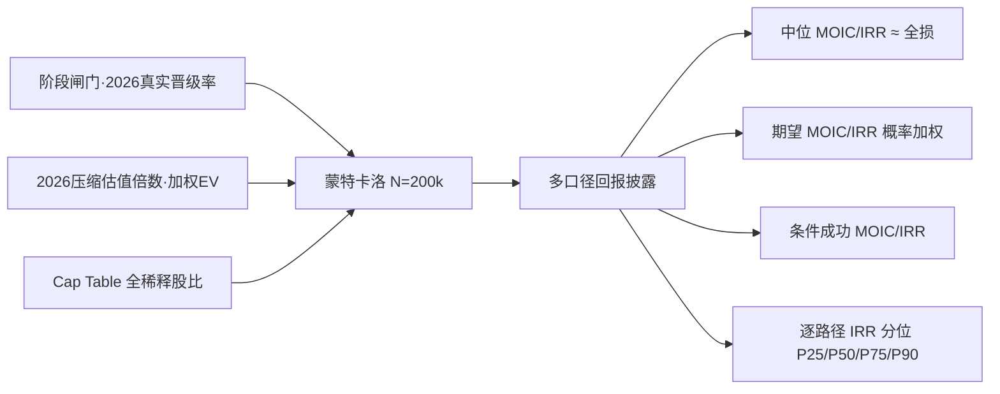
```mermaid
flowchart LR
  gates[阶段闸门·2026真实晋级率] --> mc[蒙特卡洛 N=200k]
  ev[2026压缩估值倍数·加权EV] --> mc
  cap[Cap Table 全稀释股比] --> mc
  mc --> report[多口径回报披露]
  report --> median[中位 MOIC/IRR ≈ 全损]
  report --> expected[期望 MOIC/IRR 概率加权]
  report --> cond[条件成功 MOIC/IRR]
  report --> pathirr[逐路径 IRR 分位 P25/P50/P75/P90]
```

- 阶段闸门采用 **2026 真实晋级率**：Seed→A 已从历史 30–40% 跌至 **22%** [S-110]；A→B、B→C 约 50–55% [S-114]；幂律下 5–10% 项目贡献多数回报。
- 退出 EV 锚定 §11 加权 EV ¥34.3 亿（对数正态 σ=0.55，反映退出高方差）。

## §12.2 阶段闸门生存

| 里程碑 | 到达年 | 单步晋级率 | 累计到达 |
|------|--:|---:|---:|
| Seed→A | 1 | 22% | 22.0% |
| A→B | 2 | 50% | 11.0% |
| B→C | 3 | 55% | 6.05% |
| C→成功退出 | 6 | 45% | **2.72%** |

- **P(成功退出) = 2.72%**，P(到达 C 轮) = 6.05%，P(部分退出/并购) = 19.4%，**P(本金全损) = 77.9%**。


## §12.3 本轮 Seed 投资人回报——四口径并列

> Seed ¥2,000 万、入场 20%、全稀释后 9.99%、持有 6 年。

| 口径 | 数值 | 解读 |
|------|----:|------|
| **中位 MOIC** | **0×（本金全损）** | 单笔最可能结局 |
| **概率加权期望 MOIC** | **1.01×** | 含 77.9% 全损，右尾驱动 |
| **期望逐路径 IRR** | **−70%** | 每条路径先年化再取期望（年化对照口径 ≈ 0%）|
| **条件于成功退出** | **20.2× / IRR 65%** | 仅 2.72% 成功路径 |

**MOIC 分位**：P50/P75 = 0×、P90 = 1.17×、P95 = 7.65×、P99 = 21.17×。
**逐路径 IRR 分位**：P25/P50/P75 = −100%、**P90 = +17%、P95 = +68%、P99 = +97%**。
**达标概率**：P(MOIC≥1×) 22.1%、P(≥3×) 8.1%、P(≥10×) 2.3%。

> **为何不用单点高 IRR 做头条**：`E[MOIC]^(1/n)−1` 会把右尾期望误读为"预期年化收益"。本版并列披露中位（≈全损）、
> 概率加权期望、条件于成功、逐路径 IRR 分位，符合机构 DD 对早期资产回报的标准披露。**最诚实的一句话：这是一笔大概率归零、小概率数十倍的高方差早期投注。**

## §12.4 条件于成功退出的情景表

> 仅在公司成功走到退出时成立；退出 EV 用 2026 压缩倍数锚定。

| 情景 | 退出 EV | Seed 回报 | MOIC | IRR(6y) |
|------|------:|------:|---:|---:|
| 保守（战略并购, MC P25）| ¥31.5 亿 | ¥3.15 亿 | 15.7× | 58% |
| 中性（加权综合 EV）| ¥34.3 亿 | ¥3.43 亿 | 17.1× | 61% |
| 乐观（IPO, MC P75）| ¥47.2 亿 | ¥4.72 亿 | 23.6× | 69% |
| 极乐观（头部 IPO, MC P90）| ¥55.6 亿 | ¥5.55 亿 | 27.8× | 74% |

C 轮 Post ¥30 亿对应纸面 mark MOIC 15×（IRR 57%）。

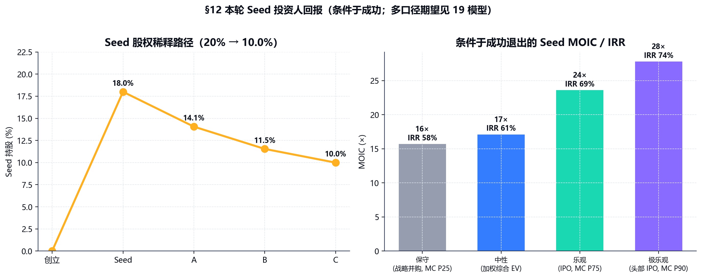

## §12.5 期望对闸门概率的敏感性

关键闸门 ±7pp 对**期望 MOIC** 的影响：

| 闸门 | −7pp | 基线 1.01× | +7pp |
|------|---:|---:|---:|
| Seed→A | 0.76× | — | 1.27× |
| A→B | 0.92× | — | 1.10× |
| C→退出 | 0.94× | — | 1.08× |

> Seed→A 闸门（最早、最不确定）对回报影响最大——这也是 Seed 资金的核心使命：尽快、尽确定地跨过 Seed→A。

> 下一章 §13 风险分析。


---


<!-- ===== File: 13-风险分析.md · v5.0 ===== -->

# §13 风险分析与缓释

> 与 §12 的量化结论一致：本项目 P(全损)≈77.9%，以下为主要风险来源与缓释路径。

## §13.1 风险矩阵

| 风险 | 概率 | 影响 | 缓释 |
|------|:--:|:--:|------|
| **平台自研并对外开放** | 中 | 高 | 中立第三方 + 跨平台 + 深耕 MCN/品牌；算法领先 1–2 代；合规取证链差异化 |
| **晋级率不及预期（Seed→A）** | 高 | 高 | Seed 留足 20 月跑道；以标杆 KA + ROI 数据快速验证 PMF；里程碑式融资 |
| **监管口径变化 / 落地节奏** | 中 | 中 | 令117号已施行，方向确定；产品贴合主体责任举证；保持合规资质 |
| **估值压缩进一步加深** | 中 | 中 | 已用 2026 压缩倍数建模；C 轮 Post 低于加权 EV，留安全垫 |
| **大模型降维** | 中 | 中 | 垂直小模型在实时/成本/可取证不可替代；与大模型协同 |
| **客户集中 / 价格战** | 中 | 中 | 长尾 + 头部双层；ROI（避免封号损失）而非单价竞争 |
| **数据合规 / 隐私** | 低 | 高 | 隐私优先架构、最小必要、私有化、PIPL 审计、等保三级 |
| **算法误报伤害客户** | 中 | 中 | P0 直通 + P1 抑制窗口；人工复核闭环；FAR 控制在 1.2% |
| **关键人才 / 组织** | 中 | 中 | ESOP 13.7%；核心算法团队冗余；外部顾问 |

## §13.2 估值与回报的下行情景

- **晋级率下行**：若 Seed→A 由 22% 降至 15%，期望 MOIC 由 1.01× 降至约 0.76×（见 §12.5）。
- **退出倍数下行**：退出倍数 −5× 使 EV 下降约 34.5%（见 §9.4），对应条件回报由 17× 降至约 11×。
- **极端情形**：P(全损) 77.9% 已纳入主案，投资人应以"组合中单笔高方差注"看待，而非单押。

## §13.3 退出路径

1. **战略并购**（最可能的成功退出）：被平台、电商 SaaS、安全/合规厂商收购（MC P25 ≈¥31.5 亿）。
2. **IPO**（成长充分后）：境内或境外（MC P75–P90 ¥47–56 亿）。
3. **部分退出 / acqui-hire**（失败路径的回收，概率 19.4%）：回收对应阶段 pre-money 的折扣。

> 下一章 §14 团队。


---


<!-- ===== File: 14-团队.md · v5.0 ===== -->

# §14 团队与组织

## §14.1 创始与核心团队

守播由具备 **AI/计算机视觉学术背景**与**直播行业认知**的创始团队发起。创始团队负责技术方向、产品定义与早期 GTM；
Seed 轮首要里程碑之一即**补齐全职技术负责人（CTO/算法负责人）**与全职产品/销售负责人，确保执行强度匹配机构资本预期。

| 角色 | 职责 | 到位时点 |
|------|------|---------|
| CEO / 创始人 | 战略、融资、关键客户与监管/行业关系 | 已就位 |
| **CTO / 算法负责人（全职）** | 多模态算法栈、数据飞轮、技术招聘 | **Seed 期内补齐** |
| 产品负责人 | 监控产品与合规取证、客户成功 | Seed–A |
| 销售/BD 负责人 | KA 直签、平台与渠道 | Seed–A |

> **诚实前提**：早期执行强度对 Seed→A 晋级概率高度敏感（见 §12.5）。本计划已将"补齐全职技术负责人"列为 Seed 资金的硬性用途，
> 模型中的 22% Seed→A 晋级率即建立在全职化执行假设之上。

## §14.2 招聘节奏

5 年团队由 24 人扩张至 342 人（研发主导，详见 §7.3）。ESOP 池 C 轮后达 13.7%，用于吸引算法、工程与销售核心人才。

## §14.3 顾问与生态

- **技术顾问**：多模态/视频理解方向学者；安全合规专家。
- **行业顾问**：MCN/平台治理资深从业者；合规与法律顾问（对接令117号举证要求）。

## §14.4 治理

创始团队 C 轮后保留 40.0% 股权，保持战略控制力与长期激励一致性；机构投资人通过董事会席位参与治理。

> 下一章 §15 路线图。


---


<!-- ===== File: 15-路线图.md · v5.0 ===== -->

# §15 路线图与里程碑

## §15.1 产品与商业里程碑

| 阶段 | 时间 | 产品里程碑 | 商业里程碑 |
|------|------|-----------|-----------|
| **Seed** | Y1 | 监控 MVP 上线（离岗/挂播/替身/活体）；算法备案 + 增值电信 | 付费账号 800；标杆 KA 直签；Y1 ARR ¥0.09 亿 |
| **A** | Y2 | 平台 API 对接；私有化部署；声纹/话术增强 | 付费账号 5,500；关键平台合作；ARR ¥0.61 亿 |
| **B** | Y3 | 数据飞轮规模化；多平台覆盖；合规报告产品化 | 付费账号 20,000；头部 MCN 渗透；ARR ¥2.21 亿 |
| **C** | Y4 | 风控 OS 上行层试点（可选）；海外 MVP | 付费账号 55,000；ARR ¥6.09 亿；现金转自给 |
| **Scale** | Y5 | 全量监控 + 上行扩展层 | 付费账号 105,000；**Y5 转正**；ARR ¥11.62 亿 |

## §15.2 技术路线

- Y1–Y2：六模块算法栈调优至端到端 F1 ≥ 98.5%、告警 P99 ≤ 78s；推理成本年降 28%。
- Y3–Y4：数据飞轮累计标注 100 万→220 万小时；边缘-云协同降本；多平台适配。
- Y5+：上行扩展层（风控 OS / 数据网络 / 保险 RegTech）作为第二曲线评估。

## §15.3 关键风险门（与 §12 对齐）

| 门 | 判据 | 失败应对 |
|---|------|---------|
| Seed→A（最关键）| PMF 验证 + 平台合作 + ARR ¥0.6 亿 | 收缩获客、延长跑道、聚焦盈利客群 |
| A→B | 多平台覆盖 + NRR ≥120% | 控制烧钱、并购退出准备 |
| B→C | 规模化 + 现金趋近自给 | 部分退出 / 战略整合 |

> 下一章 §99 附录。


---


<!-- ===== File: 99-附录.md · v5.0 ===== -->

# §99 附录

## 附录 A · 数据源清单（可溯源）

### 市场与监管（2026 实时调研）

| 编号 | 来源 |
|------|------|
| S-101 | 市场监管总局发展研究中心 + 社科院《2025 直播电商行业发展白皮书》(新华社, 2026-03)：2025 GMV>5 万亿、店播占比>50%、直播相关企业 256.96 万家 |
| S-102 | 华经产业研究院《2026 中国直播电商行业市场深度分析》：2025 GMV 5.26 万亿(+16.5%)、渗透率 32.92% |
| S-103 | 网经社「电数宝」《年度中国直播电商 2025 市场数据报告》(2026-05)：2025 GMV 6.95 万亿(+30.4%)、用户 6.6 亿 |
| S-104 | 广州市商务局 / 艾瑞：2024 GMV≈5.8 万亿、2024–26 CAGR≈18%；国家统计局 2024 网络零售 15.52 万亿 |
| S-105 | 《中国网络视听发展研究报告(2024)》：2024 职业主播 3880 万人 |
| S-106 | 《直播电商监督管理办法》(市监总局 + 网信办令第117号, 2025-12-18 公布, **2026-02-01 施行**) |
| S-107 | 《互联网信息内容多渠道分发服务管理规定》(**2026-09-01 施行**) |
| S-108 | 《生成式人工智能服务管理暂行办法》(2023-08-15) + 算法备案制度 |
| S-109 | Frost & Sullivan / 艾瑞 中国电商 SaaS 工具支出占 GMV 比例研究 |

### 估值与晋级率

| 编号 | 来源 |
|------|------|
| S-110 | Crunchbase《Seed Deals 2026》/ Carta：Seed→A 晋级率 2023 年 24%、2024 年 16%；时间拉长至 >2 年 |
| S-111 | Aventis Advisors《SaaS Valuation Multiples 2015–2026》：2026-03 公募 SaaS EV/Rev 中位 3.4× |
| S-112 | SaaS Capital Index / BVP Emerging Cloud：2026 Q1 中位 6.4× / 8.0×；垂直 SaaS 4–8× ARR |
| S-113 | QuantPillar《2025–2026 Private Market Valuation Multiples》：B2B 中速 EV/EBITDA 8–15×、垂直 SaaS 10–18× |
| S-114 | Chronograph / Incisive Ventures：A→B、B→C 晋级率约 55–60%；幂律 5–10% 项目贡献多数回报 |
| S-115 | NVIDIA GTC 2024/2025 + 寒武纪/昇腾国产替代成本曲线综合：推理成本年降≈28% |

### 技术

| 编号 | 来源 |
|------|------|
| S-130 | RetinaFace / SCRFD 论文与开源 README |
| S-131 | YOLOv8 Ultralytics 文档 |
| S-132 | OSNet (Zhou et al., ICCV 2019) |
| S-133 | SlowFast (Feichtenhofer et al., ICCV 2019) |
| S-134 | VideoMAE (Tong et al., NeurIPS 2022) |
| S-135 | ECAPA-TDNN (Desplanques et al., Interspeech 2020) |
| S-136 | Silent-Face-Anti-Spoofing (MiniVision 开源) |

---

## 附录 B · 模型清单与复现指引

全部数字由 `liveguard/models/python_models/` 下 **19 个 Python 模型**计算，`seed=42`、`N=200,000`，结果可复现。

```bash
cd liveguard/models/python_models
pip install -r requirements.txt   # numpy / scipy / matplotlib
python run_all.py                 # 一键运行，输出 outputs/*.json + 图表，并写 summary.json
```

| 模型 | 输出 | 对应章节 |
|------|------|---------|
| 01_market_sizing | TAM/SAM/SOM 双口径 | §2 |
| 02_unit_economics | LTV/CAC/回收期 | §8 |
| 03_roi_merchant | 客户 ROI | §8 |
| 04_slo_latency_budget | 告警时延 SLO | §4 |
| 05_alerts_capacity_erlangc | NOC 坐席容量 | §7 |
| 06_dedup_suppression_sim | 告警去重/抑制 | §7 |
| 07_growth_cohort | 客户/ARR 队列 | §6 |
| 08_pricing_model | 定价与弹性 | §5 |
| 09_cohort_retention | NRR/GRR | §8 |
| 10_financial_projections | 5 年三表（勾稽=0）| §9 |
| 11_fundraising_dilution | Cap Table（Seed→C）| §10 |
| 12_valuation_dcf | 两阶段 DCF | §11 |
| 13_valuation_comparables | 可比公司 | §11 |
| 14_monte_carlo_valuation | 加权 EV | §11 |
| 15_sensitivity_analysis | 龙卷风敏感性 | §9 |
| 16_tech_benchmark | 技术基准 | §4 |
| 17_resource_requirements | 创立资源倒推 | §7 |
| 18_angel_returns | Seed 条件回报 | §12 |
| 19_success_probability | 成功概率 + 多口径回报 | §12 |

---

## 附录 C · 回报口径与方法学说明

- **中位 MOIC/IRR**：蒙特卡洛全样本中位数（本项目 ≈ 全损），代表"最可能的单笔结局"。
- **概率加权期望 MOIC**：全样本均值，含 P(全损)；由右尾（成功退出）驱动。
- **期望逐路径 IRR**：对每条蒙特卡洛路径先按其退出年限年化 IRR（全损=−100%），再取期望——避免用 `E[MOIC]^(1/n)−1` 夸大。
- **条件于成功 MOIC/IRR**：仅在成功退出路径上的平均值（本项目 ≈20× / 65%）。
- **逐路径 IRR 分位**：P25/P50/P75/P90/P95/P99，完整刻画分布形状。

> **免责声明**：本文档全部回报数字为基于公开数据与明示假设的情景建模结果，**不构成任何回报承诺或投资建议**。
> 早期股权投资具有本金全损风险（本项目主案 P(全损)≈77.9%）。

---

**文档版本：v5.0（2026-06-01）** ｜ 复现：`python run_all.py` ｜ 联系：bd@liveguard.ai


---

