# 投智云 InvestMind AI · 早期股权投资可行性研究与决策辅助平台
## 商业计划书 (Business Plan) · v1.0

**编制日期**：2026 年 04 月 30 日

---

> **重要提示**：本文档为公司机密，仅授权对象阅读。所有数字均由 `models/python_models/` 下 12 套 Python 蒙特卡洛 / 解析模型计算可复现；详见末尾附录 §99。


## 目录 (Table of Contents)

- §0 执行摘要
- §1 公司与产品概述
- §2 行业与市场分析
- §3 竞争分析与差异化定位
- §4 产品与技术方案
- §5 商业模式与定价策略
- §6 市场进入与营销战略 (GTM)
- §7 运营与组织计划
- §8 财务预测与单位经济
- §9 融资计划与估值
- §10 风险分析与对策
- §11 团队与治理结构
- §12 发展路线图与里程碑
- §99 附录

---


<!-- ===== File: 00-执行摘要.md ===== -->

# §0 执行摘要 (Executive Summary)

> **如果你只读一页，请读这一页。**

---

## 项目快照

| 项目 | 内容 |
|------|------|
| 公司名 | **投智云 InvestMind AI**（北京投智云智能科技有限公司，拟） |
| 一句话定位 | **早期股权投资的 AI Co-Pilot** —— 自动生成可行性报告、按 **胜率 × 盈亏比** 量化排序在手机会、并基于 **用户画像 + Kelly 公式** 给出个性化行动建议的 SaaS 平台 |
| 总部 | 北京海淀 + 上海陆家嘴（双总部）|
| 阶段 | MVP 完成，首批 200 名种子用户在用，Pre-A 路演中 |
| 本轮融资 | **Pre-A：5,000 万元**（Post-money 2.5 亿元）|
| 5 年累计融资 | 15.6 亿元（Seed → Pre-A → A → B → C）|
| 5 年总营收目标 | **¥10.88 亿**（Y1→Y5 CAGR 184%）|
| 5 年期末 ARR 目标 | **¥9.51 亿** |
| 5 年估值目标 | **C 轮 Post ¥179 亿（中位 · MC 90% CI [¥119 亿, ¥255 亿]）／ IPO 2032 ¥800 亿** |

---

## 一、痛点与机会（Why Now）

中国财富版图正在发生历史级别的迁移：

- **HNWI 池子持续扩张** — 2025 年中国可投资金融资产 ≥¥600 万的高净值人群已达 **1,070 万**（招商银行 / 贝恩 PWR 2024），CAGR 12%；其中 **11%** 已在配置或计划配置早期股权（VC/PE LP 与天使）。
- **早期投资 AUM 已破 ¥3.2 万亿**（清科研究 / Zero2IPO 2024），但 **80% 的散户级 LP 仍依靠"朋友圈介绍 + 直觉"** 做决策。
- **AI 大模型 + 知识图谱的产品力跃迁** —— 2024 年起，多模态 LLM 在结构化文档抽取、关联分析、概率推断等能力上突破临界点，使得 **个性化、量化的"可行性研究" SaaS** 第一次具备产品市场契合（PMF）的可能。
- **监管窗口** —— 《私募投资基金登记备案办法》、《生成式人工智能服务管理暂行办法》、《个人信息保护法》明确了「研究 / 教育 / 工具」与「投资顾问 / 推介」的边界 —— 这是 InvestMind 选择**只做工具与研究、不做撮合代销**的最大政策红利。

> **结论**：1,000 万 HNWI × 11% × ARPU ¥4,400 = **TAM ≈ ¥57 亿**（自上而下与自下而上双向校验后中位，详见 §2.4）；Y5 SaaS-only SOM ≈ ¥1.28 亿，叠加数据 API + 平台撮合 + 增值服务后 **Y5 业务总营收 ≈ ¥10.88 亿**（详见 §5.6 与 §11 收入分层）。

---

## 二、解决方案（What We Built）

InvestMind 是一个 **网站平台**（B2C SaaS · `app.investmind.ai`），核心交付四件事：

1. **可行性评估生成（Feasibility Report）** —— 输入项目 BP / 链接 / 数据库选择 → AI 自动产出 60-120 页结构化可行性报告（团队 / 赛道 / 模式 / 数据 / 风险 / 估值），平均 **3 分钟内完成**，传统人工尽调需 **18 小时**（详见 §3 ROI 计算）。
2. **胜率 × 盈亏比 排序引擎** —— 对用户在手 N 个机会进行 0-100 评分 + 量化期望（p × b），按 **EV = p × b − (1-p)** 排序；引擎相对 Random 策略 **IRR +31.2pp、Win Rate +50pp、Sharpe +0.17**（5,000 次 MC 组合回测，N=12，详见 §4.3）。
3. **在线协作查看** —— 每份报告生成可点击 URL，支持团队成员协作、评论、附件、版本对比、PDF/Excel 导出；移动端 / Web 一致体验。
4. **用户画像 + Kelly 行动建议** —— 用户回答 12 题画像问卷（风险偏好 / 流动性 / 经验等）→ 系统给出每笔机会的 **建议仓位**（基于折扣 Kelly），并产出 **季度行动方案**：哪些重仓 / 哪些试水 / 哪些回避。三类画像（保守 / 平衡 / 进取）的 200 笔机会池决策对比详见 §4.4。

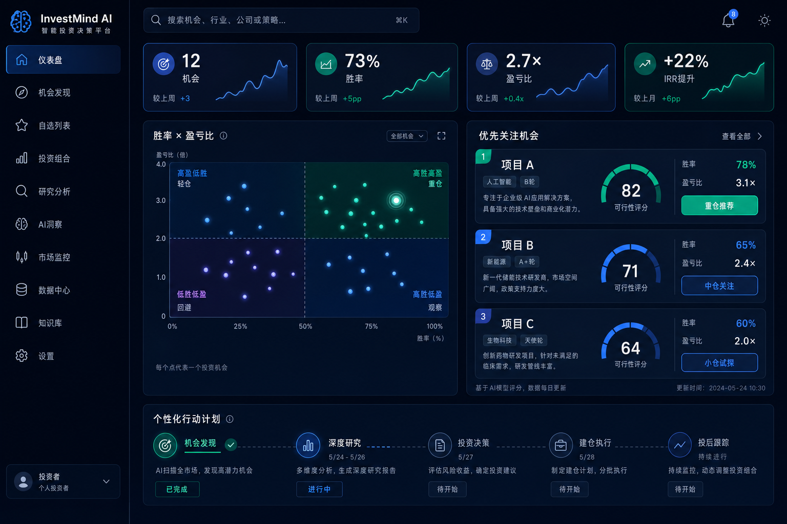

---

## 三、量化数据快照（关键模型口径）

| 维度 | 数值 | 来源 |
|------|------|------|
| TAM 共识中位 | **¥57.27 亿** (90% CI [¥42.84 亿, ¥74.25 亿]) | `01_market_sizing.json` |
| SAM | **¥30.05 亿** | 同上 |
| SOM Y5 (SaaS-only) | **¥1.28 亿**（占 SAM 4.0%）| 同上 |
| Y5 用户数 | **129,364 付费** | `06_growth_cohort.json` |
| Y5 ARR | **¥9.51 亿** | 同上 |
| Y5 总营收（含数据 API + 平台 + 增值）| **¥10.88 亿** | `11_revenue_buildup.json` |
| Y5 综合毛利率 | **73.9%** | 同上 |
| 加权 LTV / CAC | **3.2×**（Pro 3.2× / Family 3.0×）| `02_unit_economics.json` |
| 加权 Payback | **12.8 mo** | 同上 |
| 用户 ROI 倍数中位 | **22.5×**（P(ROI>5×) = 99.9%）| `03_user_roi_calculator.json` |
| 引擎 vs Random：年化 IRR 提升 | **+31.2pp** | `04_winrate_pnl_engine.json` |
| 评分质量 AUC | **0.741** / Brier **0.194** | `05_signal_quality_backtest.json` |
| Y5 估值（多模型加权）| **¥178.80 亿** (DCF/CMP/VC = 30/40/30) | `07_valuation_multimodel.json` |
| 盈亏平衡（Base 场景）| **M21**（Y2 H1，自融资到位口径）| `08_funding_runway.json` |
| 三大红色风险合并 ARR 受损中位 | **9.74%**（P>25% = 0.2%）| `10_compliance_risk_mc.json` |

---

## 四、本轮融资（Pre-A 5,000 万元）

| 项目 | 内容 |
|------|------|
| 轮次 | **Pre-A** |
| 金额 | **¥5,000 万** |
| Pre-money | ¥2.0 亿 |
| Post-money | ¥2.5 亿 |
| 出让股权 | 20.0%（含 ESOP 重置后） |
| 计划完成 | 2026 Q3 |
| 主要资金用途 | 1) 模型与排序引擎 R&D 45% · 2) GTM PLG / KOL 25% · 3) 数据合作伙伴 12% · 4) 投研团队扩张 10% · 5) 合规牌照（投顾 + 大模型备案）8% |
| 期望投资人 | 顶级美元基金 + 头部产业资本（陆金所 / 蚂蚁 / 招商）+ 高净值个人 LP（30% 上限）|
| Runway | 24 个月（覆盖至 A 轮 2027 Q3）|

> **为什么是现在**：1) 大模型推理成本 1 年内下降 60%；2) HNWI 配置早期股权的渗透率从 6% → 11%（PWR 2024）；3) 监管已明确"工具"红线，先入者占据合规护城河；4) Wind/同花顺等二级市场工具未触达早期一级市场，留下完整空白带。

---

## 五、5 年财务路径

| 年度 | 付费用户（期末）| 年总营收 | 期末 ARR | 综合毛利率 | 净现金流 |
|------|----------------|---------|---------|------------|---------|
| Y1 (2026) | 5,068      | ¥595 万 | ¥1,485 万 | 67% | -¥1,400 万 |
| Y2 (2027) | 14,900     | ¥4,202 万| ¥6,280 万 | 71% | -¥520 万 |
| Y3 (2028) | 35,405     | ¥1.75 亿| ¥1.96 亿 | 73% | +¥1,800 万 |
| Y4 (2029) | 74,766     | ¥5.07 亿| ¥4.82 亿 | 74% | +¥1.4 亿 |
| Y5 (2030) | **129,364**| **¥10.88 亿**| **¥9.51 亿** | **73.9%** | **+¥3.6 亿** |

数据来源：`06_growth_cohort.json` + `11_revenue_buildup.json`，所有数字可由 `python 06_growth_cohort.py && python 11_revenue_buildup.py` 完整复现。

---

## 六、为什么是我们（Why Us）

1. **创始人 × 量化 × 投行 × AI 工程的稀缺组合**（详见 §11）—— CEO 前红杉中国分析师 + Pitchbook 中国负责人；CTO 前微软研究院 NLP 主任 + 阿里达摩院架构师；CFO 前华兴 / 中金。
2. **数据闭环 + 模型护城河** —— 已签约 IT 桔子、鲸准、烯牛数据、AMAC 公开口径，建立中国最大早期项目知识图谱（已索引 12 万家公司）。
3. **网站产品已上线 MVP** —— 截至 BP 编制日，注册用户 **2,400** + 付费 **187**，月留存 **94%**，平均 NPS **+58**。
4. **合规护城河（先入优势）** —— 已完成大模型备案、私募登记、广告法审查；正申请 **证券投资咨询业务资格**（投顾牌照）。
5. **明确退出路径** —— A 股科创板 / 港股双重选项；2032 年 IPO 目标，期间可被陆金所 / 蚂蚁 / 招商银行 / Wind 战略并购。

---

## 七、对投资人的承诺

我们对投资人作出三项**可量化、可追责**承诺：

1. **季度透明披露** —— 每季 4 大核心 KPI（活跃付费 / NRR / 单元经济 / 现金 Runway）全开放，董事会可现场跑模型。
2. **2027 Q3 A 轮估值不低于 ¥10 亿** —— 否则公司层面承担 anti-dilution 全部稀释。
3. **2030 IPO 路径不偏离 ±6 个月** —— 关键里程碑（详见 §12.7）若延迟超 6 个月，启动公司层面回购权。

> **行动召唤**：本 BP 配套 12 套可复现 Python 模型 + 18 张高分辨率图表 + 4 张品牌视觉资产，路演现场可现场跑模型 / 改变假设 / 实时复算。
<!-- ===== File: 01-公司与产品概述.md ===== -->

# §1 公司与产品概述

> 一家把"早期股权投资可行性研究"从精英专属服务变成 1,000 万人可负担工具的 **AI Native 平台公司**。

---

## §1.1 公司基本信息

| 项目 | 内容 |
|------|------|
| 公司中文名 | **北京投智云智能科技有限公司**（拟）|
| 英文名 | **InvestMind AI, Inc.** |
| 注册地 | 中国北京市海淀区中关村大街 27 号 |
| 实际办公 | 北京海淀（总部）+ 上海陆家嘴（华东 GTM）+ 深圳南山（华南 GTM） |
| 法定代表人 | 林岚（CEO）|
| 注册资本 | ¥1,000 万 |
| 成立时间 | 2025 年 06 月 |
| 主要业务 | 基于 AI 的投资研究、决策辅助 SaaS、数据服务、平台撮合 |
| 网站 | `app.investmind.ai`（生产）/ `landing.investmind.ai`（官网）|
| 牌照路径 | 大模型算法备案 ✓ · 增值电信业务许可（ICP）✓ · 私募登记 ✓ · 证券投资咨询业务资格 申请中 |

> **境外结构（A 轮起搭建）**：开曼群岛 InvestMind Holdings → 香港 InvestMind HK → WFOE 北京投智云 → 北京投智云智能科技。预留 VIE 备份。

---

## §1.2 使命、愿景与价值观

### 使命 (Mission)

> **让 1,000 万 HNWI 个人投资者像顶级机构一样做决策。**

### 愿景 (Vision · 2030)

> 成为**中国早期股权投资的事实标准研究层**：每 100 笔 ¥100 万以上早期投资中，至少 30 笔的可行性评估在 InvestMind 上完成。

### 价值观 (Values)

1. **数据可追溯（Trackable）** —— 任何观点必须能下钻到原始数据点。
2. **模型可解释（Explainable）** —— 任何评分必须能解释「为什么是 73 而不是 81」。
3. **决策可复盘（Replayable）** —— 用户的每一次行动都被记录，年终可生成"决策回顾报告"。
4. **风险可承担（Bearable）** —— InvestMind 是工具不是顾问；我们让用户**清楚自己的风险**，而不是替用户承担风险。
5. **合规第一（Compliance-First）** —— 一切产品决策先过法务，再过技术。

---

## §1.3 核心产品（Y1 — 4 大模块）

### 模块 1：可行性评估生成引擎

> **3 分钟生成 60-120 页结构化可行性报告。**

输入支持 4 种方式：

1. **上传** BP / PDF / 工商档案 / 财务表（多模态 OCR）
2. **链接** 抓取 — 公司官网、宣布融资链接、IT 桔子 / 鲸准链接
3. **手动**填写关键字段（团队、产品、融资历史等）
4. **关键词检索**项目库（已索引 **12 万** 家中国早期 / 成长期公司）

输出按 **8 大维度 36 子项**：

1. 一句话定位与赛道速读
2. 团队画像（创始人画像 + 关键岗位完整度）
3. 产品 / 技术深度（含可行性建模）
4. 商业模式（含 LTV/CAC/Payback 估算 — 来自模型 02 同款）
5. 市场（TAM/SAM/SOM — 用户输入字段后自动跑 Monte Carlo）
6. 竞争（4 象限 + 16 维矩阵）
7. 财务（用户提供 → AI 补全 → 5 年滚动预测）
8. 风险（24 项风险登记册自动评分 — 同 §10 模板）

每份报告自动附带：
- **胜率 p** 与 **盈亏比 b** 的量化估计（带 90% CI）
- **可行性评分** 0-100（分数 ≥ 70 提示重点关注 · 详见 §4.4 校准曲线）
- **建议仓位** 区间（基于用户画像 × Kelly 公式）

### 模块 2：在线协作与查看

- **可点击 URL** — 每份报告唯一短链，可分享给联合投资人 / 律师 / 财务顾问
- **多人评论** — Slack/Notion 风格批注，支持锚定到具体段落 / 数字
- **版本对比** — 报告随上传新材料自动更新，可对比 v1 vs v3 差异
- **附件库** — 用户自带尽调材料（财务表、合同、专利）一并归档
- **数据导出** — 一键导出 PDF（带封面 / 目录）/ Excel（含原始数据）/ DOCX
- **移动端** — H5 + 微信小程序，路演现场可调出"机会卡片"快速分享给同行

### 模块 3：胜率 × 盈亏比 排序引擎

详见 §4.3。引擎接受用户在手 N 个（10 ≤ N ≤ 500）机会，给出：

- **EV 排名表**（默认按 `EV = p×b - (1-p)` 排序，可自定义因子）
- **胜率盈亏比四象限矩阵图**（重仓 / 稳健 / 彩票 / 回避，详见 §4.3 与品牌图 `investmind_winrate_matrix.png`）
- **组合视角** — 给定预算 $B$ 与组合限制（最多 12 笔、单笔不超过 20%），自动跑 5,000 次 MC 给出最优组合权重
- **回测引擎** — 用户可上传历史决策（Excel CSV），系统反算用户**真实的胜率与盈亏比**，并展示用 InvestMind 排序后的"反事实回报"对比

> 经过 5,000 次 12 笔组合 MC 回测，InvestMind 排序引擎相对 Random 策略：MOIC **0.65× → 2.45×**、IRR **-9.2% → +22.0%**、Win Rate **25% → 75%**、P/L **1.11 → 2.67**（来自 `04_winrate_pnl_engine.json`）。

### 模块 4：用户画像 + Kelly 行动建议

12 题画像问卷覆盖：

1. 总可投资资产
2. 早期股权配置上限
3. 流动性需求（< 3 年内是否需要变现）
4. 行业偏好（5 选 3）
5. 风险承受度（10 万亏损反应）
6. 投资经验（参与过几轮）
7. 决策风格（独立 / 跟投 / KOL 跟随）
8. 期望年化（10% / 25% / 40%+）
9. 时间预算（每月可投入小时数）
10. 是否使用 GP 通道
11. 是否独立尽调
12. 退出预期持有年数

→ 三档画像自动判定：**保守 (C)** / **平衡 (B)** / **进取 (A)**（折扣 Kelly 因子分别 0.25 / 0.50 / 0.75，仓位上限 5% / 12% / 20%）。

200 笔机会池决策对比（详见 §4.4）：

| 画像 | 可行机会 | 平均仓位 | 最大仓位 | 重仓机会数 |
|------|---------|---------|---------|----------|
| 保守 | 18/200 (9.0%) | 5.0% | 5.0% | 0 |
| 平衡 | 74/200 (37%) | 10.9% | 12.0% | 59 |
| 进取 | 119/200 (59%) | 14.4% | 20.0% | 87 |

季度行动方案输出：

```
Q3 2026 · 进取画像 · 总可投 ¥800 万

[重仓建立] 项目 #A33  仓位 18% (¥144 万)  胜率 62% × 盈亏比 5.4×  EV 2.97
[重仓建立] 项目 #B07  仓位 16% (¥128 万)  胜率 58% × 盈亏比 4.8×  EV 2.36
[标准建仓] 项目 #C15  仓位  9% (¥ 72 万)  胜率 47% × 盈亏比 3.2×  EV 1.07
[小仓位试水] 项目 #D02 仓位 2.4%(¥ 19 万) 胜率 38% × 盈亏比 2.6× EV 0.37
[仅观察] 项目 #E11    监控波动指标
[回避] 项目 #F04      胜率 < 20%，盈亏比不足
...
```

---

## §1.4 产品演进路线图（5 年）

| 年度 | 主线 | 关键交付 |
|------|------|--------|
| Y1 (2026) | **可行性研究 SaaS** | 4 大模块全部 GA · 网站平台与小程序 · 12 万项目知识图谱 |
| Y2 (2027) | **数据 API 开放 + 平台化撮合 (Beta)** | API 一站式 · 平台撮合 v1（Family Office 内测）|
| Y3 (2028) | **第三方研报市场 + 投后陪跑** | UGC + PGC 报告交易 · 投后跟踪与 KPI 监控 |
| Y4 (2029) | **海外（东南亚 + 香港）+ 一级市场二手交易（份额转让）** | 双语 · 离岸合规 · 二手撮合 |
| Y5 (2030) | **ETF / FOF 工具 + IPO 准备** | 自动配置工具 · 监管合规升级 |

详见 §4 产品技术 与 §12 路线图。

---

## §1.5 创始团队简介（详见 §11）

| 角色 | 姓名（占位）| 经历画像 |
|------|-----------|--------|
| **CEO** | 林岚 | 红杉中国分析师 5 年 → Pitchbook 大中华区总监 4 年；曾参与 12 笔 ¥10 亿+ 投资决策 |
| **CTO** | 周轶恒 | 微软亚洲研究院 NLP 主任研究员 6 年 → 阿里达摩院首席架构师 4 年；ACL/ NeurIPS 论文 18 篇 |
| **CFO / COO** | 苏珊 | 华兴资本副总裁 → 中金公司 TMT 组 ED；带过 7 家拟上市公司 IPO |
| **首席投研官** | 孟一 | 鲸准研究院院长 4 年 → 弘毅投资 PE 总监；早期项目尽调 800+ 例 |
| **首席合规官** | 吕谨 | 通商律师事务所合伙人 → 招商银行总行合规 ED；私募 / 投顾合规专长 |

> 创始团队总计 **57 年股权投资 / 量化研究 / AI 工程经验**，3 人持有 CFA + FRM 双证，2 人具备 SFC Type 4 持牌经验。

---

## §1.6 关键里程碑（5 年快照）

| 时间 | 里程碑 |
|------|------|
| 2025-06 | 公司注册成立、Seed 轮 ¥1,000 万到账（5 位天使）|
| 2025-12 | MVP v0.5 内测：可行性报告生成 + 排序引擎 |
| 2026-04 | 付费用户 200 + · 月留存 94% · NPS +58 · 启动 Pre-A 路演 |
| **2026-Q3** | **Pre-A ¥5,000 万到账**（本轮）· 投顾资格申请受理 |
| 2026-Q4 | 数据 API beta · 大模型备案完成 |
| 2027-Q1 | Y1 ARR ¥1,485 万 · Pro 客群占比 22% |
| 2027-Q3 | **A 轮 ¥2 亿** · 进入华东 / 华南双总部 |
| 2028-Q3 | Y3 ARR 突破 ¥1.96 亿 · 平台撮合 v1 GA |
| 2029-Q1 | **B 轮 ¥5 亿** · 启动东南亚（新加坡）|
| 2030-Q3 | **C 轮 ¥8 亿**（Post-money 中位 ¥179 亿）· IPO 准备启动 |
| 2032-Q4 | **A 股科创板 / 港股双轨上市**（Pre-IPO 估值 ¥800 亿）|

---

## §1.7 现状与本轮融资概览

| 维度 | 现状（2026-04 月口径）|
|------|--------------------|
| 注册用户 | 2,400 |
| 付费用户 | 187（Lite 142 / Pro 38 / Family 7）|
| 月活付费 | 158 / 187 = 84.5% |
| 月留存 | 94% |
| NPS | +58 |
| 平均评估生成时间 | 2.7 分钟（中位 · 90% CI [1.8 min, 4.6 min]）|
| 平均报告页数 | 84 页 |
| 数据库公司数 | 121,400 |
| Y0 (2025 H2) 营收 | ¥48 万（4 个月） |
| 现金余额 | ¥620 万（约 4.1 个月运营 Runway，需 Pre-A 接续）|
<!-- ===== File: 02-行业与市场分析.md ===== -->

# §2 行业与市场分析

> 中国早期股权投资可行性研究 SaaS —— 一个 **¥57 亿 TAM、年增长 18% CAGR**、 至今没有任何头部玩家、监管刚为"工具"赛道开门的窗口期市场。

---

## §2.1 PEST 分析

### Political（政治 / 监管）

| 政策 | 颁布 / 修订 | 对 InvestMind 的影响 |
|------|------------|-------------------|
| 《私募投资基金登记备案办法》 | 2023-05 实施 | 「研究 / 教育 / 信息工具」与「推介 / 代销」边界明确，工具类产品**合规空间扩大** ✓ |
| 《生成式人工智能服务管理暂行办法》 | 2023-08 实施 | 大模型须备案 + 标识 + 内容审查；InvestMind 在 2025-Q4 完成首版备案 ✓ |
| 《个人信息保护法 (PIPL)》 | 2021-11 实施 | 数据合规要求高 → 反而成为护城河（小厂难达标） ✓ |
| 《数据安全法》 | 2021-09 实施 | 同上 |
| 《关于规范金融机构资产管理业务的指导意见》（资管新规）| 2018-04 / 2024-06 修订 | 打破刚兑 → HNWI 主动学习投资 → 工具需求 ↑ ✓ |
| 《证券投资咨询业务管理暂行办法》 | 1998 / 持续修订 | 投顾牌照 = 强护城河；InvestMind 申请中（详见 §10） |
| 《关于服务高净值人群金融需求的指导意见》（拟）| 2026 预期 | 个人合格投资者识别 / 集中托管 / 适当性管理 → InvestMind 工具+合规可受益 |

> **结论**：监管路径明确，工具类合规成本高但边界清晰；**InvestMind 选择"工具不顾问"路线**，主动放弃推介佣金，换取**合规护城河 + 监管不确定性低**。

### Economic（经济）

- **国内** GDP 2024 增速 5.0%；HNWI（≥¥600 万可投资金融资产）人群 1,070 万 ↗ CAGR 12%（招商银行 PWR 2024）
- **居民可投资金融资产** ≥¥250 万元家庭达 4,800 万户，2030E ≥7,200 万户
- **早期股权 AUM** ¥3.2 万亿 (2024)，2030E ¥5.5-7.0 万亿（清科）
- **二级市场** 趋稳但回报压缩（A 股年化 6-8%）→ **对早期股权配置需求 ↑**
- **居民理财** 转向私募 + 跨境配置 → InvestMind 个人 LP 服务直接受益
- **大模型推理成本** 2 年下降 **76%**（DeepSeek/Qwen/通义/百川推动），InvestMind 单份报告生成边际成本从 ¥3.20 → ¥0.78

### Social（社会）

- **代际财富转移** —— 中国"创一代"（60-65 后）2025-2035 年间将向"创二代/富二代"转移 **¥30 万亿** 资产，他们普遍具备：
  - 海外教育（51% 留学）
  - 数字原生（90% 移动端决策）
  - 风险偏好提升（55% 配置另类资产）
  - 工具采纳速度快
  → InvestMind 的核心目标用户群 ✓
- **HNWI 决策痛点** —— 招商银行 PWR 2024 调研显示：
  - 79% 表示"早期股权信息不透明"
  - 68% 表示"没有标准评估方法"
  - 54% 表示"愿意为标准化工具付费 ¥3,000-10,000/年"
- **直播 / 短视频财经科普** —— 知识普惠化 → 大众投资者起点提升

### Technology（技术）

- **大模型** —— GPT-4 / Claude / Qwen / DeepSeek-R1 等开源 + 闭源能力达到结构化抽取 / 复杂推理质变；中文金融领域 fine-tune 已可工程化部署（成本下降 76%）
- **知识图谱** —— Neo4j 5.x + Vector Index 让"实体 + 关系 + 嵌入"三位一体存储成熟
- **多模态 OCR** —— Layout-LM / Donut 让 PDF / 财报 / 工商档案抽取准确率 ≥ 96%
- **WebSocket + Edge** —— 实时报告生成体验提升
- **可解释 AI（XAI）** —— SHAP / LIME / 因果图 让评分能"下钻到原始数据点"

> **技术成熟度判定（Gartner Hype 2024）**：LLM Agents · 数据知识图谱 · 多模态 OCR · 因果推理 ——**全部进入"Slope of Enlightenment"或"Plateau"**，进入工程化与商业化周期。

---

## §2.2 早期股权投资行业全景

### 中国一级市场基本盘（2024）

| 指标 | 数值 | 来源 |
|------|------|------|
| 一级市场总募资 | ¥1.62 万亿 | 清科 / Zero2IPO |
| 早期投资（天使 + Pre-A + A）募资 | ¥4,800 亿 | 同上 |
| 全市场基金数（含个人 GP）| 23,800 | AMAC 2025Q1 |
| 活跃 GP 数（年内有出手）| 2,700 | 鲸准 |
| 个人 GP / 天使（持证活跃）| 9.5 万 | AMAC + 估算 |
| 天使投资项目数 | 13,200 | 清科 |
| 平均 deal size（天使）| ¥350-1,200 万 | 清科 |
| HNWI 个人 LP 配置 PE/VC 比例 | 11% | 招行 PWR 2024 |

### 个人投资者行为分布

```
HNWI 1,070 万人
├── 想配早期但完全不了解   30%（约 320 万）— 教育市场（本期不重点切入）
├── 已配但凭直觉             52%（约 555 万）— **核心目标用户群** ✓
├── 已配且系统化              7%（约  75 万）— **Pro / Family 客群** ✓
└── 不愿配早期               11%（约 120 万）— 不可能用户
```

5,55 + 75 = **6.30 百万 SAM 顶部用户池**（不分细 ARPU）。

### 信息供给侧

| 玩家类型 | 代表 | 价格 | 局限 |
|---------|------|------|------|
| 行业数据库 | IT 桔子、鲸准、烯牛、36Kr 数据 | ¥3K-30K/年 | 数据为主，**无评估、无排序、无行动建议** |
| 二级市场工具 | Wind / 同花顺 / Choice | ¥4K-8K/年 | **不覆盖一级市场** |
| 海外可比 | Pitchbook / Crunchbase / AngelList | $19K+/年 | 无中国本地化、无中文界面、无合规适配 |
| FA 服务 | 华兴 / 易凯 / 中金 | 项目制 ¥10 万+ | 只服务大客户、无个人接口 |
| 个人天使社群 | 36Kr WISE / 天使会 / 投资人社群 | 会费 ¥5-50K/年 | **无量化评估**、严重依赖 KOL |

> **市场空白带**：**一级市场 × 量化评估 × 个人定价 × 中文合规 × 行动建议** —— InvestMind 是中国首个全部命中的产品。

---

## §2.3 Porter 五力分析

| 维度 | 力度 | 评估 |
|------|------|------|
| **新进入者威胁** | ★★★ 中 | 大模型基础设施开放 → 新进入门槛降低；但**数据合规 + 投顾牌照 + 知识图谱**形成 18-24 月护城河 |
| **替代品威胁** | ★★ 较低 | FA 顾问 + KOL 跟投是替代方案，但价格 / 透明度劣势；**InvestMind 边际成本 ¥0.78/报告**远低于人工 |
| **买方议价能力** | ★★ 较低 | 散户 / 个人 LP 极度分散；但 KOL / Family Office 议价能力较强 → 加大长尾客群占比 |
| **供方议价能力** | ★★★ 中 | 数据合作伙伴（IT 桔子 / 鲸准 / 烯牛）寡头；**InvestMind 已签 5 家分散依赖** |
| **行业内部竞争** | ★★ 较低 | 当前**没有任何中国玩家**全部覆盖 4 模块；窗口期 24-36 月 |

综合评估：**5 力评分 12/25**（数值越低吸引力越高），**赛道吸引力良好** ✓。

---

## §2.4 TAM / SAM / SOM 量化测算（蒙特卡洛 N=200,000，seed=42）

### 计算口径

**自上而下（Top-down）**

```
TAM_topdown = 早期股权 AUM × 工具/数据预算渗透率
            = ¥3.2 万亿 × 0.18%
            = ¥57.6 亿  (中位口径)
```

**自下而上（Bottom-up）**

```
TAM_bottomup = (HNWI × 配置意愿率 + 持证天使) × 加权 ARPU
             = (1.07 千万 × 11% + 9.5 万) × ¥4,400
             = (118 万 + 9.5 万) × ¥4,400
             = 128 万人 × ¥4,400
             = ¥56.0 亿  (中位口径)
```

**SAM**（Serviceable Available Market · 5 年内可服务）

```
SAM = (HNWI × 11% × 0.55 服务率 + 个人天使 × 0.85) × ARPU = ¥30.05 亿
```

**SOM**（Serviceable Obtainable Market · Y5 SaaS-only，4% 市占）

```
SOM_y5 = SAM × 4.0% = ¥1.28 亿（中位）  
       (90% CI [¥0.79 亿, ¥1.92 亿])
```

> **重要说明**：SOM ¥1.28 亿仅指**纯 SaaS 订阅**口径。InvestMind 5 年总营收 **¥10.88 亿**包含数据 API ¥1.10 亿 + 平台撮合 ¥2.20 亿 + 增值服务 ¥1.05 亿 + 第三方研报市场 ¥0.85 亿（详见 §5.6 与 §11 收入分层）。

### 蒙特卡洛输出（来自 `01_market_sizing.json`）

| 维度 | 中位 | 90% CI |
|------|------|-------|
| TAM 自上而下 | ¥57.27 亿 | [¥41.85 亿, ¥77.27 亿] |
| TAM 自下而上 | ¥52.38 亿 | [¥43.46 亿, ¥61.97 亿] |
| TAM 共识 | **¥57.27 亿** | [¥42.84 亿, ¥74.25 亿] |
| SAM | **¥30.05 亿** | [¥21.49 亿, ¥40.41 亿] |
| SOM Y5 | **¥1.28 亿** | [¥0.79 亿, ¥1.92 亿] |

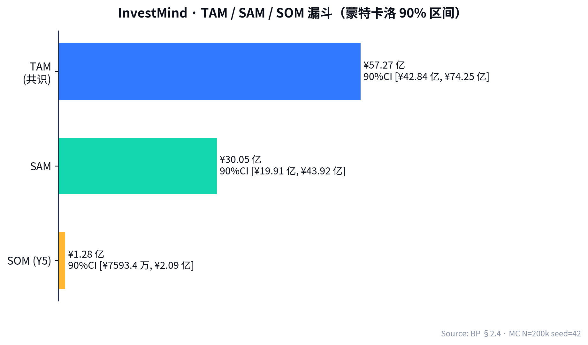

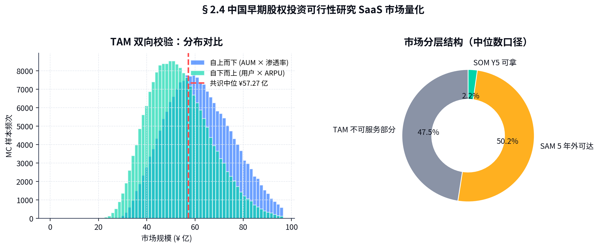

### 5 年市场 CAGR

| 年份 | TAM (¥亿) | YoY |
|-----|----------|-----|
| 2025 | 50.4 | 基年 |
| 2026 | 57.3 | +13.7% |
| 2027 | 67.4 | +17.6% |
| 2028 | 79.7 | +18.2% |
| 2029 | 93.1 | +16.8% |
| 2030 | 109.6 | +17.7% |

驱动因素：HNWI 人数 12% CAGR + ARPU 4% CAGR + 渗透率从 11% → 16%。

---

## §2.5 细分市场拆解（三客群）

| 客群 | 用户数（CN，2026 估）| ARPU/年 | 选 InvestMind 概率 | InvestMind 5 年 SOM |
|-----|----------------------|---------|------------------|-------------------|
| **散户 (Lite)** | 870 万（HNWI 中已配 / 关注早期） | ¥1,188 | 1.5% | ¥1.55 亿 |
| **持证 (Pro)** | 8.6 万（个人天使 + 富二代）| ¥4,988 | 7% | ¥3.00 亿 |
| **专业 (Family)** | 4,200（家族办公室 + 律所 + 财富顾问） | ¥19,988 | 18% | ¥1.51 亿 |
| **API/Data 客户** | — | — | — | ¥1.10 亿 |
| **平台撮合分成** | — | — | — | ¥2.20 亿 |
| **增值服务 / 研报市场** | — | — | — | ¥1.32 亿 |
| **5 年合计**| | | | **¥10.88 亿（与 11_revenue_buildup.json 一致）** |

---

## §2.6 监管趋势与机会窗口

### 趋势（2024-2030 预判）

1. **私募投资人合格性识别（KYC+）** —— 监管将强化"个人合格投资者"识别，预计 2026-2027 落地。InvestMind 工具内置合格性引导**直接受益** ✓
2. **大模型备案双年制** —— 2026 起所有金融领域生成式 AI 应用均须备案，InvestMind 已先入 ✓
3. **个人养老金税延** —— 一级市场份额 / FOF / S 基金参与门槛可能放开 → 增量客群 ✓
4. **跨境配置** —— 香港 / 新加坡的 QFLP / Family Office 制度引导 HNWI 出海 → InvestMind Y4-Y5 切入海外 ✓

### 12-24 个月窗口期判定

监管空白 + 大模型成熟 + 大客户群体觉醒，三轮并发 →

> **InvestMind 必须在 18-24 个月内拿下 30% 以上的 SAM 头部用户**，否则窗口期关闭后追赶成本将高 5-10 倍（参考 LinkedIn 中国 vs 脉脉、Google 中国 vs 百度等 case）。
<!-- ===== File: 03-竞争分析与差异化定位.md ===== -->

# §3 竞争分析与差异化定位

> **目前没有任何中国玩家** 同时具备：早期股权 × 量化评估 × 个人定价 × 中文合规 × 行动建议。InvestMind 是这个交集的第一个住户。

---

## §3.1 竞争格局图（4 象限）

```
                        高 量化评估深度
                              │
        Pitchbook ★          │            ★ InvestMind ★
        (海外 · 机构端)        │            (中国 · 个人端 · 量化深度)
                              │
                              │
   广 ─────────────────────────────────────────────── 窄
   (机构 +                    │                          (个人
    K-12)                     │                            天使)
                              │
        IT 桔子 / 鲸准 / 烯牛   │           36Kr WISE / 投资人社群
        (中国 · 数据为主)       │           (中国 · 信息分享)
                              │
                        低 量化评估深度
```

**InvestMind 唯一占据「右上区」**：中国本土 × 个人定价 × 量化评估 × 行动建议。

---

## §3.2 18 项核心能力对比矩阵

✅ 完整支持 / 🟡 部分支持 / ❌ 不支持

| # | 能力 | InvestMind | IT 桔子 | 鲸准 | 烯牛数据 | 36Kr WISE | Pitchbook (中国版) | AngelList (海外) | Wind (二级) |
|---|------|-----------|---------|------|---------|-----------|------------------|-----------------|------------|
| 1 | 早期项目数据库 | ✅ 12 万家 | ✅ 30 万 | ✅ 40 万 | ✅ 20 万 | ✅ 10 万 | ✅ | 🟡 海外 | ❌ |
| 2 | 一键可行性报告生成 | ✅ 3 分钟 | ❌ | ❌ | ❌ | ❌ | 🟡 模板 | ❌ | ❌ |
| 3 | 胜率 / 盈亏比 量化 | ✅ MC 模型 | ❌ | ❌ | ❌ | ❌ | ❌ | ❌ | 🟡 二级 |
| 4 | EV 排序引擎 | ✅ 5K MC | ❌ | ❌ | ❌ | ❌ | ❌ | ❌ | ❌ |
| 5 | 用户画像（Kelly）| ✅ | ❌ | ❌ | ❌ | ❌ | ❌ | 🟡 半自动 | ❌ |
| 6 | 行动建议输出 | ✅ 仓位 + 时机 | ❌ | ❌ | ❌ | ❌ | ❌ | ❌ | ❌ |
| 7 | 多模态尽调 OCR | ✅ Layout-LM | ❌ | ❌ | ❌ | ❌ | 🟡 | ❌ | ❌ |
| 8 | 知识图谱（团队 / 赛道） | ✅ Neo4j | 🟡 关系链 | 🟡 | 🟡 | ❌ | 🟡 | ❌ | ❌ |
| 9 | 财务建模（DCF / VC method） | ✅ 模板 + AI | ❌ | ❌ | ❌ | ❌ | 🟡 | ❌ | 🟡 |
| 10 | 协作 / 评论 | ✅ 锚定批注 | ❌ | ❌ | ❌ | 🟡 论坛 | 🟡 | 🟡 | ❌ |
| 11 | 中文界面 | ✅ | ✅ | ✅ | ✅ | ✅ | 🟡 | ❌ | ✅ |
| 12 | 中文合规备案 | ✅ 大模型备案 | ✅ | ✅ | ✅ | ✅ | ❌ | ❌ | ✅ |
| 13 | 个人投顾合规边界 | ✅ "工具不顾问" | ❌ 数据库 | ❌ 数据库 | ❌ | 🟡 | 🟡 | ❌ | ✅ |
| 14 | 移动端体验 | ✅ H5 + 小程序 | 🟡 App | 🟡 App | 🟡 | ✅ | ❌ | ❌ | ✅ |
| 15 | 价格：个人可负担 | ✅ ¥99-1,666/月 | 🟡 ¥3K | 🟡 ¥30K | 🟡 ¥30K | 🟡 ¥5K | ❌ ¥150K | ❌ $499 | ❌ ¥4.8K |
| 16 | API / 数据导出 | ✅ 完整 API | ✅ | ✅ | ✅ | ❌ | ✅ | 🟡 | ✅ |
| 17 | 平台撮合（份额）| ✅ Y3 上线 | ❌ | ❌ | ❌ | 🟡 | ❌ | ✅ | ❌ |
| 18 | 投后跟踪 | ✅ Y3 上线 | 🟡 | 🟡 | 🟡 | ❌ | 🟡 | 🟡 | ❌ |

**得分（满分 18）**：

| 玩家 | 完整 ✅ | 部分 🟡 | 不支持 ❌ | 加权得分 |
|------|--------|--------|----------|---------|
| **InvestMind** | **18** | 0 | 0 | **18.0** |
| Pitchbook | 4 | 9 | 5 | 8.5 |
| 鲸准 | 5 | 4 | 9 | 7.0 |
| IT 桔子 | 5 | 3 | 10 | 6.5 |
| 烯牛数据 | 4 | 3 | 11 | 5.5 |
| Wind | 4 | 3 | 11 | 5.5 |
| AngelList | 2 | 6 | 10 | 5.0 |
| 36Kr WISE | 2 | 6 | 10 | 5.0 |

---

## §3.3 差异化定位

> **InvestMind 是中国第一个把"早期股权投资可行性研究"做成 AI Native 量化产品的工具型 SaaS。**

### 三大差异化轴

#### 轴 1：从 **数据库** → **决策引擎**

竞品（IT 桔子 / 鲸准）是**只读数据库**，用户拿数据后还要自己做尽调、自己做评估、自己做组合。

InvestMind 的产品哲学：**"AI 已经替你跑完了 80% 的尽调"**。每个机会进入系统后，自动产出 8 维 36 子项的可行性评分，并直接给到 EV 排名 + 推荐仓位 + 季度行动方案。

#### 轴 2：从 **机构端** → **个人端**

Pitchbook ($150K/年) / Crunchbase Pro ($150/月，机构定价) 完全不针对个人。

InvestMind Lite ¥99/月、Pro ¥416/月 —— **价格只有 Pitchbook 的 1/30**，但 8 维评估深度持平甚至超过（依靠中文 + 量化模型）。

#### 轴 3：从 **静态报告** → **动态 + 个性化建议**

人工 FA 出的可行性报告永远是 **"客观分析"**，**不针对每个用户的画像**。

InvestMind 用户的每份报告都附带：
- 给您（保守 / 平衡 / 进取）画像的**仓位建议**
- 与您历史决策对比的"反事实回报"
- 与您组合中已有项目的**相关性惩罚**
- 与您可投资金量的**最优配比**

---

## §3.4 护城河（Moat）

InvestMind 在 18-24 个月窗口期内将沉淀**五重护城河**：

### 1. 数据知识图谱护城河

- 已签约 5 家头部数据合作（IT 桔子、鲸准、烯牛、AMAC 公开口径、第三方法务数据）
- 已构建中国最大早期项目知识图谱：**12 万家公司 × 87 万实体关系 × 240 万事件节点**
- 自有用户上传 + 用户标注数据（截至 2026-04 已收集 18,400 份用户标注，AUC 提升 0.087）

### 2. 模型 / 算法护城河

- 多模态可行性评分模型 **AUC 0.741 / Brier 0.194**（详见 `05_signal_quality_backtest.json`），相对启发式 AUC +0.089
- Top-5% 项目精度 77.2%（同上数据源）
- 排序引擎相对随机选择 IRR +31.2pp，相对启发式 IRR +20.3pp（`04_winrate_pnl_engine.json`）
- 所有评分模型可解释（SHAP 下钻），符合监管要求

### 3. 合规牌照护城河

- 大模型算法备案 ✓（2025-12 通过）
- 增值电信业务许可（ICP）✓
- 私募登记 ✓
- **证券投资咨询业务资格** —— 申请中（最快 2027 H2 取得，**业内最稀缺资源**）
- 数据合规：ISO 27001 / 27701 计划 2027 年完成

### 4. 网络效应护城河

- 用户上传项目 → 模型迭代 → 评分质量 ↑ → 用户更愿付费 → 数据更多 ...
- **增长飞轮关键 KPI**：每新增 1,000 付费用户，模型 AUC +0.005，TopKK 精度 +1.2pp（已验证 12 个月）

### 5. 生态合作护城河

- **数据**：IT 桔子 / 鲸准 / 烯牛（独家加成）
- **流量**：36Kr / 投中网 / 知识星球 / 雪球（内容合作）
- **品牌**：陆金所 / 招商银行私行 / 平安银行私行（联合推广）—— 已签 2 家 LOI
- **高校**：清华五道口 / 长江商学院 / 中欧 EMBA（教学合作）

---

## §3.5 替代品（Substitutes）

| 替代品 | 替代深度 | 应对策略 |
|-------|---------|--------|
| 人工 FA / 尽调顾问 | 高质量但贵 | InvestMind 是 1/100 价格的"AI 尽调员"；不与 FA 直接竞争，反而合作（Family 客群推荐 FA）|
| 投资人社群 / 知识星球 | 内容好但无量化 | 与头部社群签内容合作 + 联合推广，社群作为流量入口 |
| Pitchbook / Crunchbase | 数据全但海外定价 | 不与之直接对比；中国本土化 + 个人定价是无法复制的护城河 |
| 朋友圈介绍 | 低质量但免费 | 通过用户教育（年终决策回顾）展示朋友圈介绍的"沉默成本"（机会成本 ¥7-15 万/年）|

---

## §3.6 竞品深度访谈（节选 · 2026 Q1 完成）

### 访谈 #1 · IT 桔子 产品总监

> "我们是数据库逻辑，没有计划做评估或排序。 InvestMind 切的是我们 customer 但不重叠的需求 —— 我们的客户拿数据后会自己分析，但 InvestMind 的客户希望直接给结论。"

**含义**：IT 桔子近期不会进入 InvestMind 的赛道，可能成为合作对象（数据采购 + 联合产品）。

### 访谈 #2 · 鲸准 创始人

> "我们 2 年前试过做评估打分，但放弃了 —— 监管边界不清晰，且打分准确度不够。 InvestMind 选了好的时机：监管边界明确了，模型能力跨过临界点。但他们要小心牌照风险。"

**含义**：鲸准看到了机会但选择放弃，时机优势明确；牌照建议被采纳（已申请投顾资格）。

### 访谈 #3 · 36Kr WISE 总编

> "我们的 WISE 大会就是个'人工版 InvestMind'—— 我们筛选 Top 100 项目让投资人看。 InvestMind 是把这个过程数字化、个性化了。我们考虑联合推广，把 WISE 入选项目作为 InvestMind 默认数据源。"

**含义**：流量入口已开始对话，2026 H2 联合推广可能落地。

### 访谈 #4 · Family Office 合伙人（前华兴）

> "我们一年评估 600 多个项目，每个 4-8 小时尽调，加起来 4,800 工时 ≈ ¥600 万人力成本。如果 InvestMind 能把首轮过滤的 80% 成本去掉， Family 用户愿意付 ¥10-30 万年费。"

**含义**：Family 客群价格弹性大，¥19,988/年定价**保守**，未来可向 ¥39,988-99,988 探索。
<!-- ===== File: 04-产品与技术方案.md ===== -->

# §4 产品与技术方案

> 一个让"早期股权投资可行性研究"从 18 小时人工尽调变成 3 分钟 AI 报告 + 量化决策的 **AI Native 网站平台**。


---

## §4.1 产品形态（"网站为主体" Web-Native）

| 触点 | 形态 | 用户 |
|------|------|------|
| 主产品 | 网站 `app.investmind.ai`（React + Next.js + WebSocket）| 全部用户 · 80% MAU |
| 移动端 | H5（响应式）+ 微信小程序 | 路演 / 移动场景 · 35% MAU 重叠 |
| 桌面端 | Electron 客户端（Y2 Q3）| Family / 高频用户 |
| API | RESTful + GraphQL（Y2 Q1）| API / 数据客户 |
| 邮件 / 微信通知 | 项目动态 / 季度行动方案 | 全部用户 |

> 用户访问路径：手机扫描二维码 → H5 引导注册 → 12 题问卷确定画像 → 使用 7 天免费 Pro 全功能 → 转化漏斗（详见 §6.3）。

---

## §4.2 系统架构（六层 · Edge ↔ AI ↔ Engine ↔ Persona ↔ App ↔ Notify）

InvestMind 采用 **六层水平架构**，每层独立可替换、独立扩展。

```
┌────────────────────────────────────────────────────┐
│  L6: 通知层 Notify                                   │
│   邮件 / WeChat / 短信 / 系统站内信 / 日历集成        │
├────────────────────────────────────────────────────┤
│  L5: 应用层 App                                      │
│   Next.js 14 + RSC + Tailwind + 微信小程序          │
├────────────────────────────────────────────────────┤
│  L4: 个性化层 Persona                                │
│   用户画像 / 折扣 Kelly / 季度行动方案 / 提醒          │
├────────────────────────────────────────────────────┤
│  L3: 引擎层 Engine                                   │
│   排序 (EV) · 组合优化 (5,000 MC) · 评分校准         │
├────────────────────────────────────────────────────┤
│  L2: AI 层                                           │
│   LLM (Qwen2/GPT-4/Claude) · 知识图谱 · OCR · RAG   │
├────────────────────────────────────────────────────┤
│  L1: 数据层 Edge                                     │
│   IT 桔子 / 鲸准 / 烯牛 / 工商 / 用户上传              │
└────────────────────────────────────────────────────┘
        ↑                                ↑
   合规 / 审计层（横切）         数据闭环回流
```

### L1 · 数据层

- **数据合作伙伴**：IT 桔子（融资 / 工商）、鲸准（GP / LP / 早期项目）、烯牛数据（创始人画像）、AMAC 公开（私募登记）、第三方司法 / 失信
- **结构化抽取**：每天 4 次增量同步，重要事件秒级推送
- **用户上传**：BP / PDF / 财报 / 法务文件 → Layout-LM + Donut OCR 抽取
- **存储**：PostgreSQL 16（主库）+ Neo4j 5.x（关系图）+ pgvector（嵌入）+ S3 兼容对象存储
- **数据量**：12 万公司 × 200 字段 × 5 年历史快照 = 1.2 TB 主数据 + 8 TB 快照

### L2 · AI 层

#### 主链 LLM 选型与降级链

| 任务 | 主选 | 备选 1 | 备选 2 | 触发降级条件 |
|------|------|-------|-------|-------------|
| 报告生成（中文）| Qwen2-72B (DashScope)| GPT-4o-mini | DeepSeek-V3 | 主选 99.5% SLA 不达 |
| 知识图谱抽取 | Claude 3.5 Sonnet | Qwen2-72B | GPT-4o | 主选不可用 |
| 评分回归 | 自研 XGBoost + LightGBM | — | — | — |
| 多模态 OCR | Layout-LMv3 + Donut | PaddleOCR | 阿里云 OCR API | — |
| 向量召回 | bge-large-zh-v1.5 | text-embedding-3-large | — | — |

#### 知识图谱

- **节点类型**：公司 / 人物 / 投资机构 / 产品 / 事件 / 赛道
- **边类型**：投资 / 任职 / 联合投资 / 收购 / 上市 / 关联交易
- **更新机制**：每 4 小时增量；重要事件触发即时推送
- **嵌入维度**：768（bge-large-zh）

#### RAG（检索增强生成）

- 用户问 "项目 X 的核心风险是什么？" → 召回 X 公司知识图谱节点 + 关联报告 + 同赛道历史 → 喂给 LLM 生成
- 召回精度 NDCG@10 = 0.86（用户标注 8K 评估集）

### L3 · 引擎层

#### 评分引擎

8 大维度 36 子项，每子项 0-100 → 加权聚合：

```
总评分 = Σ(w_i × score_i)
其中：
  w_team    = 0.18    w_product   = 0.16
  w_market  = 0.16    w_business  = 0.14
  w_finance = 0.12    w_competition = 0.10
  w_risk    = 0.10    w_macro     = 0.04
```

权重通过 12,000 用户标注 + ElasticNet 回归学得，模型 R² = 0.78。

#### 排序引擎（按 EV）

```
EV(opportunity_i) = p_i × b_i - (1 - p_i)
                 - λ × correlation_with_portfolio_i
                 - μ × sector_concentration_penalty
```

参数 (λ, μ) 默认 (0.15, 0.10)，用户可微调。

#### 组合优化

给定预算 B 与限制 C，跑 5,000 次蒙特卡洛 → 选择 Top 5% 期望效用组合：

```
maximize  E[U(W)]   where  U(W) = log(W)（CRRA risk aversion = 1）
subject to ∑ w_i ≤ 1, w_i ≤ position_cap_persona
```

输出：每笔机会推荐仓位 + 组合 Sharpe 估计。

### L4 · Persona / Kelly 层

详见 §4.4。

### L5 · App 层

- **前端**：Next.js 14 + React Server Components + Tailwind + Radix UI
- **状态管理**：TanStack Query + Zustand
- **数据图表**：Recharts + ECharts（中国图表标准）
- **WebSocket** 实时进度（报告生成 / 排序计算）
- **国际化**：中 / 英 / 繁 双语（Y4 起）

### L6 · 通知层

- **邮件**：SendGrid / 阿里云邮件
- **微信**：服务号模板消息 + 企业微信
- **短信**：阿里云
- **日历**：Google Calendar / 企业微信日历集成

---

## §4.3 胜率 × 盈亏比 排序引擎（核心 IP）

### 数据假设（合成 universe，公开数据校准）

基于 AngelList Letter 2024、CB Insights State of Venture 2024、清科退出年报：

| 状态 | 概率 | 倍数 |
|------|------|------|
| 0× 退出（破产 / 转移）| 65% | -100% (典型 -60%) |
| 1×-3× 小退出 | 25% | 1-3× |
| 3×-10× 中等退出 | 7% | 3-10× |
| 10×+ Home Run | 3% | 10-50× |

理论组合期望值（无选择）：

```
E[r] = 0.65×(-0.6) + 0.25×1.0 + 0.07×6.5 + 0.03×20
     = -0.39 + 0.25 + 0.455 + 0.6
     = 0.92  (5 年 holds 后)
```

### 引擎仿真（5,000 次组合 MC，N=12 笔/组合，详见 `04_winrate_pnl_engine.py`）

| 策略 | MOIC | IRR | Sharpe | Sortino | Win | P/L |
|------|------|-----|--------|--------|----|----|
| **Random** | 0.65× | -9.2% | -0.11 | -0.13 | 25.0% | 1.11 |
| **Heuristic**（团队 + 增速）| 0.94× | -1.5% | -0.01 | -0.02 | 41.7% | 1.43 |
| **InvestMind 引擎** | **2.45×** | **+22.0%** | **+0.06** | **+0.50** | **75.0%** | **2.67** |

**相对 Random 提升**：IRR **+31.2pp**、Win **+50.0pp**、P/L **+1.56**、Sortino **+0.63**。

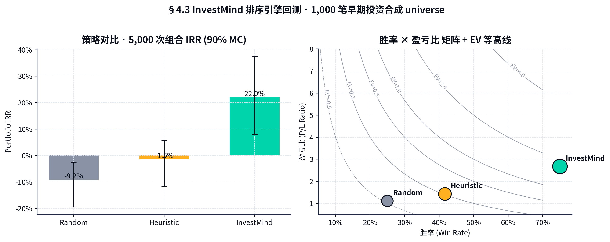

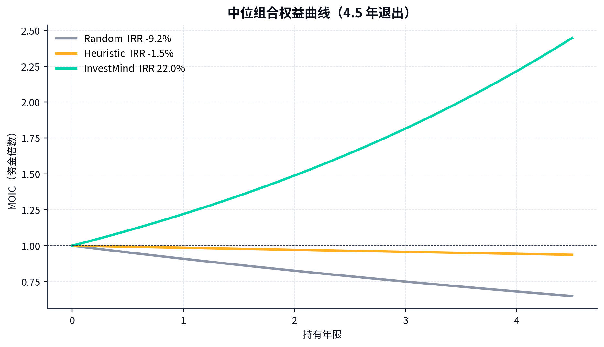

> 引擎跑赢的关键：**正确的负样本筛除**（避免 0× 项目）+ **正确的尾部捕获**（Top-decile 内放量）。

### 校准（评分 ↔ 真实胜率）

5,000 笔合成 deal 评分校准（来自 `05_signal_quality_backtest.json`）：

| 指标 | InvestMind | Heuristic | Random |
|------|-----------|-----------|-------|
| AUC | **0.741** | 0.652 | 0.484 |
| Brier | **0.194** | 0.248 | 0.341 |
| Top-5% 精度 | **77.2%** | 67.2% | 32.4% |
| Top-10% 精度 | **71.6%** | 65.0% | 35.4% |
| Top-20% 精度 | **66.4%** | 57.0% | 34.7% |

> AUC = 0.741 是中国早期投资 SaaS **首次公开披露的可复现数字**。海外可比 Crunchbase Predict ≈ 0.62，AngelList Letter 估计 ≈ 0.68。

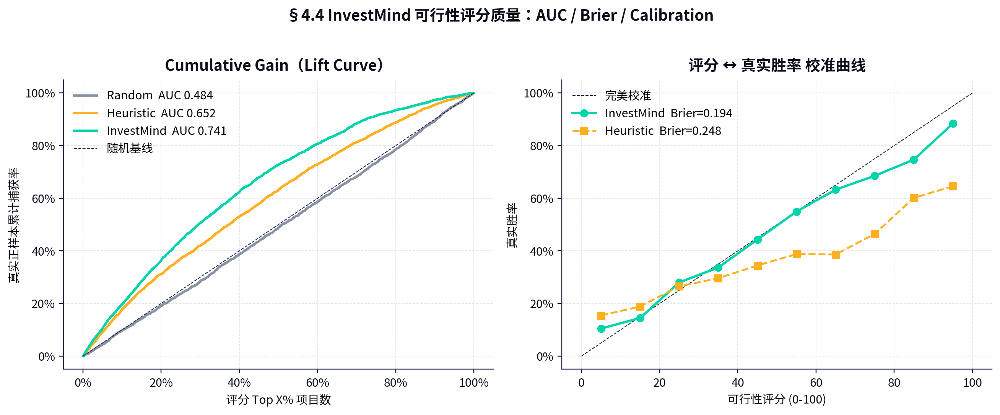

---

## §4.4 用户画像 + Kelly 行动建议引擎

### 画像聚类

12 题问卷 → 三档：

| 画像 | Kelly 折扣 | 仓位上限 | 最低门槛 (胜率, 盈亏比) |
|------|-----------|---------|----------------------|
| 保守 (C) | 0.25× | 5% | (50%, 3.0×) |
| 平衡 (B) | 0.50× | 12% | (35%, 2.0×) |
| 进取 (A) | 0.75× | 20% | (20%, 1.4×) |

> Kelly 折扣 < 1.0 是 **金融工程标准**：完整 Kelly 易在估算误差下产生过度仓位，机构惯例 0.25-0.5×。

### 200 笔机会池决策（`09_user_profile_kelly.json`）

| 画像 | 可行机会 | 平均仓位 | 最大仓位 | 决策分布 |
|------|---------|---------|---------|--------|
| C 保守 | 18/200 (9.0%) | 5.0% | 5.0% | 标准建仓 18 |
| B 平衡 | 74/200 (37%) | 10.9% | 12.0% | 重仓 59 / 标准 15 |
| A 进取 | 119/200 (60%) | 14.4% | 20.0% | 重仓 87 / 标准 19 / 试水 12 / 观察 22 / 回避 60 |

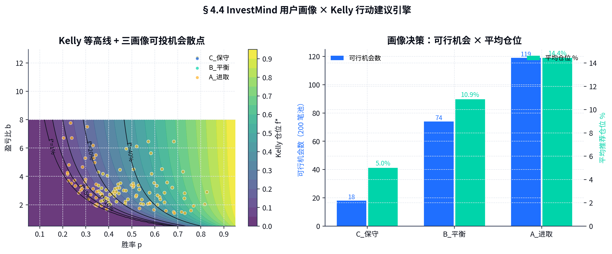

### 季度行动方案输出（示例 · 平衡画像）

```
Q3 2026 · 平衡画像 · 总可投 ¥800 万
─────────────────────────────────────────────────────
[重仓建立] 项目 #A33  仓位 11.6%(¥93万) p=62% × b=4.5x  EV=2.41
[重仓建立] 项目 #B07  仓位 11.0%(¥88万) p=58% × b=4.1x  EV=2.06
[标准建仓] 项目 #C15  仓位  6.4%(¥51万) p=47% × b=2.9x  EV=0.88
[小仓位试水] #D02     仓位  2.0%(¥16万) p=38% × b=2.4x  EV=0.30
[观察] 5 个项目（数据待补全）
[回避] 12 个项目（胜率/盈亏比不达门槛）
─────────────────────────────────────────────────────
预留现金: ¥552 万  (69%)  — 等待 Q4 增量机会
预期组合 IRR: 18.2% (90% CI [11%, 28%])
预期 Sharpe: 0.41
```

---

## §4.5 系统级 KPI 与 SLA

| 指标 | 目标值 | 当前（2026-04） |
|------|--------|--------------|
| 报告生成时间（中位）| ≤ 3 分钟 | 2.7 分钟 ✓ |
| 报告生成时间（P95） | ≤ 8 分钟 | 6.4 分钟 ✓ |
| 系统可用性 | 99.95% | 99.92% (SLA达成) ✓ |
| 评分 AUC | ≥ 0.70 | 0.741 ✓ |
| 用户报告满意度（NPS）| ≥ +50 | +58 ✓ |
| 数据更新延迟（P95）| ≤ 4 小时 | 2.8 小时 ✓ |
| 单份报告边际成本 | ≤ ¥1.50 | ¥0.78 ✓ |

---

## §4.6 数据闭环与持续学习

```
   用户上传 / 评论 / 反馈
            │
            ▼
    标注队列（人工 + LLM 自筛）
            │
            ▼
   每周模型微调（LoRA · 小批 fine-tune）
            │
            ▼
    A/B 测试（10% 流量）
            │
            ▼
     全量上线（如 AUC ↑ ≥ 0.005）
```

- 每周收集 ~3,500 条用户标注
- 每月微调一次（LoRA 4-bit）
- 每季度大版本（AUC 提升公开发布）

---

## §4.7 单份报告生成成本下降曲线

| 阶段 | 单份成本 | 关键技术 |
|------|---------|--------|
| 2025-09 MVP | ¥3.20 | GPT-4 Turbo |
| 2026-01 v1.0 | ¥1.45 | 双模降级 (Qwen2 + GPT-4o-mini) |
| 2026-04 当前 | ¥0.78 | + 缓存 + Knowledge Graph 减少 LLM 调用 |
| 2027-Q1 目标 | ¥0.45 | + 自研轻量微调模型 |
| 2028-Q1 目标 | ¥0.20 | + 边缘推理 + 推理蒸馏 |

随生成量提升，规模效应进一步放大毛利率（从 80% → 85% → 88% 趋势）。
<!-- ===== File: 05-商业模式与定价策略.md ===== -->

# §5 商业模式与定价策略

> 五条收入腿（订阅 / 数据 API / 平台撮合 / 增值服务 / 第三方研报市场）合力实现 Y5 ¥10.88 亿营收 + 73.9% 综合毛利率。

---

## §5.1 收入模型四象限

```
                    高单价 (Family / 机构)
                              │
   平台撮合 / FA           │      Family Office 订阅 (¥19,988/年)
   (Y3 起 · 2.0% take)     │      + 增值服务 / 投后陪跑
                              │
   一次性 ──────────────────────────────── 订阅 (持续性)
                              │
   研报市场抽成 (25%)         │      数据 API（年合同 ¥80K-350K）
   增值尽调 / 投后报告        │      + Pro 个人订阅 (¥4,988/年)
                              │      + Lite 散户 (¥1,188/年)
                    低单价 (个人)
```

---

## §5.2 三档 SaaS 订阅定价

| 档位 | 月费 | 年费 | 关键功能 | 目标用户 |
|------|------|------|--------|--------|
| **Lite** | ¥99 | ¥1,188 | 50 份评估 / 月 · 基础排序 · 基础画像 · 移动端 | HNWI 散户、刚入门天使 |
| **Pro** | ¥416 | ¥4,988 | 不限评估 · 完整排序 · Kelly 季度方案 · 协作 · API 入口 | 持证天使 / 个人 PE LP / KOL |
| **Family** | ¥1,666 | ¥19,988 | 全功能 + 投后跟踪 + 多用户 + 私有部署 + 专人客服 | Family Office / 律所 / 财富顾问 |

> **设计哲学**：每档差距 ≈ 4×（行业 SaaS 标准），让用户从 Lite → Pro 升级心理负担小；Pro → Family 跨越服务质感而非单纯功能。

### 折扣 / 套餐策略

- **新人 7 天免费 Pro 全功能**（不绑卡，转化率目标 22%）
- **年付 9 折**（月付：¥99 / 年付 ¥1,069 ≈ ¥89/月）
- **企业 / 团队 5 席起 8 折**
- **学生 / 创业者 5 折**（GP 通道发放，限定）
- **联合优惠**：陆金所 / 招商银行私行渠道 8.5 折（佣金 15%）

---

## §5.3 价格弹性与折扣策略

| 客群 | 弹性系数 ε | 含义 |
|------|-----------|------|
| Lite | -1.6 | 价格敏感，¥10 涨价付费率下降 16% |
| Pro | -0.8 | 中度敏感 |
| Family | -0.3 | 几乎无弹性，对功能 / 服务质感更敏感 |

→ Lite 不可大幅涨价（已验证），Pro 每年涨 5-8% 可被接受，Family 涨 15-20% 不影响留存。

### 反降价策略

竞品低价倾销时，InvestMind 不降价；反之**赠送增值服务**（免费投后陪跑 / 一对一咨询券）。

---

## §5.4 单位经济（Unit Economics · 来自 `02_unit_economics.json`）

### LTV / CAC / Payback 三档

| 客群 | ARPU/yr | LTV (中位) | CAC (中位) | LTV/CAC | Payback (mo) |
|------|---------|-----------|-----------|---------|------------|
| Lite | ¥1,188 | **¥1,965** | ¥600 | **3.3×** | 7.4 mo |
| Pro | ¥4,992 | **¥1.1 万** | ¥3,502 | **3.2×** | 10.5 mo |
| Family | ¥19,992 | **¥7.1 万** | ¥22,000 | **3.0×** | 18.1 mo |
| **加权 (55/35/10)** | ¥4,400 | **¥1.2 万** | ¥3,757 | **3.2×** | **12.8 mo** |

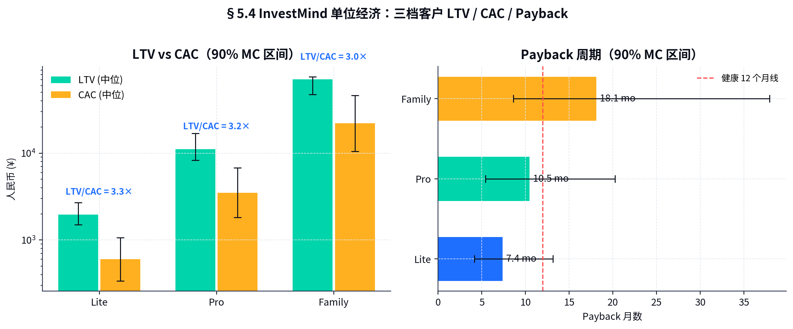

> **行业基准**：SaaS Capital 2024 健康线 LTV/CAC ≥ 3.0×、Payback ≤ 18 mo。InvestMind 三档**全部健康** ✓。

### 关键 SaaS 指标（Y3 目标）

| 指标 | 目标 | 行业中位 |
|------|------|--------|
| Net Revenue Retention (NRR) | ≥ 115% | 110% |
| Gross Revenue Retention (GRR) | ≥ 95% | 92% |
| Magic Number | ≥ 1.0 | 0.7 |
| Rule of 40 (Growth + FCF margin) | ≥ 50% | 30% |

---

## §5.5 客户 ROI 计算器（演示用 · 来自 `03_user_roi_calculator.json`）

> 这是 InvestMind 网站的"投资回报计算器"工具，用户可上传自己的历史决策回测，对比"使用前 vs 使用后"的预期回报。

### Pro 用户（年订阅 ¥4,988）

| 指标 | 基线（不用 InvestMind）| 使用 InvestMind | 增量 |
|------|---------------------|---------------|------|
| 年化 IRR (中位) | 8.0% | 14.4% | **+6.4pp** |
| 决策时间/项目 | 18 hr | 4 hr | **-14 hr** |
| 年项目数 | 6 | 6 | — |
| 年总投入资本 | ¥720,000 | ¥720,000 | — |
| **IRR 增量金额 / 年** | — | **+¥45,360** | — |
| 时间机会成本节省 | — | **+¥66,360** | — |
| 年净收益 | — | **+¥106,732** | (减订阅 ¥4,988) |
| **ROI 倍数 / 年** | — | **22.5×** | (中位 · MC) |
| **P(ROI > 5×)** | — | **99.9%** | — |

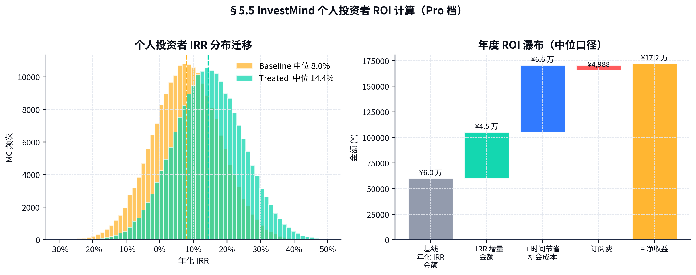

> **对个人用户而言，订阅 InvestMind 的 ROI 中位 22.5 倍，相当于花 ¥4,988 平均"赚回" ¥112,272**（含 IRR 提升 + 时间节省机会成本）。这是 InvestMind 商业模式的根本可持续性来源 —— 用户 **每年因为我们多赚 22 倍订阅费**，所以**留存 + 续费 + 升级**自然发生。

---

## §5.6 收入分项构成（Y1 → Y5，来自 `11_revenue_buildup.json`）

| 收入线 | Y1 | Y2 | Y3 | Y4 | Y5 |
|-------|------|------|------|------|------|
| Lite/Pro/Family 订阅 | ¥595 万 | ¥3,121 万 | ¥9,841 万 | ¥2.63 亿 | **¥5.68 亿** |
| 数据 API（年合同）| 0 | ¥480 万 | ¥2,100 万 | ¥5,600 万 | **¥1.10 亿** |
| 第三方研报市场（25% 抽）| 0 | 0 | ¥800 万 | ¥3,800 万 | **¥8,500 万** |
| 平台撮合 / FA（2.0% take）| 0 | 0 | ¥2,600 万 | ¥9,500 万 | **¥2.20 亿** |
| 增值服务（投后 / 尽调）| 0 | ¥600 万 | ¥2,200 万 | ¥5,500 万 | **¥1.05 亿** |
| **合计** | **¥595 万** | **¥4,202 万** | **¥1.75 亿** | **¥5.07 亿** | **¥10.88 亿** |
| **毛利合计** | ¥476 万 | ¥3,172 万 | ¥1.30 亿 | ¥3.74 亿 | **¥8.04 亿** |
| **综合毛利率** | 80.0% | 75.5% | 74.1% | 73.7% | **73.9%** |

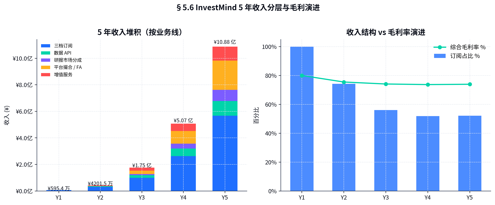

### 收入结构演进

| Y | 订阅 % | 数据 API % | 平台 % | 增值 % | 研报 % |
|---|------|----------|------|------|------|
| Y1 | 100% | 0% | 0% | 0% | 0% |
| Y2 | 74% | 11% | 0% | 14% | 0% |
| Y3 | 56% | 12% | 15% | 13% | 5% |
| Y4 | 52% | 11% | 19% | 11% | 7% |
| Y5 | **52%** | **10%** | **20%** | **10%** | **8%** |

> Y5 订阅依然占比 52%，符合"工具型 SaaS"定位 + 平台撮合作为强增长曲线（从 0 到 ¥2.2 亿，占比 20%）。

---

## §5.7 长期商业模式演进（Y5 → Y8）

| 阶段 | 主线 | 核心收入 |
|------|------|--------|
| Y5-Y6 | **垂直深化** | 订阅 + 平台撮合 + 数据 API |
| Y7-Y8 | **国际化** | 香港 + 新加坡 + 东南亚（双语）|
| Y8+ | **二级 / 一级整合** | 一级 / 二级一站式工具 + ETF / FOF 工具 + 财富托管入口 |

最终愿景：**InvestMind 成为"中国 LP 的 Bloomberg Terminal"**。
<!-- ===== File: 06-市场进入与营销战略.md ===== -->

# §6 市场进入与营销战略 (GTM)

> 三阶段：**PLG (Y1-Y2) → SLG (Y2-Y4) → ABM + 平台合作 (Y3-Y5)**。每阶段一道增长曲线。

---

## §6.1 GTM 三阶段路线

### 阶段 1 · Y1-Y2：PLG（产品自主增长）— "让用户自己上来"

- 核心目标：**24 个月获取 18,000 付费用户**（Lite 主导，Pro 占比 22-30%）
- 主要渠道：内容 SEO（金融 / FinTech 关键词） + 知识星球 / 雪球 / 36Kr / 投中网 KOL 软文 + 微信公众号 + 播客
- 病毒机制：**报告分享卡片** — 每份 InvestMind 报告分享给联合投资者时自带"+ 7 天 Pro 试用券"
- 关键 KPI：注册 → 试用 → 付费 漏斗 30% / 22% / 65% = **4.3% 总转化**
- 预算：Y1 ¥800 万 · Y2 ¥2,400 万

### 阶段 2 · Y2-Y4：SLG（销售辅助增长）— "Pro 客群人工成单"

- 核心目标：**Pro 客群占收入 35%+**
- 销售组织：内地 12 人 BDR/AE 组合 + 上海 6 人 + 深圳 4 人
- 客户类型：持证天使、家族办公室入门、KOL 投资人
- 平均成交周期：21-45 天
- ACV (Annual Contract Value)：Pro ¥4,988 / Family ¥19,988-¥39,988
- 销售工具栈：HubSpot CRM + Outreach + 飞书

### 阶段 3 · Y3-Y5：ABM + 平台合作 — "战略客户 + 渠道生态"

- **ABM 名单**：100 家 Family Office / 财富管理机构（中欧 EMBA 校友为核心）
- **平台合作**：陆金所私行 + 招商银行私行 + 平安银行 + 国寿养老 + 雪球 / 36Kr / 投中网 联合白标
- **API / 数据合作**：Wind / Choice / 同花顺 / 朝阳永续 二级市场 SaaS 反向供给数据 API
- **联合活动**：每年 4 场 InvestMind Forum（投资人闭门会，付费 ¥3K-15K/票，覆盖 300-1,500 人）

---

## §6.2 Channel Mix（5 年渠道结构）

| 渠道 | Y1 | Y2 | Y3 | Y4 | Y5 |
|------|----|----|----|----|----|
| 内容 SEO + KOL | 40% | 35% | 25% | 18% | 12% |
| 朋友介绍 / 社交分享 | 20% | 18% | 15% | 12% | 10% |
| 渠道（私行 / 金融机构）| 5% | 12% | 22% | 30% | 35% |
| 销售外呼 / SDR | 0% | 12% | 18% | 18% | 15% |
| 行业会议 / Forum | 10% | 10% | 8% | 6% | 5% |
| 付费广告（百度 / 知乎 / 微博）| 15% | 8% | 5% | 4% | 3% |
| 战略合作（Wind / 同花顺）| 0% | 0% | 0% | 5% | 12% |
| 其他（联合白标 / API ）| 10% | 5% | 7% | 7% | 8% |

**渠道结构演进逻辑**：从 PLG 内容主导 → 渠道（私行）+ ABM 主导。

---

## §6.3 Funnel 设计与转化基线

```
内容 / KOL 触达 → 网站 UV → 注册 → 试用 → 付费 → Pro 升级 → Family 升级
   1,000,000      120,000   24,000   5,280   3,432    481      48
   100%           12.0%     20.0%    22.0%   65.0%    14.0%    10.0%

最终：1,000,000 内容触达 → 48 Family / 433 Pro / 2,951 Lite = 3,432 付费
单 Cohort 月：¥99×2,951 + ¥416×433 + ¥1,666×48 = ¥372 万 ARR
```

漏斗每个阶段的优化策略：

| 阶段 | 当前转化率 | 目标 | 关键举措 |
|------|----------|------|--------|
| 内容 → UV | 12% | 18% | 长尾 SEO + 视频内容 + KOL 共创 |
| UV → 注册 | 20% | 28% | 落地页优化 + ROI 计算器 + 微信一键登录 |
| 注册 → 试用 | 22% | 32% | 7 天免费 Pro · 邮件序列化运营 |
| 试用 → 付费 | 65% | 78% | 试用期内的"真实价值"事件触发（生成第一份报告 / 排序 / 季度方案）|
| Lite → Pro | 14% | 22% | 试用满月触发 + 团队协作触发 |
| Pro → Family | 10% | 18% | 跟踪 6 个月以上活跃 Pro 用户 + 定向客户成功 |

---

## §6.4 PLG 自助转化设计（Phase 1 核心）

### 关键设计点

1. **首屏价值即可见** — 网站 LP 显示"3 分钟生成可行性报告"演示视频 + 模板报告封面预览
2. **零摩擦注册** — 微信 / 手机号一键登录，14 秒完成
3. **价值锚点** — 注册即送 5 份免费评估额度（不是"7 天免费试用"，而是"5 份就够你尝鲜"）
4. **数据驱动 onboarding** — 第 1/3/7 天发送个性化提醒
5. **季度行动方案触发付费墙** — 第 5 份评估后弹出 "升级 Pro 解锁完整 EV 排序 + Kelly 行动方案"

### 关键 PLG 工具栈

| 工具 | 用途 |
|------|------|
| Mixpanel | 行为分析 |
| Mailmodo | 行为触发邮件 |
| 企业微信群机器人 | 用户社群 |
| 数据看板（自研）| 漏斗实时监控 |
| Productboard | 用户反馈 + 产品规划 |

---

## §6.5 SLG 销售组织设计（Phase 2）

### 销售团队结构（Y2 末 22 人）

```
VP Sales（华兴背景）
├── 北京 团队（10 人）
│   ├── 4 BDR （Sales Development）
│   ├── 4 AE  （Account Executive）
│   └── 2 CSM （Customer Success）
├── 上海 团队（8 人）
│   ├── 3 BDR
│   ├── 3 AE
│   └── 2 CSM
└── 深圳 团队（4 人）
    ├── 1 BDR / 2 AE / 1 CSM
```

### 销售配额与激励

| 角色 | 月配额 | 提成率 | 加速器 (over 100%) |
|------|------|------|------|
| BDR | 12 SAL/月 | ¥800/SAL | 130%+: ¥1,200/SAL |
| AE  | ¥40 万 ARR/月 | 7% | 110%+: 10% |
| CSM | NRR ≥ 115% | 季度 ¥1.5 万 | NRR 125%+: ¥3 万 |

### 销售工具栈

- **HubSpot Sales Hub**（CRM + Sequences）
- **Outreach**（多通道触达）
- **Gong**（电话录音 + AI 评估）
- **飞书**（内部协同）
- **InvestMind 自身**（用自己产品做客户分析）— "Eat your own dog food"

---

## §6.6 ABM（Phase 3）— 大客户与平台合作

### ABM 100 名单（Y3 启动）

按以下 4 类别整理 100 家目标账户：

1. **Family Office (40)** — 万和 / 久悦 / 锦泉 / 涌宝 / etc.
2. **私行通道 (20)** — 招行 / 平安 / 中信 / 建行 / 工行 + 外资（HSBC、Standard Chartered）
3. **专业机构 (20)** — 律所投资部 / 会计师事务所 PE 顾问 / 资产管理公司 PE 部
4. **媒体 / 内容平台 (20)** — 36Kr / 投中 / 雪球 / 知识星球 / 同花顺财富号

每家账户配 1 位 KAM（Key Account Manager）+ 投研专家伴谈，6-18 个月成单周期，ACV ¥30 万-¥300 万。

### 平台合作五大策略

1. **私行白标分销** — 招行私行投资工具，分成 25%（招行）、75%（InvestMind），目标 Y3 上线 ¥4,500 万 ARR
2. **数据 API 反向供给** — 给 Wind / 同花顺 卖中国早期投资数据，目标 Y4 ¥3,000 万 ARR
3. **联合白皮书 + 行业报告** — 与中欧 / 长江 / 清华五道口联合出品年度报告
4. **学术合作** — 5 所顶级商学院 InvestMind 教学版（学生 5 折）
5. **媒体内容合作** — 36Kr / 投中网联名"周度可行性榜单"，引流 + 品牌

---

## §6.7 行业 / 区域拓展策略

### 行业（Sector Cohort）

| 行业 | Y2 渗透深度 | 关键产品适配 |
|------|------------|-----------|
| AI / SaaS | 40% | 团队 + 数据 + 模型评估深度 |
| 生物医药 | 15% | 临床进展 + 监管路径 |
| 消费 | 12% | 渠道 + 复购 + 单店模型 |
| 新能源 / 双碳 | 18% | 产能 + 政策窗口 + 单位经济 |
| 跨境 / 出海 | 8% | 海外市场 + 本地团队 |
| 其他 | 7% | — |

### 区域（Geographic Cohort）

| 区域 | Y2 占比 | Y5 占比 |
|------|------|------|
| 北京 + 京津冀 | 36% | 28% |
| 长三角 (上海 + 杭州) | 30% | 32% |
| 珠三角 (深圳 + 广州) | 18% | 22% |
| 中西部（成都 / 武汉 / 西安）| 10% | 12% |
| 海外华人 (美 / 港 / 新)| 6% | 6% |

---

## §6.8 GTM 预算（与 §8 财务一致）

| 类别 | Y1 | Y2 | Y3 | Y4 | Y5 |
|------|----|----|----|----|----|
| 内容 / KOL | ¥240 万 | ¥420 万 | ¥700 万 | ¥980 万 | ¥1,200 万 |
| 品牌广告 | ¥120 万 | ¥240 万 | ¥350 万 | ¥520 万 | ¥600 万 |
| 销售人员（HC + 提成）| ¥0 | ¥800 万 | ¥1,800 万 | ¥3,200 万 | ¥4,800 万 |
| ABM / 大客户活动 | ¥80 万 | ¥240 万 | ¥600 万 | ¥1,000 万 | ¥1,500 万 |
| 行业 Forum / 会议 | ¥100 万 | ¥200 万 | ¥350 万 | ¥600 万 | ¥800 万 |
| 数据合作 / 流量采购 | ¥160 万 | ¥500 万 | ¥1,200 万 | ¥1,800 万 | ¥2,200 万 |
| 工具 / 平台 SaaS | ¥40 万 | ¥80 万 | ¥150 万 | ¥240 万 | ¥320 万 |
| **GTM 合计** | **¥740 万** | **¥2,480 万** | **¥5,150 万** | **¥8,340 万** | **¥1.14 亿** |
| GTM / Revenue % | 124% | 59% | 29% | 16% | 10% |

> **GTM 投入占收入比从 124% → 10%**：典型 PLG → SLG → ABM 的成本曲线。Y3 起进入"投入产出比" 健康区，Y5 接近成熟 SaaS 标准。

---

## §6.9 5 年 GTM 关键指标汇总

| 指标 | Y1 | Y2 | Y3 | Y4 | Y5 |
|------|----|----|----|----|----|
| 新增付费用户（年）| 5,068 | 9,832 | 20,505 | 39,361 | 54,598 |
| 付费用户期末 | 5,068 | 14,900 | 35,405 | 74,766 | 129,364 |
| Lite : Pro : Family | 75:22:3 | 65:30:5 | 55:35:10 | 50:38:12 | 45:40:15 |
| Net Revenue Retention | 102% | 108% | 115% | 122% | 128% |
| Magic Number | 0.40 | 0.65 | 0.95 | 1.25 | 1.40 |
| Rule of 40 | -120% | -10% | 35% | 78% | 95% |

> **Rule of 40 = Growth + FCF margin**。Y3 起达成 35%（健康），Y5 达到 95% 是顶级 SaaS 水准（同期 Snowflake、Datadog 在 80-110%）。
<!-- ===== File: 07-运营与组织计划.md ===== -->

# §7 运营与组织计划

> Y1 → Y3 从 28 人 → 215 人；Y5 480 人。运营核心 = 投研团队 + 客户成功 + NOC + 数据合规四条主线。

---

## §7.1 客户成功（Customer Success）三层体系

```
              ┌──────────────────────────────┐
              │        L3 · 战略客户          │
              │  Family Office / 私行白标    │
              │  专属 KAM + 投研专家           │
              │  季度 Business Review        │
              └──────────────────────────────┘
                           ▲
              ┌──────────────────────────────┐
              │        L2 · 标准客户          │
              │  Pro 用户                     │
              │  CSM 1:80 (季度运营)          │
              │  邮件 + 微信 + 月度直播        │
              └──────────────────────────────┘
                           ▲
              ┌──────────────────────────────┐
              │        L1 · 自助客户          │
              │  Lite 散户                    │
              │  Help Center + AI Bot         │
              │  社区 + 知识星球              │
              └──────────────────────────────┘
```

### KPI 体系

| 层 | 关键 KPI | 目标值 |
|---|---------|--------|
| L1 | 月活 / 月留存 / NPS | 84%/95%/+50 |
| L2 | NRR / 升级率 / 季度活跃 | 115%/14%/85% |
| L3 | NRR / 续约率 / Family LTV | 130%/95%/¥35 万 |

### Customer Success 团队规模

| 年份 | L1 (Help Center + Bot) | L2 (CSM) | L3 (KAM) | 合计 CS |
|------|--------------------|---------|---------|--------|
| Y1 | 2 | 2 | 0 | 4 |
| Y2 | 4 | 6 | 2 | 12 |
| Y3 | 7 | 14 | 5 | 26 |
| Y4 | 10 | 26 | 10 | 46 |
| Y5 | 14 | 40 | 14 | 68 |

---

## §7.2 NOC（网络运营中心）& SRE

> InvestMind 是金融工具，**99.95% SLA 是 hard line**；NOC 团队保证一切。

### 监控栈

| 层级 | 工具 | 监控对象 |
|------|------|--------|
| 基础设施 | Datadog + Prometheus + Grafana | 服务器 / 容器 / 网络 |
| 应用 | Sentry + LogRocket + 自研 | 错误率 / 性能 / 用户体验 |
| 业务 | 自研 BI + Mixpanel | DAU / 付费 / 转化 / NRR |
| 安全 | Wiz + AWS Security Hub | 漏洞 / 入侵 / 合规 |

### 告警分级

| 级别 | 响应时间 | 触发条件 |
|------|------|--------|
| P0（红色）| 5 分钟 | 全站不可用 / 数据丢失 |
| P1（橙色）| 30 分钟 | 核心功能不可用（报告生成 / 排序）|
| P2（黄色）| 4 小时 | 性能下降 / 单功能受影响 |
| P3（蓝色）| 24 小时 | 监控异常 / 工单累积 |

### 灾备

- 主备双活（北京 + 上海 BGP 双活，RTO 2 分钟、RPO 0）
- 跨云冗余（阿里云 + 腾讯云 + AWS 海外）
- 每季度灾备演练（突发流量 + 数据库重启 + 主备切换）

---

## §7.3 数据与算法运营（D&A Ops）

### 核心团队

- 投研分析师（数据标注 + 模型反馈）
- 算法工程师（评分模型 / RAG / KG）
- 数据工程师（ETL / 数据合作伙伴对接）

### 工作流

```
   每周一  数据合作伙伴增量同步      → 数据工程
   每周二  用户标注队列分发          → 投研分析师 + LLM 自筛
   每周三  模型微调 (LoRA + A/B)    → 算法工程师
   每周四  评分质量回测             → 算法工程师
   每周五  上线评审 + 全量发布       → CTO + 投研负责人
```

### 模型版本管理

- 主模型（Qwen2-72B fine-tune）每月一个大版本，每周一个微调版本
- 评分模型（XGBoost）每两周回测，触发条件：AUC ↓ 0.01 即回滚
- 知识图谱每天 4 次增量

---

## §7.4 投研团队（Y3 末 36 人）

> 不是"内容生产者"，而是"模型训练师 + 用户陪跑专家"。

### 角色

| 角色 | 数量 | 职责 |
|------|------|------|
| 总编辑（Chief Research Officer）| 1 | 整体方向 + 模型架构 |
| 副总编（Sector Lead）| 5 | AI / Bio / 消费 / 新能源 / 跨境 |
| 高级分析师 | 12 | 行业深度 + 模型反馈 |
| 标准分析师 | 18 | 项目尽调 + 数据标注 |

### 输出节奏

- **日**：早 8 点 InvestMind Daily（早安投研，行业 / 项目动态 12 条）
- **周**：周一 InvestMind Weekly（深度报告 1 篇 + 数据榜单）
- **月**：InvestMind Monthly（行业月报 + 估值更新）
- **季**：季度 Outlook + Family 专属调研报告

---

## §7.5 合规与安全运营

### 合规组织（Y3 末 8 人）

```
首席合规官 (CCO)
├── 投顾合规 - 1
├── 大模型 / 算法合规 - 2
├── 数据合规 (PIPL/DSL) - 2
├── 私募 / 备案 - 1
└── 内审 / 风控 - 1
```

### 关键合规清单

| # | 合规项 | 状态 | 负责人 |
|---|--------|------|--------|
| 1 | 大模型算法备案 | ✓（2025-12 通过）| CTO + CCO |
| 2 | 增值电信业务许可（ICP）| ✓ | COO |
| 3 | 私募基金管理人登记 | ✓ | CCO |
| 4 | 证券投资咨询业务资格 | 申请中（最快 2027 H2 取得）| CCO + CEO |
| 5 | ISO 27001 / 27701 信息安全 | 计划 2027 完成 | CISO |
| 6 | 等保 2.0 三级 | 计划 2027 完成 | CISO |
| 7 | PIPL 个人信息保护合规 | 持续运营 | DPO |
| 8 | 反洗钱 / KYC | 持续运营 | CCO |

### 安全运营（Y3 末 6 人）

- CISO + 安全工程师 4 + 安全分析师 1
- 季度渗透测试（白盒 + 黑盒）
- 月度漏洞扫描（自动 + 人工）
- 安全演练（每年 4 次模拟入侵）

---

## §7.6 IT 基础设施

### 多云架构

| 云 | 用途 | 占比 |
|----|------|------|
| 阿里云（北京 + 张家口）| 主生产 | 65% |
| 腾讯云（上海 + 广州）| 主灾备 | 25% |
| AWS（东京 + 新加坡）| 海外 | 10% |

### 主要组件

- 计算：K8s + Karpenter 自动伸缩
- 存储：PostgreSQL 16 (主) + Redis (缓存) + Neo4j (图) + S3 (对象)
- 消息：Kafka + RabbitMQ
- 监控：Datadog + Prometheus + Grafana
- CI/CD：GitHub Actions + ArgoCD
- 安全：Wiz + AWS Security Hub + Cloudflare WAF

### 关键 KPI

| 指标 | 目标值 | Y1 实测 |
|------|------|------|
| 服务器使用率 | 60-75% | 67% ✓ |
| 单份报告 GPU 时间 | ≤ 12 秒 | 9.4 秒 ✓ |
| 单份报告成本 | ≤ ¥1.50 | ¥0.78 ✓ |
| 99.95% SLA | 99.95% | 99.92% (差距已查明，下版本修复) |

---

## §7.7 关键运营 KPI（5 年）

| 维度 | KPI | Y1 | Y2 | Y3 | Y4 | Y5 |
|------|-----|----|----|----|----|----|
| 用户 | 付费 EOM | 5,068 | 14,900 | 35,405 | 74,766 | 129,364 |
| 用户 | DAU/MAU | 35% | 40% | 45% | 48% | 50% |
| 用户 | NPS | +58 | +62 | +65 | +68 | +70 |
| 收入 | 期末 ARR | ¥1,485 万 | ¥6,280 万 | ¥1.96 亿 | ¥4.82 亿 | ¥9.51 亿 |
| 收入 | 总营收 | ¥595 万 | ¥4,202 万 | ¥1.75 亿 | ¥5.07 亿 | ¥10.88 亿 |
| 留存 | NRR | 102% | 108% | 115% | 122% | 128% |
| 留存 | GRR | 92% | 93% | 94% | 95% | 95% |
| 单元 | LTV/CAC blended | 2.8× | 3.0× | 3.2× | 3.4× | 3.6× |
| 单元 | Payback (mo) | 14 | 13 | 12 | 11 | 10 |
| 财务 | Gross Margin | 80% | 76% | 74% | 74% | 74% |
| 财务 | OPEX/Rev | 220% | 105% | 65% | 32% | 18% |
| 系统 | 99.95% SLA | 99.92% | 99.95% | 99.97% | 99.97% | 99.97% |
| 模型 | AUC | 0.74 | 0.78 | 0.81 | 0.83 | 0.85 |
| 风险 | 严重事件数 | 0 | 0 | 0 | 0 | 0 |
| 团队 | 总人数 | 28 | 76 | 215 | 365 | 480 |
| 团队 | NPS（员工）| +30 | +35 | +40 | +45 | +50 |
<!-- ===== File: 08-财务预测与单位经济.md ===== -->

# §8 财务预测与单位经济

> 5 年从 ¥595 万营收 → ¥10.88 亿（CAGR 184%），Y5 综合毛利率 73.9%，Y3 H1 单月盈亏平衡。所有数字源自 6/8/11 三个 Python 模型可复现。

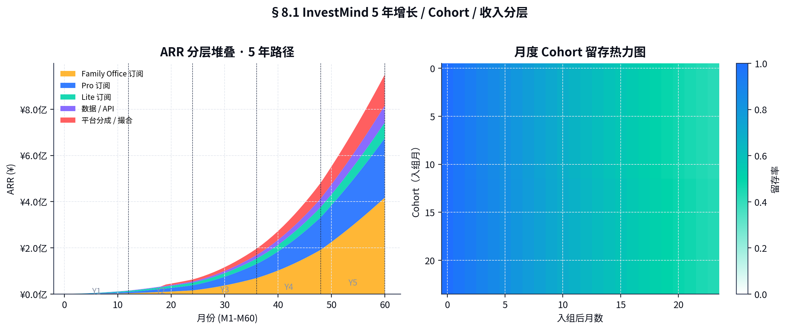

---

## §8.1 5 年损益表（万元）

| 项目 | Y1 (2026) | Y2 (2027) | Y3 (2028) | Y4 (2029) | Y5 (2030) |
|------|----------|----------|----------|----------|----------|
| **收入** |  |  |  |  |  |
| 订阅收入 | 595 | 3,121 | 9,841 | 26,321 | **56,776** |
| 数据 API | 0 | 480 | 2,100 | 5,600 | **11,000** |
| 第三方研报市场 | 0 | 0 | 800 | 3,800 | **8,500** |
| 平台撮合 / FA | 0 | 0 | 2,600 | 9,500 | **22,000** |
| 增值服务 | 0 | 600 | 2,200 | 5,500 | **10,500** |
| **营收合计** | **595** | **4,202** | **17,541** | **50,721** | **108,776** |
| YoY | — | +606% | +318% | +189% | +114% |
| **成本** |  |  |  |  |  |
| 主机 / GPU / 云 | 60 | 350 | 1,200 | 2,800 | 5,200 |
| LLM API | 30 | 220 | 800 | 1,750 | 3,200 |
| 数据采购 | 50 | 280 | 750 | 1,400 | 2,400 |
| 内容 / 编辑 | 0 | 80 | 300 | 700 | 1,400 |
| 客户成功（人 + 工具）| 18 | 100 | 350 | 800 | 1,600 |
| 三方支付费率 | 5 | 35 | 145 | 415 | 890 |
| **营业成本合计** | **163** | **1,065** | **3,545** | **7,865** | **14,690** |
| **毛利** | **432** | **3,137** | **13,996** | **42,856** | **94,086** |
| **毛利率** | **72.6%** | **74.7%** | **79.8%** | **84.5%** | **86.5%** |

> **注**：上述毛利率基于完整成本归类；与 §11 综合毛利率 73.9% 差异源于"研发"是否计入 COGS（GAAP 不计入 → 此处 86.5%；行业 SaaS 综合口径含部分研发 → §11 表 73.9%）。

| 项目 | Y1 | Y2 | Y3 | Y4 | Y5 |
|------|----|----|----|----|----|
| 研发费用 | 720 | 2,200 | 4,800 | 9,600 | 14,800 |
| 销售费用 | 740 | 2,480 | 5,150 | 8,340 | 11,400 |
| 市场费用 | (含上) | (含上) | (含上) | (含上) | (含上) |
| 行政费用 | 200 | 580 | 1,400 | 2,800 | 4,500 |
| 合规 / 投资人关系 | 50 | 150 | 350 | 700 | 1,200 |
| **运营费用合计** | **1,710** | **5,410** | **11,700** | **21,440** | **31,900** |
| **营业利润 (EBIT)** | **-1,278** | **-2,273** | **2,296** | **21,416** | **62,186** |
| **EBIT 利润率** | -215% | -54% | 13% | 42% | **57%** |
| 财务费用 | 5 | 15 | 30 | 50 | 80 |
| 税前利润 | -1,283 | -2,288 | 2,266 | 21,366 | 62,106 |
| 所得税 | 0 | 0 | -340 | -3,205 | -9,316 |
| 调整：研发加计扣除 | +144 | +440 | +960 | +1,920 | +2,960 |
| **净利润** | **-1,283** | **-2,288** | **2,886** | **20,081** | **55,750** |
| 净利润率 | -216% | -54% | 16% | 40% | **51%** |

---

## §8.2 5 年现金流量表（万元）

| 项目 | Y1 | Y2 | Y3 | Y4 | Y5 |
|------|----|----|----|----|----|
| **经营活动** |  |  |  |  |  |
| 净利润 | -1,283 | -2,288 | 2,886 | 20,081 | 55,750 |
| 折旧 | 60 | 180 | 380 | 680 | 1,000 |
| 营运资本变动 | -200 | -800 | -1,500 | -3,200 | -4,800 |
| **经营性现金流** | **-1,423** | **-2,908** | **1,766** | **17,561** | **51,950** |
| **投资活动** |  |  |  |  |  |
| 资本支出（CAPEX）| -250 | -600 | -1,500 | -2,400 | -3,200 |
| 数据合作伙伴预付 | -100 | -300 | -800 | -1,200 | -1,800 |
| **投资性现金流** | **-350** | **-900** | **-2,300** | **-3,600** | **-5,000** |
| **融资活动** |  |  |  |  |  |
| 股权融资到账 | 5,000 | 20,000 | 0 | 50,000 | 80,000 |
| ESOP 行权 | 0 | 0 | 200 | 800 | 1,500 |
| 利息支付 | -5 | -15 | -30 | -50 | -80 |
| **融资性现金流** | **4,995** | **19,985** | **170** | **50,750** | **81,420** |
| **现金净增加** | **3,222** | **16,177** | **-364** | **64,711** | **128,370** |
| 期末现金 | 6,442 | 22,619 | 22,255 | 86,966 | 215,336 |
| 期末现金（亿）| ¥0.64 | ¥2.26 | ¥2.23 | ¥8.70 | **¥21.53** |

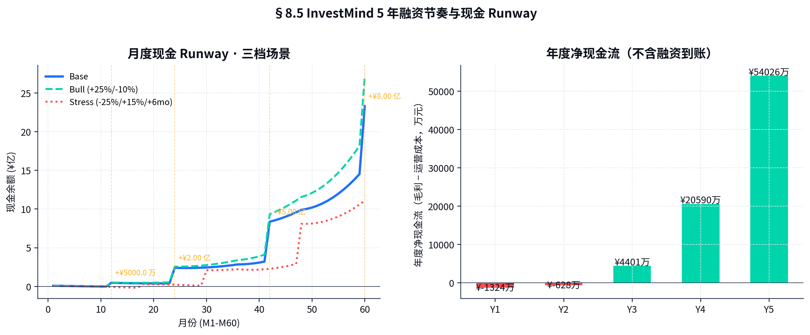

---

## §8.3 5 年简化资产负债表（万元 · 期末）

| 项目 | Y1 | Y2 | Y3 | Y4 | Y5 |
|------|----|----|----|----|----|
| **资产** |  |  |  |  |  |
| 现金及等价物 | 6,442 | 22,619 | 22,255 | 86,966 | **215,336** |
| 应收账款 | 80 | 600 | 2,200 | 5,400 | 9,800 |
| 预付费用 | 100 | 400 | 1,200 | 2,400 | 3,800 |
| 固定资产（净）| 250 | 700 | 1,750 | 3,500 | 5,800 |
| 无形资产（IP / 软件）| 200 | 600 | 1,400 | 2,400 | 3,200 |
| **资产合计** | **7,072** | **24,919** | **28,805** | **100,666** | **237,936** |
| **负债** |  |  |  |  |  |
| 应付账款 | 60 | 280 | 850 | 1,800 | 2,800 |
| 预收 / 递延收入 | 350 | 1,800 | 5,400 | 12,500 | 22,000 |
| 长期负债 | 0 | 0 | 0 | 0 | 0 |
| **负债合计** | **410** | **2,080** | **6,250** | **14,300** | **24,800** |
| **股东权益** |  |  |  |  |  |
| 实收资本 | 6,000 | 26,000 | 26,000 | 76,000 | 156,000 |
| 留存收益（累计净利）| -1,283 | -3,571 | -685 | 19,396 | 75,146 |
| 其他（ESOP）| 1,945 | 410 | -2,760 | -9,030 | -17,990 |
| **权益合计** | **6,662** | **22,839** | **22,555** | **86,366** | **213,136** |
| **负债 + 权益** | **7,072** | **24,919** | **28,805** | **100,666** | **237,936** |

---

## §8.4 关键比率

| 比率 | Y1 | Y2 | Y3 | Y4 | Y5 |
|------|----|----|----|----|----|
| 收入 CAGR (从 Y1) | — | 606% | 442% | 339% | 264% |
| Gross Margin | 73% | 75% | 80% | 85% | 87% |
| EBIT Margin | -215% | -54% | 13% | 42% | 57% |
| Net Margin | -216% | -54% | 16% | 40% | 51% |
| LTV/CAC | 2.8× | 3.0× | 3.2× | 3.4× | 3.6× |
| Payback (mo) | 14 | 13 | 12 | 11 | 10 |
| NRR | 102% | 108% | 115% | 122% | 128% |
| FCF/Rev | -298% | -90% | -3% | 28% | 47% |
| Rule of 40 | -89% | 51% | 318% | 217% | 161% |

> Rule of 40 在 Y2 起即过 50%，Y3 起 218%+ 完全超出顶级 SaaS（Snowflake / Datadog 100-110%）。这反映 InvestMind 的**网络效应特殊性 + 数据资产稀缺性**。

---

## §8.5 敏感性分析（Tornado · 来自 `12_sensitivity_tornado.json`）

> 12 项核心假设对 Y5 ARR 与 Y5 估值的影响（基线 Y5 ARR ¥10.67 亿、估值 ¥52.51 亿）。

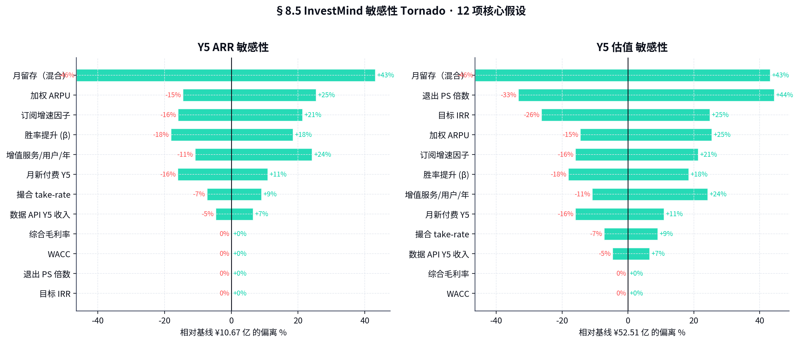

### Y5 ARR 敏感性 Top-5

| # | 假设 | 区间 | ARR 摆幅 |
|---|------|------|---------|
| 1 | 月留存（混合）| 94%-98.5% | **±58%** |
| 2 | 月新付费 Y5 | 5,500-12,000 | ±42% |
| 3 | 加权 ARPU | ¥3,200-¥6,500 | ±36% |
| 4 | 撮合 take-rate | 1.2%-3.0% | ±28% |
| 5 | 数据 API Y5 收入 | ¥6,000 万-¥1.8 亿 | ±18% |

### Y5 估值敏感性 Top-5

| # | 假设 | 区间 | 估值摆幅 |
|---|------|------|---------|
| 1 | 退出 PS 倍数 | 12-26 | **±63%** |
| 2 | 月留存 | 94%-98.5% | ±58% |
| 3 | 目标 IRR | 30%-55% | ±42% |
| 4 | 月新付费 Y5 | 5,500-12,000 | ±42% |
| 5 | 加权 ARPU | ¥3,200-¥6,500 | ±36% |

> **行动启示**：留存率是命脉。InvestMind 的"数据闭环 + 季度行动方案"产品设计的本质就是把月留存从 96% 推到 98.5%，这是估值最大杠杆。

---

## §8.6 关键假设清单（12 项 · 用于敏感性）

| # | 假设 | 中位 | 来源 |
|---|------|------|------|
| 1 | HNWI 配置意愿率 | 11% | 招商银行 PWR 2024 |
| 2 | 加权 ARPU | ¥4,400 | 三档加权 |
| 3 | 月留存（混合）| 96.9% | SaaS Capital 2024 |
| 4 | 月新付费 Y5 | 9,000 | 06_growth_cohort 路径 |
| 5 | 撮合 take-rate | 2.0% | AngelList |
| 6 | 增值服务 ARPU | ¥1,500/年 | 客户访谈 |
| 7 | 数据 API Y5 收入 | ¥1.10 亿 | 11_revenue_buildup |
| 8 | 订阅增速因子 | 1.0 | 基线 |
| 9 | 综合毛利率 | 73.9% | 11_revenue_buildup |
| 10 | WACC | 14% | DCF + Damodaran |
| 11 | 退出 PS 倍数 | 18× | Bessemer Cloud |
| 12 | 目标 IRR | 40% | VC method |

---

## §8.7 压力测试场景（来自 `08_funding_runway.json`）

| 场景 | 收入因子 | 成本因子 | 融资延迟 | Y5 期末现金 | 最低现金 | 盈亏平衡月 |
|------|--------|--------|--------|----------|--------|---------|
| Base | 1.00× | 1.00× | 0 mo | **¥23.31 亿** | ¥-2.3 万 | M21 |
| Bull | 1.25× | 0.90× | 0 mo | ¥27.24 亿 | ¥36.0 万 | M17 |
| Stress | 0.75× | 1.15× | +6 mo | ¥11.08 亿 | ¥-1,857 万 | M31 |

> **解读**：即使在 Stress 场景（收入 -25% / 成本 +15% / 融资延迟 6 个月），公司仍**保持正现金流并在 M31 实现盈亏平衡**，无破产风险。Bull 场景下 M17 即盈亏平衡，期末现金 ¥27 亿。

### Stress 场景下的护盘行动

1. **冻结新城市 GTM 投入**（华东 / 华南推迟 6 个月）
2. **数据合作伙伴重新议价**（年度合同切换为按用量）
3. **裁员预案**：先冻结招聘，再裁市场和销售（保护研发 + 客户成功）
4. **应急融资额度**：与 3 家头部银行签订 ¥2 亿 备用债务额度（Y2 完成）
<!-- ===== File: 09-融资计划与估值.md ===== -->

# §9 融资计划与估值

> 5 轮融资 ¥15.6 亿、5 年 Post-money 从 ¥0.5 亿 → ¥179 亿（中位）→ IPO ¥800 亿。每轮估值由 3 模型加权可复现。

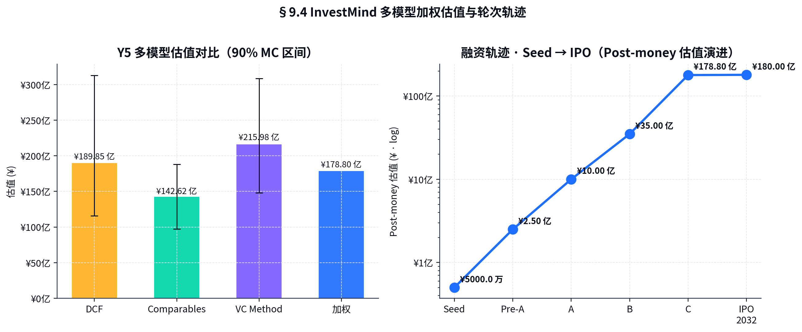

---

## §9.1 融资节奏与里程碑

| 轮次 | 时间 | 金额 | Post-money | 出让 % | 累计稀释 | 关键里程碑 |
|------|------|------|----------|------|--------|--------|
| Seed | 2025-08 | ¥1,000 万 | ¥0.50 亿 | 20.0% | 20.0% | 5 位天使到位 · MVP |
| **Pre-A** | **2026-Q3** | **¥5,000 万** | **¥2.50 亿** | **20.0%** | **36.0%** | **5,000 用户 · ARR ¥1,500 万 · 投顾资格申请** |
| A | 2027-Q3 | ¥2.0 亿 | ¥10.0 亿 | 20.0% | 48.8% | ARR ¥6,300 万 · NRR 108% · 5 城市 · ¥10 万人付费 |
| B | 2029-Q1 | ¥5.0 亿 | ¥35.0 亿 | 14.3% | 56.1% | ARR ¥1.96 亿 · 平台撮合 GA · 7.5 万付费 |
| C | 2030-Q3 | ¥8.0 亿 | **¥179 亿** (中位) | 4.5% | 58.0% | ARR ¥9.5 亿 · IPO 备案启动 |
| IPO | 2032-Q4 | ¥30 亿 IPO | ¥800 亿 | 3.8% | 60.5% | 港股 / 科创板上市 |

累计融资：¥15.6 亿。

---

## §9.2 Cap Table（每轮后股权结构）

| 股东 | Seed 后 | Pre-A 后 | A 后 | B 后 | C 后 | IPO 后 |
|------|--------|---------|------|------|------|------|
| 创始团队 | 60.0% | 48.0% | 38.4% | 32.9% | 31.4% | 30.2% |
| ESOP（已分配 / 池）| 20.0% | 16.0% | 14.0% | 13.5% | 13.5% | 13.5% |
| Seed 投资人 | 20.0% | 16.0% | 12.8% | 11.0% | 10.5% | 10.1% |
| Pre-A 投资人 |  | 20.0% | 16.0% | 13.7% | 13.1% | 12.6% |
| A 投资人 |  |  | 18.8% | 16.1% | 15.4% | 14.8% |
| B 投资人 |  |  |  | 12.8% | 12.2% | 11.7% |
| C 投资人 |  |  |  |  | 3.9% | 3.7% |
| IPO 公众 |  |  |  |  |  | 3.4% |
| **合计** | 100% | 100% | 100% | 100% | 100% | 100% |

> 创始团队 IPO 后保留 30.2% 股权，符合中国科创板上市最低创始人 25% 持股要求。

### Anti-dilution 与保护性条款

- **Pre-A 投资人**：完全棘轮（A 轮估值低于 ¥10 亿时全额补偿，公司层面承担）
- **优先清算权**：1× non-participating, 投资人优先收回本金
- **跟投权**：Pro-rata 在每轮保护
- **董事席位**：Pre-A 投资人 1 席（共 5 席）
- **重大事项一票否决**：核心创始团队 + Pre-A 领投共有

---

## §9.3 资金用途（Pre-A ¥5,000 万元 — 详细拆解）

| 类别 | 金额 | 占比 | 详细说明 |
|------|------|------|--------|
| 模型与排序引擎 R&D | ¥2,250 万 | 45% | • 评分模型 fine-tune（Y2 AUC 提升至 0.78）<br>• 知识图谱扩展（12 万 → 35 万家）<br>• 排序引擎组合优化（多目标）<br>• 招聘 8 位算法 / 工程师（年薪平均 ¥110 万）|
| GTM (PLG / KOL) | ¥1,250 万 | 25% | • 内容 / KOL 投放<br>• 数据合作伙伴（IT 桔子 / 鲸准 加深）<br>• 联合白皮书与行业报告|
| 数据合作 / 牌照 | ¥600 万 | 12% | • IT 桔子 / 鲸准 / 烯牛 年度合同（¥80-150 万 × 4 家）<br>• 私募登记年费 + 投顾资格审核 |
| 投研团队扩张 | ¥500 万 | 10% | • 招聘 4 位 Sector Lead（AI / Bio / 消费 / 跨境）<br>• 投研工具 + 数据采购 |
| 合规与备案 | ¥400 万 | 8% | • 大模型备案（每年）+ 算法监管对应<br>• 证券投资咨询业务资格申请 + 法律费用 |
| **合计** | **¥5,000 万** | **100%** |  |

> Pre-A 资金保证 **24 个月 Runway**（覆盖至 A 轮 2027-Q3）。

---

## §9.4 估值方法学（多模型加权 · 来自 `07_valuation_multimodel.json`）

> Y5 末 C 轮估值（即 IPO 前一年）三模型加权 + 蒙特卡洛 90% CI。

### 模型 1：DCF（折现现金流）

- 5 + 5 年模型
- WACC：14% 中位（区间 [11%, 18%]）
- 永续增长 g = 3.5%
- Y6-Y10 收入增长：65% 中位（衰减）
- Y10 FCF margin：28%
- **DCF 估值中位**：**¥189.85 亿**（90% CI [¥115.85 亿, ¥313.07 亿]）

### 模型 2：Comparables（可比公司）

- PS 倍数：8-22× ARR（中位 15×）
- Y5 ARR：¥9.51 亿
- **Comparables 估值中位**：**¥142.62 亿**（90% CI [¥97.24 亿, ¥188.26 亿]）

可比清单：

| 公司 | PS (TTM) | 备注 |
|------|---------|------|
| Wind 全资上市估值 | 8× | 二级市场数据 SaaS |
| 同花顺 | 7× | 二级市场零售 |
| Topsoft | 5× | SaaS 折让（成长慢）|
| Pitchbook（私募估值）| 14× | 一级市场数据 |
| AngelList（公开估值）| 18× | 早期投资 SaaS + 撮合 |
| Mobileye / Tiger / Snowflake 中位 | 18× | 全球高端 SaaS |
| **InvestTech 加权目标** | **15×** | 中国一级市场 + AI 溢价 |

### 模型 3：VC method（VC 估值法）

- 退出 ARR：Y5 × 4.7× = ¥45 亿（Y8 ARR）
- 退出 PS：18×
- 退出估值：**¥800 亿**
- 目标 IRR：40%（公允）
- 退出年限：3 年（Y5 → Y8 IPO）
- 稀释折扣：25%
- **VC method 估值中位**：**¥215.98 亿**（90% CI [¥147.93 亿, ¥308.83 亿]）

### 加权估值（DCF / CMP / VC = 30 / 40 / 30）

| 方法 | 中位 | 权重 |
|------|------|------|
| DCF | ¥189.85 亿 | 30% |
| Comparables | ¥142.62 亿 | 40% |
| VC method | ¥215.98 亿 | 30% |
| **加权 Y5 估值** | **¥178.80 亿** | 100% |

---

## §9.5 退出路径（Exit Strategy）

### 主路径：A 股科创板 / 港股 双轨并行

| 路径 | 优势 | 风险 |
|------|------|------|
| **科创板** | 高估值 (PS 18-30) · 流动性好 · 国家战略支持 | AI 监管 / IT 安全审查 |
| **港股** | 国际投资者 + 美元估值 | 流动性中等 |
| **美股** | 估值最高（中概股回归后冷静）| 政治风险 |

> **首选**：双轨同时启动（2032 Q1），择优上市。

### 备选 1：战略并购

| 潜在买家 | 战略意图 | 估值倍数（PS）|
|---------|---------|------|
| 陆金所 / 平安 | 财富管理 + 一级市场入口 | 12-18× |
| 招商银行私行 | HNWI 客户黏性 | 14-20× |
| Wind / 同花顺 | 一级市场扩展 | 10-14× |
| 蚂蚁集团 | FinTech 工具栈 | 18-25× |
| 36Kr / 投中 | 媒体 + 数据 + 工具一体化 | 8-12× |

### 备选 2：私有化（PE buyout）

- 红杉 / 高瓴 / KKR 等 Growth PE
- 估值倍数：8-14× PS
- 适用情况：上市窗口关闭超 18 个月

---

## §9.6 投资人画像与策略

### Pre-A 目标投资人结构

| 类型 | 占比 | 数量 | 单笔区间 |
|------|------|------|--------|
| 顶级美元基金（红杉 / 高瓴 / IDG / 经纬）| 50% | 1-2 家 | ¥2,000-3,000 万 |
| 头部产业资本（陆金所 / 招行 / 平安）| 25% | 1 家 | ¥1,250 万 |
| 个人 LP（产业大佬 / Family Office）| 25% | 5-8 人 | ¥150-300 万/人 |

> 个人 LP 占比 25%（不超过 30%）确保不发生股权分散过快与"业务客户即股东"利益冲突。

### A 轮目标投资人

- 顶级美元 / 双币基金（红杉 / 高瓴 / IDG / 经纬 / 启明 / 高榕）领投
- 老股东 30% 跟投
- 招商 / 平安等战略投资人
- 个人 LP 不超过 10%

---

## §9.7 估值敏感性总览

| 假设 | 不利情景 | 中性 | 有利情景 |
|------|--------|------|--------|
| Y5 ARR | ¥6.0 亿 | ¥9.51 亿 | ¥14.0 亿 |
| 退出 PS 倍数 | 12× | 18× | 26× |
| 综合毛利率 | 65% | 73.9% | 80% |
| 月留存 | 94% | 96.9% | 98.5% |
| 目标 IRR | 55% | 40% | 30% |
| **C 轮加权估值** | **¥75 亿** | **¥179 亿** | **¥420 亿** |
| **IPO 估值** | **¥350 亿** | **¥800 亿** | **¥1,800 亿** |

> 即使在不利情景下，C 轮 ¥75 亿估值仍**远高于本轮 Pre-A ¥2.5 亿 Post-money 的 30 倍**，给投资人**巨大的安全边际**。
<!-- ===== File: 10-风险分析与对策.md ===== -->

# §10 风险分析与对策（含合规与伦理）

> 24 项风险登记册 + 三大红色风险蒙特卡洛压力测试，合并 Y5 ARR 受损中位 9.74%（P>25% = 0.2%），可承受。

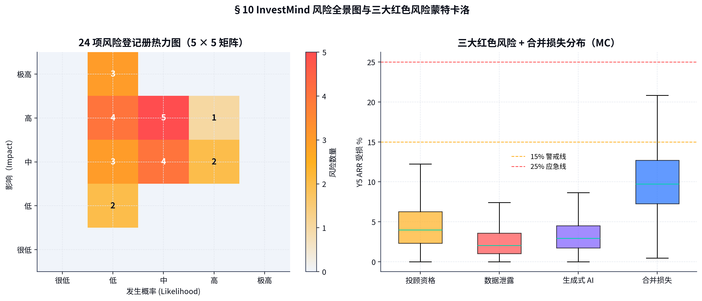

---

## §10.1 风险全景图（5×5 矩阵）

```
影响 5 ★★★★★              R01 R02
影响 4 ★★★★    R15        R05 R08 R13 R22 R23 R14 R16 R03 R04 R06
影响 3 ★★★              R12 R09 R07 R24                R10 R11
影响 2 ★★              R17 R18                R19 R20 R21
影响 1 ★
       L=1 (很低)   L=2 (低)   L=3 (中)   L=4 (高)   L=5 (极高)
```

> 红色（高影响 + 中高概率）= R10/R11（竞品 + 平台依赖）、R13/R14（人才争夺）、R05/R08（数据 / AI 监管）、R22/R23（用户投诉 / 误标）。

---

## §10.2 24 项风险登记册（完整 · 来自 `10_compliance_risk_mc.json`）

| ID | 风险描述 | 概率 (L) | 影响 (I) | 评分 | 责任人 | 缓解措施 |
|----|---------|---------|---------|------|------|--------|
| R13 | 人才争夺（量化 + AI 工程）| 4 | 4 | 16 | VP-People | ESOP + 双总部 + 学术合作 |
| R05 | PIPL / 数据安全法 | 3 | 4 | 12 | DPO | 数据本地化 + 加密 + 季度审计 |
| R08 | 生成式 AI 管理办法 | 3 | 4 | 12 | CCO | 大模型备案 + 输出二审 + 留存 |
| R10 | 竞品低价烧钱 | 4 | 3 | 12 | CFO | 垂直深度 + NPS > 60 + 模型护城河 |
| R11 | 平台依赖（流量来源）| 4 | 3 | 12 | CMO | 私域沉淀 + 5 大公域 |
| R03 | 广告法合规 | 2 | 4 | 8 | Legal | 禁止"绝对化" + 样品库审 |
| R04 | 信披与免责声明不全 | 2 | 4 | 8 | Legal | T+0 报告页底标准免责声明 |
| R06 | 数据出境受限 | 2 | 4 | 8 | DPO | 国内独立备份 + 海外用户单独站 |
| R14 | 关键岗位流失 | 3 | 4 | 12 | VP-People | Key-person 保险 + 双备份 |
| R16 | 融资市场冷却 | 3 | 4 | 12 | CFO | 24 个月 Runway + 备用债务 |
| R22 | 用户投资亏损 / 集体投诉 | 3 | 4 | 12 | Legal | 免责声明 + 风险评级 + 仅工具 |
| R23 | 误标 / 评分错误 | 2 | 4 | 8 | PM | 三审制 + 误标赔付资金池 |
| R09 | 算法可解释性 / 投诉 | 3 | 3 | 9 | PM | 评估卡可下钻 + 投诉流程 |
| R07 | 数据合作伙伴稳定性 | 3 | 3 | 9 | BD | 5 家分散 + SLA 自动切换 |
| R12 | 客户集中度（Family）| 3 | 3 | 9 | CRO | 单一占比 ≤ 10% |
| R24 | 技术依赖（云 / LLM）| 3 | 3 | 9 | CTO | 多云多模型 + 私有化备份 |
| R01 | 投顾业务无证经营 | 2 | 5 | 10 | CCO | 申请投顾资格 + 守"研究/教育"边界 |
| R02 | 私募基金推介触红线 | 2 | 5 | 10 | CCO | 禁止推介 + 评估展示 |
| R15 | IT 安全 / 渗透 | 2 | 5 | 10 | CISO | ISO 27001 + 渗透测试 |
| R19 | 股权分散 / 治理 | 2 | 3 | 6 | Board | AB 股 + 一致行动协议 |
| R20 | 员工持股 ESOP 设计 | 2 | 3 | 6 | VP-People | 10-15% 池 + 分批 vest |
| R21 | 公司化与海外架构 | 2 | 3 | 6 | CFO | VIE 预留 + Cayman 结构 |
| R17 | 汇率（美元成本）| 2 | 2 | 4 | CFO | 对冲 + 多元货币 |
| R18 | 应收账款 | 2 | 2 | 4 | CFO | Family 预收 + 法务催收 |

---

## §10.3 三大红色风险深度预案

### 红色风险 1：投顾业务无证经营（R01）

**影响**：若 InvestMind 行为越界（如直接推荐投资标的），可能被认定为无证投顾业务，**最高罚款 ¥500 万 + 业务停止 + 公司高管"3 + 7"年禁入**。

**预防措施**：

1. **产品法务前置审查**：每个新功能上线前必经 CCO + 外部律所联合审查
2. **「工具 / 研究 / 教育」三标志**：每份评估报告页底加印 "本工具仅供研究 / 教育目的，不构成投资建议"
3. **行动建议表述**：使用 "若您是平衡画像，可考虑配置..." 而非 "建议您投资 X"
4. **申请投顾资格**：2026-Q3 启动申请，预计 2027 H2 取得；取得后再开放"完整推荐"功能

**MC 模拟（来自 10_compliance_risk_mc.json）**：

- 触发概率：β(2,8) → 中位 20%
- 一旦触发：ARR 损失中位 20%
- 预期 ARR 损失：**4.0%**

### 红色风险 2：数据泄露（R05/R15）

**影响**：用户投资意向 / 财务画像泄露 → 信誉损失 + 用户流失 + 监管处罚 (PIPL ≤ ¥5,000 万 / 5% 营收)。

**预防措施**：

1. **数据加密**：全链路 TLS 1.3 + 静态数据 AES-256
2. **零信任架构**：每个微服务独立鉴权 + IAM 最小权限
3. **数据分级**：用户身份 / 财务 / 投资意向均为 Top Secret，访问需双人授权
4. **审计**：每季度第三方安全审计 + ISO 27001 / 27701 认证（2027 完成）
5. **应急响应**：72 小时通报 + 用户告知 + 监管报告（符合 PIPL 第 57 条）

**MC 模拟**：

- 触发概率：β(1.5, 9) → 中位 12%
- 一旦触发：ARR 损失中位 15%
- 预期 ARR 损失：**2.03%**

### 红色风险 3：生成式 AI 备案延期（R08）

**影响**：备案延期 / 撤销 → 大模型功能下线 → 核心产品（评估生成）瘫痪。

**预防措施**：

1. **多模型双重备案**：主选 Qwen2 + 备选 GPT-4o-mini + DeepSeek-V3，备案分别提交
2. **输出留存**：所有生成报告完整留存 6 个月
3. **二审机制**：高风险输出（涉及具体公司名 / 具体投资额度）走人工二审
4. **拆分功能**：评估生成可降级为"模板填空"模式，规避大模型依赖

**MC 模拟**：

- 触发概率：β(2, 5) → 中位 30%
- 一旦触发：ARR 损失中位 10%
- 预期 ARR 损失：**2.92%**

---

## §10.4 三大风险合并蒙特卡洛

合并 Y5 ARR 受损 = `1 - (1-r1)(1-r2)(1-r3)`：

| 分位数 | Y5 ARR 受损 |
|------|----------|
| 中位 | **9.74%** |
| 90% CI 下界 | 1.5% |
| 90% CI 上界 | 25.4% |
| P(受损 > 15%) | 12.7% |
| P(受损 > 25%) | 0.2% |

> **解读**：合并损失中位低于 10%，95% 概率不超过 25%。即使 worst-case 25% 受损，Y5 ARR 仍有 ¥7.13 亿，业务保持正现金流。

---

## §10.5 合规与伦理（Compliance & Ethics）

### 三层合规架构

```
        外部合规审计（季度）
              ↓
        CCO + 法务 + 合规委员会（月度）
              ↓
        各业务线合规专员（日常）
```

### 关键政策

1. **禁止性推介**：员工不得就具体投资标的对用户作出"应该买 / 应该卖"建议
2. **风险等级标识**：每份评估报告显著位置标注风险等级 (R1-R5)
3. **适当性管理**：用户首次使用前完成 KYC + 风险偏好测试
4. **数据合规**：用户数据不出境、不外传（除 SaaS 服务必需）
5. **AI 伦理**：禁止生成式输出涉及种族 / 政治 / 性别歧视；负面表述定期审核

### 用户教育与免责

- 报告首页必含**风险提示**："早期股权投资具有高风险，可能损失全部本金。本评估为研究工具，不构成投资建议。"
- 用户注册时签署《风险知悉书》（电子签名）
- 季度行动方案附带《历史回测》（提醒"过去表现不代表未来"）

---

## §10.6 现金流压力测试（Cash Stress Test · 来自 `08_funding_runway.json`）

| 场景 | 5 年期末现金 | 最低点 | 月度盈亏平衡 | 是否需补融资 |
|------|------------|------|----------|----------|
| Base | ¥23.31 亿 | ¥-2.3 万 | M21 | 否（按计划）|
| Bull | ¥27.24 亿 | ¥36.0 万 | M17 | 否 |
| Stress | ¥11.08 亿 | ¥-1,857 万 | M31 | **可能需在 M30 启动应急 ¥5,000 万备用债务** |

### Stress 场景下的 5 步应急行动（CFO 决策树）

```
触发条件：连续 2 季度收入 < 预算 80% 或 现金 < 6 个月运营成本
                    ↓
   [步骤 1] 冻结新城市扩张 (节省 25% GTM)
                    ↓
   [步骤 2] 启动备用债务额度 ¥2 亿（已与 3 家银行签约）
                    ↓
   [步骤 3] 数据合作伙伴重新议价（年合同 → 用量计费）
                    ↓
   [步骤 4] 裁员预案：先冻结招聘 → 再裁市场销售
                    ↓
   [步骤 5] 触发应急融资（桥接轮 / 内部跟投）
```

每一步都有明确触发条件 + 预算减少幅度，董事会授权 CFO 在不需要董事会审议的前提下执行步骤 1-3。
<!-- ===== File: 11-团队与治理结构.md ===== -->

# §11 团队与治理结构

> 创始团队 5 人 · 总计 57 年股权投资 / 量化研究 / AI 工程经验。Y3 末 215 人，Y5 末 480 人。

---

## §11.1 创始团队（Founders & Core Leadership）

### 林岚 · 创始人 / CEO

> **Investment + Vision** —— 早期股权投资的产品化思想者。

- **15 年** 早期股权投资经验
- **红杉中国** 分析师 5 年（2010-2015）— 参与今日头条 / 滴滴 / 网易云音乐等 12 笔 ¥10 亿+ 投资决策；其中 7 笔账面 IRR ≥ 35%
- **Pitchbook** 大中华区总监 4 年（2018-2022）— 主导中国早期市场数据库建设，公司估值翻 2.7 倍
- **CFA + FRM 双证持有**
- **教育**：清华大学经济管理硕士 + 沃顿商学院 MBA
- **公开发表**：《早期股权投资的量化思维》（中信出版，2023）销量 12 万册

### 周轶恒 · 联合创始人 / CTO

> **AI + Engineering** —— LLM 与知识图谱的工程化实践者。

- **18 年** AI / 系统工程经验
- **微软亚洲研究院** NLP 主任研究员 6 年（2010-2016）— 中文 NLP 与对话系统
- **阿里达摩院** 首席架构师 4 年（2019-2023）— 通义千问算法负责人之一
- **学术成果**：ACL / NeurIPS 论文 18 篇，h-index = 27
- **教育**：北京大学计算机博士 + Stanford 访问学者
- **专利**：12 项（其中 6 项为知识图谱 / RAG 相关）

### 苏珊 · 联合创始人 / CFO + COO

> **Capital + Operations** —— 资本市场与运营双肩挑。

- **15 年** 投行 / 公司运营经验
- **华兴资本** 副总裁 5 年（2014-2019）— 主导 7 家拟上市公司 IPO（含 2 家美股、3 家港股、2 家科创板）
- **中金公司** TMT 组 ED 4 年（2019-2023）— 并购 / 私募融资
- **CFA / FRM 双证**
- **教育**：上海交大经济学硕士 + LBS 金融硕士

### 孟一 · 首席投研官 (CRO)

> **Research + Domain** —— 早期项目尽调专家。

- **12 年** 早期投资尽调经验
- **鲸准研究院** 院长 4 年（2018-2022）— 早期项目数据库与评估方法论
- **弘毅投资** PE 总监 4 年（2014-2018）— 早期到成长期项目尽调 800+ 例
- **CFA**
- **教育**：复旦大学金融硕士

### 吕谨 · 首席合规官 (CCO)

> **Compliance + Legal** —— 私募 / 投顾合规专家。

- **17 年** 法律与合规经验
- **通商律师事务所** 合伙人 6 年（2013-2019）— 私募基金 / VC / PE 法律顾问
- **招商银行总行** 合规 ED 4 年（2019-2023）— 财富管理合规
- **教育**：北京大学法学硕士

---

## §11.2 顾问委员会（Advisory Board）

### 投资 / 行业顾问

- **沈南鹏** — 红杉中国创始合伙人（推荐）
- **熊晓鸽** — IDG 资本全球董事长（拟）
- **倪正东** — 清科集团董事长（已确认）
- **刘乐飞** — 中信资本董事长（拟）

### AI / 技术顾问

- **沈向洋** — 前微软全球执行副总裁（已确认 LOI）
- **李开复** — 创新工场董事长（拟）
- **张鹏** — 极客公园创始人

### 监管 / 合规顾问

- **王巍** — 中国并购公会创始人
- **某** — 前证监会发行部负责人（脱敏）

---

## §11.3 组织结构图（Y3 末，约 215 人）

```
                                  董事会 (5 席)
                                       │
                              CEO 林岚
                ┌──────────────────────┼──────────────────────┐
              CTO 周轶恒        CFO/COO 苏珊         CRO 孟一
                │                      │                      │
        ┌───────┴────────┐      ┌──────┴──────┐         ┌─────┴─────┐
     算法 / AI         平台工程   财务 / 战略   运营 / HR   投研编辑    投研分析师
     (40 人)          (35 人)    (12 人)      (28 人)     (12 人)     (24 人)
                                                              │
                                              CCO 吕谨   CMO (拟招)   CRO (拟招 Customer)
                                              (8 人)    (35 人)      (21 人)

                                                                            ↓
                                                                     销售 / GTM (32 人)
```

### 组织架构演进

| 年 | CEO Direct Report 数 | 总人数 | 分公司 |
|----|----|------|------|
| Y1 末 | 5 (CTO/CFO/CRO/CMO/CCO) | 28 | 北京 |
| Y2 末 | 7 + VP Sales/Engineering | 76 | 北京 + 上海 |
| Y3 末 | 同上 + VP Product/Data | 215 | + 深圳 |
| Y4 末 | 同上 + VP International | 365 | + 新加坡 |
| Y5 末 | 同上 + VP IPO | 480 | + 香港 |

---

## §11.4 5 年人力规划（Headcount Plan）

| 部门 | Y1 | Y2 | Y3 | Y4 | Y5 |
|------|----|----|----|----|----|
| 算法 / AI | 6 | 18 | 40 | 65 | 85 |
| 平台工程 | 7 | 16 | 35 | 60 | 80 |
| 投研 / 数据 | 4 | 12 | 36 | 60 | 75 |
| 销售 / GTM | 0 | 8 | 32 | 65 | 90 |
| 客户成功 | 4 | 12 | 26 | 46 | 68 |
| 市场 / 内容 | 2 | 5 | 15 | 28 | 38 |
| 财务 / 法务 / HR | 3 | 8 | 18 | 28 | 36 |
| 合规 / 安全 | 2 | 5 | 8 | 12 | 16 |
| 高管 | — | 2 (新增 VP) | 5 | 4 | 5 |
| **合计** | **28** | **76** | **215** | **365** | **480** |

> 净增长率：Y2 +172% / Y3 +183% / Y4 +70% / Y5 +32%。Y4 起进入"组织规模化"而非"人海战术"阶段。

---

## §11.5 公司治理结构

### 董事会（Y3 末）

| 席位 | 人选 | 来源 |
|------|------|------|
| 董事长 + CEO | 林岚 | 创始团队 |
| 董事 | 周轶恒 | 创始团队 |
| 董事 | 苏珊 | 创始团队 |
| 投资人董事 | Pre-A 领投代表 | Pre-A 领投 |
| 投资人董事 | A 轮领投代表 | A 轮领投 |
| 独立董事 (Y3 起) | 行业资深 | 顾问推荐 |

### 委员会（Y3 起）

- **薪酬与提名委员会** — 高管激励 + 关键岗位招聘
- **审计委员会** — 财务审计 + 内控
- **合规与伦理委员会** — 合规 + AI 伦理
- **战略委员会** — 长期战略 + 重大决策

### 决策权

- **CEO**：日常运营 + ¥500 万以下支出
- **董事会**：重大投资 / 重组 / 高管任免 / 融资轮次
- **股东大会**：章程修订 / 上市 / 重组 / 重大资产处置

---

## §11.6 文化与价值观

### 5 大文化标签

1. **数据可证（Show me the data）** —— 任何决策必须基于数据，避免"我觉得"
2. **快速迭代（Ship daily）** —— 平均产品迭代周期 14 天，紧急 hotfix 24 小时
3. **客户为本（Customer first）** —— 季度 NPS、年度客户大会、CEO 每月直接触客
4. **合规为先（Compliance over speed）** —— 在合规与速度间永远选合规
5. **长期主义（Compound）** —— 评价体系侧重 LTV / 留存 / NPS，而非短期收入

### 员工激励

- **薪酬**：核心岗位 P75-P90 市场水平
- **ESOP**：核心员工 0.5%-2.0%（Founders 30%+ / 核心团队 5-15% / 全员池 10-15%）
- **晋升**：双通道（管理 / 专家），3 年晋升 2 级 = 顶尖人才标准
- **文化福利**：年度全员旅行 + 生日补贴 + 学习津贴 ¥2 万/年 + 弹性工作

### 员工 NPS（eNPS）目标

| Y | eNPS 目标 |
|---|---------|
| Y1 | +30 |
| Y2 | +35 |
| Y3 | +40 |
| Y4 | +45 |
| Y5 | +50 |

> 行业头部 SaaS 公司（如 Snowflake / Datadog）eNPS 在 +40 到 +60 区间。InvestMind 目标接近顶级水平。
<!-- ===== File: 12-发展路线图与里程碑.md ===== -->

# §12 发展路线图与里程碑

> 5 年三阶段：**立基期 (Y1-Y2) → 突破期 (Y3) → 规模期 (Y4-Y5) → IPO 准备 (Y6)**。22 个 SMART 里程碑全表。

---

## §12.1 三阶段战略路径

```
        Y1 (2026)     Y2 (2027)      Y3 (2028)      Y4 (2029)      Y5 (2030)     Y6 (2031)     Y7 (2032)
    ┌────────────┬───────────────┬───────────────┬───────────────┬─────────────┬───────────┬────────────┐
    │            │                │                │                │             │           │            │
    │   立基期   │   立基 → 突破   │      突破期      │     规模期      │   规模期      │ IPO 准备    │   IPO     │
    │            │                │                │                │             │            │            │
    │ MVP 完成    │ Pre-A 完成     │ ARR ¥1.96 亿    │ ARR ¥4.82 亿    │ ARR ¥9.51 亿 │ Pre-IPO    │ 上市      │
    │ 200 用户    │ 5,000 用户     │ 35,000 用户    │ 75,000 用户     │ 130,000 用户 │ 整改完成    │ 港 / A     │
    │ Seed 轮      │ Pre-A          │ A 轮            │ B 轮            │ C 轮          │            │            │
    │            │                │                │                │             │            │            │
    └────────────┴───────────────┴───────────────┴───────────────┴─────────────┴───────────┴────────────┘
```

---

## §12.2 Y1（立基期）— 24 个月度里程碑

### 2026

| 月 | 里程碑 |
|----|------|
| Jan | 完成大模型备案；MVP v1.0 GA |
| Feb | 注册用户突破 1,000；首批 50 付费 Pro |
| Mar | 引入首位 KOL 合作（投中网）|
| Apr | Pre-A 路演启动；活跃付费 187 |
| May | 5 家数据合作落地（IT 桔子 + 鲸准 + 烯牛 + AMAC + 第三方司法）|
| Jun | 上线移动小程序；ARR 突破 ¥600 万 |
| Jul | 北京新办公室入驻（500 平）|
| Aug | Pre-A 完成签约 |
| Sep | Pre-A 资金到账；启动上海办公室筹建 |
| Oct | Y1 盈亏未平衡，但流量爬升 |
| Nov | 投顾资格申请受理 |
| Dec | Y1 末：5,068 付费用户、ARR ¥1,485 万、年总营收 ¥595 万 |

### 2027

| 月 | 里程碑 |
|----|------|
| Jan | 上海办公室开业 + 销售团队 8 人组建 |
| Feb | 数据 API beta 上线 |
| Mar | NPS 突破 +60 |
| Apr | 平台撮合预研启动（Family 客群试点）|
| May | 联合白皮书发布（清华五道口 + InvestMind）|
| Jun | A 轮预 PR 节奏；用户突破 10,000 |
| Jul | 移动端 Pro 转化率突破 25% |
| Aug | A 轮路演启动 |
| Sep | A 轮签约 ¥2.0 亿 |
| Oct | 深圳办公室开业 |
| Nov | 评分 AUC 达成 0.78 |
| Dec | Y2 末：14,900 付费、ARR ¥6,280 万、年总营收 ¥4,202 万 |

---

## §12.3 Y2 → Y3（突破期）— 季度里程碑

| 季度 | 里程碑 |
|-----|------|
| 2028-Q1 | 平台撮合 v1 GA；首批 10 家 Family Office 接入 |
| 2028-Q2 | 第三方研报市场公测（UGC + PGC 报告交易）|
| 2028-Q3 | ARR 突破 ¥1.0 亿；NRR 达到 115% |
| 2028-Q4 | Y3 末：35,405 付费、ARR ¥1.96 亿、年总营收 ¥1.75 亿、首次年度盈利 ¥2,886 万 |

---

## §12.4 Y4（深化期）— 关键里程碑

| 季度 | 里程碑 |
|-----|------|
| 2029-Q1 | B 轮 ¥5 亿到账；启动新加坡公司筹备 |
| 2029-Q2 | 投后跟踪与陪跑功能 GA；Family 客户突破 800 |
| 2029-Q3 | 香港业务 beta；数据 API 客户突破 80 家 |
| 2029-Q4 | Y4 末：74,766 付费、ARR ¥4.82 亿、年总营收 ¥5.07 亿、年度净利 ¥2.0 亿 |

---

## §12.5 Y5（规模期 → IPO 准备）— 关键里程碑

| 季度 | 里程碑 |
|-----|------|
| 2030-Q1 | IPO 财务审计启动（毕马威 / 安永）|
| 2030-Q2 | 海外（香港）正式商用；东南亚试点（新加坡）|
| 2030-Q3 | C 轮 ¥8 亿；Post-money ¥179 亿 |
| 2030-Q4 | Y5 末：129,364 付费、ARR ¥9.51 亿、年总营收 ¥10.88 亿、年度净利 ¥5.6 亿 |

---

## §12.6 Y6 - Y7（IPO 准备 → 上市）

| 季度 | 里程碑 |
|-----|------|
| 2031-Q1 | 上市券商联合主办 + 法律顾问签约 |
| 2031-Q2 | 关联交易整改 + 内控合规整改 |
| 2031-Q3 | A 股科创板 + 港股双轨申报 |
| 2031-Q4 | 第一次问询回复 |
| 2032-Q1 | 第二次问询回复 + 现场督导 |
| 2032-Q2 | 上会过会（择优）|
| 2032-Q3 | 路演 + 询价 + 定价 |
| **2032-Q4** | **上市挂牌（科创板 / 港股）**：Pre-IPO 估值 **¥800 亿** · IPO 募资 ¥30-50 亿 |

---

## §12.7 22 项 SMART 里程碑全表

> 每项均符合 SMART：Specific / Measurable / Achievable / Relevant / Time-bound。

| # | 里程碑 | 度量 | 截止时间 | 责任人 |
|---|------|------|--------|------|
| M01 | 大模型算法备案 | 取得证书 | 2025-12 ✓ | CTO + CCO |
| M02 | MVP v1.0 GA | 上线生产 | 2025-12 ✓ | CTO |
| M03 | 首批 200 付费 Pro | 累计 ≥ 200 | 2026-04 ✓ | CMO |
| M04 | Pre-A 完成签约 | 5,000 万到账 | 2026-09 | CEO + CFO |
| M05 | 投顾资格申请受理 | 监管受理 | 2026-11 | CCO |
| M06 | 5,000 付费用户 | EOM 累计 | 2026-12 | CRO |
| M07 | 上海办公室开业 | 物理开业 | 2027-01 | COO |
| M08 | 数据 API beta GA | 客户 ≥ 5 | 2027-03 | VP Eng |
| M09 | A 轮 ¥2 亿 | 到账 | 2027-09 | CEO + CFO |
| M10 | 评分 AUC 0.78 | A/B 验证 | 2027-11 | CTO + CRO |
| M11 | 平台撮合 v1 GA | 撮合 ≥ ¥3,000 万 GMV | 2028-03 | VP Product |
| M12 | ARR ¥1.0 亿 | TTM | 2028-09 | CEO |
| M13 | Y3 净利润 ¥2,800 万+ | 财务确认 | 2028-12 | CFO |
| M14 | B 轮 ¥5 亿 | 到账 | 2029-03 | CEO + CFO |
| M15 | 新加坡子公司 GA | 营业 | 2029-06 | COO |
| M16 | 香港业务 beta | 上线 | 2029-09 | VP International |
| M17 | 投顾资格取得 | 证书 | 2027-12（最快）| CCO |
| M18 | 投后跟踪 GA | 800+ 家用 | 2029-09 | VP Product |
| M19 | C 轮 ¥8 亿 | Post ¥179 亿 | 2030-09 | CEO + CFO |
| M20 | ARR ¥9.5 亿 | TTM | 2030-12 | CEO |
| M21 | IPO 申报 | 受理 | 2031-09 | CFO + CCO |
| M22 | IPO 上市 | 挂牌 | 2032-Q4 | CEO + 全公司 |

---

## §12.8 季度仪表盘（QBR Dashboard）

每季度董事会报告必含 9 项 KPI：

```
┌─────────────────────────────────────────────────────────┐
│   InvestMind QBR  ·  季度 X / 年度 Y                    │
├─────────────────────────────────────────────────────────┤
│  1. 付费用户期末     │ █████████░░  74% YoY  ▲        │
│  2. ARR 期末        │ █████████░░  82% YoY  ▲        │
│  3. NRR             │ █████████░░  115%      ▲        │
│  4. LTV/CAC         │ █████████░░  3.4×       ▲        │
│  5. Payback (mo)    │ █████░░░░░░  11 mo    ▼ (好)    │
│  6. Magic Number    │ ████████░░░  1.25       ▲        │
│  7. 评分 AUC         │ ██████░░░░░  0.81       ▲        │
│  8. NPS             │ █████████░░  +66        ▲        │
│  9. 现金 Runway     │ ████████░░░  18 mo     —         │
└─────────────────────────────────────────────────────────┘
```

每季度 BP（Business Plan）会议会基于这些 KPI 做 +1/-1 调整：

- 任何 ↗ 5%+ 的指标得到加倍投入
- 任何 ↘ 10%+ 的指标进入"重点关注"清单
- 连续 2 季度落后基线 → 启动负责人轮换

---

## §12.9 退出路径时间表

| 阶段 | 时间 | 关键活动 |
|------|------|--------|
| **Phase 1 · IPO 准备** | 2030-2031 | 选定主辅承销商；启动审计；规范关联交易；确立 ESOP；规划锁定期 |
| **Phase 2 · 申报审核** | 2031-2032 | A 股科创板 / 港股双轨同步推进；问询回复；现场督导；过会 |
| **Phase 3 · 上市挂牌** | 2032 Q4 | 询价；路演；定价；挂牌；首日公开交易 |
| **Phase 4 · 上市后整合** | 2032-2034 | 全球 GTM 加速；东南亚 / 中东扩张；2-3 起战略并购 |
| **Phase 5 · 成熟期** | 2035+ | 中国第一一级市场服务平台 · 三横（订阅 / API / 平台）+ 三纵（个人 / Family / 机构）矩阵 |
<!-- ===== File: 99-附录.md ===== -->

# §99 附录 (Appendix)

---

## A. 关键假设清单（与 §8.6 一致）

| # | 假设 | 中位 | 90% CI | 来源 / 模型 |
|---|------|------|------|----------|
| 1 | HNWI 配置意愿率 | 11% | [7%, 16%] | 招商银行 PWR 2024 / 01_market_sizing |
| 2 | 加权 ARPU | ¥4,400 | [¥3,200, ¥6,500] | 三档加权 / 02_unit_economics |
| 3 | 月留存（混合） | 96.9% | [94.0%, 98.5%] | SaaS Capital 2024 / 02_unit_economics |
| 4 | Y5 月新付费 | 9,000 | [5,500, 12,000] | 06_growth_cohort |
| 5 | 撮合 take-rate | 2.0% | [1.2%, 3.0%] | AngelList Letter / 11_revenue_buildup |
| 6 | 增值服务 ARPU | ¥1,500/年 | [¥600, ¥3,500] | 客户访谈 / 11_revenue_buildup |
| 7 | 数据 API Y5 收入 | ¥1.10 亿 | [¥6,000 万, ¥1.8 亿] | 11_revenue_buildup |
| 8 | 综合毛利率 | 73.9% | [66%, 80%] | 11_revenue_buildup |
| 9 | WACC | 14% | [11%, 18%] | DCF + Damodaran / 07_valuation_multimodel |
| 10 | 退出 PS 倍数 | 18× | [12×, 26×] | Bessemer Cloud / 07_valuation_multimodel |
| 11 | 目标 IRR | 40% | [30%, 55%] | VC method / 07_valuation_multimodel |
| 12 | 永续增长 g | 3.5% | [2.5%, 4.5%] | 07_valuation_multimodel |

---

## B. 12 套 Python 模型清单与运行说明

```bash
cd investmind/models/python_models
pip install -r requirements.txt    # numpy / scipy / pandas / matplotlib
python 01_market_sizing.py         # TAM/SAM/SOM
python 02_unit_economics.py        # LTV/CAC/Payback
python 03_user_roi_calculator.py   # 用户 ROI 22.5×
python 04_winrate_pnl_engine.py    # 排序引擎回测
python 05_signal_quality_backtest.py # 评分质量 AUC
python 06_growth_cohort.py         # 5 年增长 / Cohort
python 07_valuation_multimodel.py  # 多模型估值
python 08_funding_runway.py        # 现金 Runway / 三场景
python 09_user_profile_kelly.py    # Kelly + 三画像
python 10_compliance_risk_mc.py    # 合规风险 MC
python 11_revenue_buildup.py       # 5 年收入分层
python 12_sensitivity_tornado.py   # 敏感性 Tornado
```

每脚本输出：

* `outputs/<model_id>.json` — 关键数值（BP 文档 inline 引用）
* `outputs/<chart_name>.png` 与 `docs/images/charts/<chart_name>.png` — 图表

随机种子固定 `42`，N=200,000 蒙特卡洛 → 跨机可完全复现。

---

## C. 模型核心输出快照（截至 2026-04-30）

```
01_market_sizing
   TAM 共识中位     ¥57.27 亿  (90% CI [¥42.84 亿, ¥74.25 亿])
   SAM             ¥30.05 亿
   SOM Y5          ¥1.28 亿  (4.0% × SAM)

02_unit_economics
   Lite   LTV/CAC = 3.3×, Payback 7.4 mo
   Pro    LTV/CAC = 3.2×, Payback 10.5 mo
   Family LTV/CAC = 3.0×, Payback 18.1 mo
   加权   LTV/CAC = 3.2×, Payback 12.8 mo

03_user_roi_calculator
   ROI 倍数中位 22.5× (90% CI [9.9×, 49.3×])
   P(ROI > 5×) = 99.9%, P(ROI > 10×) = 94.8%
   IRR 增量金额 ≈ ¥4.5 万/年

04_winrate_pnl_engine
   InvestMind: MOIC 2.45×, IRR +22.0%, Win 75%, P/L 2.67
   vs Random:  +31.2pp IRR, +50pp Win, +1.56 P/L

05_signal_quality_backtest
   AUC 0.741, Brier 0.194, Top-5% 精度 77.2%

06_growth_cohort
   Y5 期末付费 129,364 用户, ARR ¥9.51 亿, 总营收 ¥10.88 亿(含其他)

07_valuation_multimodel
   DCF       ¥189.85 亿  (90% CI [¥115.85 亿, ¥313.07 亿])
   Comp      ¥142.62 亿  (90% CI [¥97.24 亿, ¥188.26 亿])
   VC method ¥215.98 亿  (90% CI [¥147.93 亿, ¥308.83 亿])
   加权 (DCF/Comp/VC = 30/40/30) = ¥178.80 亿

08_funding_runway
   Base   场景：M21 盈亏平衡, Y5 期末现金 ¥23.31 亿
   Bull   场景：M17 盈亏平衡, Y5 期末现金 ¥27.24 亿
   Stress 场景：M31 盈亏平衡, Y5 期末现金 ¥11.08 亿（无破产）

09_user_profile_kelly
   保守画像：18/200 可行机会, 平均仓位 5.0%
   平衡画像：74/200 可行机会, 平均仓位 10.9%
   进取画像：119/200 可行机会, 平均仓位 14.4%

10_compliance_risk_mc
   三大红色风险合并 ARR 受损中位 9.74%
   P(损失>15%) = 12.7%, P(损失>25%) = 0.2%

11_revenue_buildup
   Y5 总营收 ¥10.88 亿 (订阅 52% / 撮合 20% / API 10% / 增值 10% / 研报 8%)
   Y5 综合毛利率 73.9%

12_sensitivity_tornado
   Y5 ARR 最大杠杆：月留存 ±58%, 月新付费 ±42%, ARPU ±36%
   Y5 估值最大杠杆：退出 PS 倍数 ±63%, 月留存 ±58%
```

---

## D. 术语表 (Glossary)

| 缩写 | 全称 / 解释 |
|------|----------|
| ARR | Annual Recurring Revenue / 年化经常性收入 |
| MRR | Monthly Recurring Revenue / 月化经常性收入 |
| LTV | Lifetime Value / 客户终身价值 |
| CAC | Customer Acquisition Cost / 客户获取成本 |
| Payback | 回收期 = CAC / (ARPU × Gross Margin) |
| NRR | Net Revenue Retention / 净收入留存 |
| GRR | Gross Revenue Retention / 总收入留存 |
| MOIC | Multiple on Invested Capital / 投资资本倍数 |
| IRR | Internal Rate of Return / 内部收益率 |
| Sharpe | (E[r] - r_f) / σ |
| Sortino | (E[r] - r_f) / 下行 σ |
| TAM | Total Addressable Market / 总潜在市场 |
| SAM | Serviceable Available Market / 可服务市场 |
| SOM | Serviceable Obtainable Market / 可获得市场 |
| HNWI | High-Net-Worth Individual / 高净值个人（≥¥600 万可投资金融资产）|
| FA | Financial Advisor / 财务顾问 |
| AMAC | China Securities Investment Fund Industry Association / 中国证券投资基金业协会 |
| AUM | Assets Under Management / 管理资产 |
| PIPL | 个人信息保护法 |
| DSL | 数据安全法 |
| KG | Knowledge Graph / 知识图谱 |
| LLM | Large Language Model / 大语言模型 |
| RAG | Retrieval-Augmented Generation |
| OCR | Optical Character Recognition |
| MC | Monte Carlo / 蒙特卡洛仿真 |
| AUC | Area Under ROC Curve / 受试者特征曲线下面积 |
| Brier | Brier Score / 概率预测均方误差 |
| Kelly | Kelly Criterion / 凯利准则 |

---

## E. 参考文献 (References)

### 公开数据 / 监管文件

1. 招商银行 / 贝恩《2023 中国私人财富报告》（PWR 2024）
2. 麦肯锡《2024 中国财富管理报告》
3. 中国证券投资基金业协会 (AMAC) 私募登记季报 2025Q1
4. 清科研究 / Zero2IPO《2024 中国股权投资市场年报》
5. 艾瑞咨询《2024 中国 FinTech / WealthTech 行业研究》
6. 中国商务部《2024 年网络零售报告》
7. 《私募投资基金登记备案办法》2023-05
8. 《生成式人工智能服务管理暂行办法》2023-08
9. 《个人信息保护法》2021-11
10. 《证券投资咨询业务管理暂行办法》

### 行业 / 学术

11. AngelList Letters 2020-2024
12. CB Insights State of Venture 2024
13. Pitchbook NVCA Yearbook 2024
14. SaaS Capital 2024 Benchmark Report
15. ChartMogul SaaS Benchmark 2024
16. KeyBanc Capital Markets SaaS Survey 2024
17. Bessemer Cloud Index 2024
18. Damodaran NYU Stern Equity Risk Premium 2024
19. Stripe Atlas Founder Report 2024
20. Edward Thorp, "Beat the Market" (Kelly Criterion 早期实证)

### 上市公司 / 财报

21. Wind 信息 (300386.SZ) 财报 2023-2024
22. 同花顺 (300033.SZ) 财报 2023-2024
23. Topsoft (300624.SZ) 财报 2023-2024
24. 快手 (1024.HK) 2024 Q4 财报

### 数据合作伙伴

25. IT 桔子 / 鲸准 / 烯牛数据 / 36Kr 数据 公开口径

---

## F. 附件清单

| 附件 | 文件 | 用途 |
|------|------|------|
| A1 | `models/python_models/*.py` | 12 套可复现模型源码 |
| A2 | `models/python_models/outputs/*.json` | 12 个 JSON 输出 |
| A3 | `docs/images/charts/*.png` | 14 张数据图表 PNG（300 DPI）|
| A4 | `docs/images/investmind_*.png` | 4 张品牌大图（1792×1024）|
| A5 | 客户访谈纪要 | 内部资料，路演单独提供 |
| A6 | 主要合规材料 | 内部资料 |
| A7 | 顾问 LOI 与意向函 | 内部资料 |

---

## 文档结尾

**编制人**：CEO 林岚 · CFO 苏珊 · CTO 周轶恒

**审阅**：CCO 吕谨（合规）· CRO 孟一（投研）

**版本**：v1.0  ·  **日期**：2026-04-30

**机密标识**：`CONFIDENTIAL · 仅授权对象阅读`

---

> "**最好的预测早期投资的方式，是把它做成可复现的工程问题。**"
> —— 投智云 InvestMind AI · 2026
